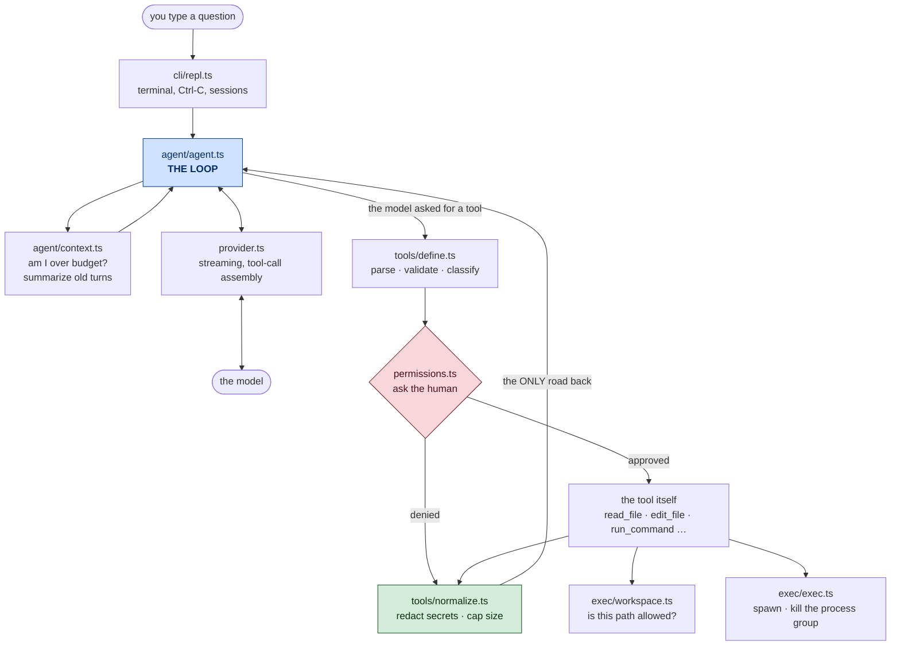

# KRIMICODE — Learning Notes

Four days of notes explaining **every line of code in this project**, in plain
language, with diagrams.

Read the days in order. Inside a day, read the files in order.

---

## The whole system on one page



---

## Where the code lives

The source started as one flat `src/` folder and was later split into one
folder per layer. The notes were written before that, so **any chapter that
names a bare file — `agent.ts`, `exec.ts` — is still naming the right file; it
just lives one level deeper now.** Paths in exercises have been updated. This
is the whole map:

| Was | Is now | Why there |
|---|---|---|
| `src/agent.ts` `context.ts` `session.ts` | `src/agent/` | the runtime, the context engine, and saved state |
| `src/index.ts` (all of it) | `src/index.ts` + `src/cli/` | see below |
| `src/render.ts` | `src/cli/ansi.ts` | **renamed** — colours and `renderDiff`, no state |
| `src/commands.ts` `args.ts` `paste.ts` | `src/cli/` | terminal, and nothing else |
| `src/exec.ts` `platform.ts` `workspace.ts` | `src/exec/` | the execution layer: processes and paths |
| `src/normalize.ts` | `src/tools/normalize.ts` | ARCHITECTURE §2 puts result normalization in the tool system |
| `src/permissions.ts` `provider.ts` `redact.ts` `config.ts` `types.ts` | unchanged | a layer that is one file stays flat |

`index.ts` used to be the whole CLI — 511 lines, with a 370-line `main()`.
Days 1–4 describe it that way, and that is how it really was. It has since been
split, and each piece kept its comments:

| Now in | What Days 1–4 called "index.ts" |
|---|---|
| `cli/repl.ts` | the REPL loop, Ctrl-C and the two AbortControllers, session saving |
| `cli/renderer.ts` | the spinner, dim reasoning, tool lines — everything written to stdout |
| `cli/approve.ts` | the permission prompt (`y` / `n` / `a`) |
| `index.ts` | wiring only — 129 lines that build the pieces and start the loop |

The one behavioural consequence: **the approval prompt is now testable.** It
used to live inside `main()`, which runs on import, so no test could reach the
last human check before a write. It has ten tests now.

---

## The four days

| Day | Question it answers | Files |
|---|---|---|
| **[Day 1](day-1/00-start-here.md)** | How does an agent work? | 11 |
| **[Day 2](day-2/00-start-here.md)** | What happens when it goes wrong? | 10 |
| **[Day 3](day-3/00-start-here.md)** | What happens when it keeps working — for a long time? | 9 |
| **[Day 4](day-4/00-start-here.md)** | What separates working code from a product? | 9 |

### Day 1 — the spine

Setup · config and Zod · types · streaming · **the agent loop** · security
(paths, secrets, size caps) · the tool system · terminal rendering.

### Day 2 — making it safe

**The permission gate** · processes and **command injection** · `edit_file`'s
five rules · discovery tools · git and test tools · bracketed paste and diffs ·
the test suite.

### Day 3 — making it last

The context problem · counting tokens · **where to cut** · writing the summary ·
**cancellation** · testing what you cannot see.

### Day 4 — making it real

Lint and CI · Windows on a Mac · saving conversations · slash commands and the
Ctrl-C hang · **the eight bugs 308 tests could not see** · the day CI went red.

---

## If you remember only twelve things

1. **The agent is a loop, not a pipeline.** The model decides how many times it
   goes round. We just keep it turning safely.

2. **The model has no hands and no memory.** It only ever *asks*. Our code does
   every real action, and we re-send the entire history every single request.

3. **One road, one rule.** When something must always happen, build the code so
   there is only one path and put the rule on that path. Redaction, validation,
   the permission gate, and path checks all work this way. A future tool
   *cannot* skip them.

4. **Classify the call, not the tool.** `read_file` on `src/a.ts` is harmless.
   `read_file` on `.env` is not. The argument decides the risk.

5. **Make the mistake unexpressible.** Don't rely on remembering to escape a
   shell string — pass an argv array so there is nothing to escape.

6. **Kill the process group, never just the child.** `process.kill(-pid)`.
   Otherwise grandchildren survive and you never find them.

7. **Ambiguity is an error, never a guess.** Two matches for `old_str` fails
   loudly rather than silently editing the wrong one.

8. ⭐ **A tool result must never be separated from the call that asked for it.**
   Break that pairing — by compacting badly or by `break`ing out of the tool
   loop — and every future request is a 400. The conversation is dead and
   cannot be recovered.

9. **Leave only where the structure is complete.** Cut history only at a `user`
   message. Abandon a turn only at the top of the loop. Same rule, two places.

10. **A test you have never seen fail is a test you should not trust.** Put the
    bug back, watch it go red, then revert.

11. ⭐ **Green tests mean the code does what you told it to.** Only using the
    software tells you whether you told it the right things. Every bug in Day 4
    was found by a person at a prompt, none by 308 passing tests.

12. **Most real bugs are two right decisions meeting.** Redaction is correct.
    Exact-match editing is correct. Together they deadlocked.

---

## How to use these notes

Each chapter follows the same shape:


**Do the "Try it yourself" sections.** Most of them tell you to break something
on purpose and watch what fails. Reading about a bug and watching it happen are
different kinds of knowing, and only the second one sticks.

Each day ends with a **cheat sheet** (everything on one page) and a **quiz**
(recall questions with answers, plus build exercises).

The diagrams render in VS Code's markdown preview and on GitHub. In VS Code,
open a file and press `Cmd+Shift+V`.

---

## The state of the project

```
9 tools · 333 tests · ~4,700 lines of source
lint · CI on Linux, macOS and Windows · installable · sessions resume
one folder per layer · /compact on demand
```

Known gaps, honestly listed: `precheck` runs before the permission gate and its
"must not mutate" rule is a comment rather than something CI enforces; the
other read tools have not been audited for the prompt-before-boundary-check bug
that `edit_file` had; and permission approvals are still per-session with no
policy file.

Changed after Day 4 was written, and not yet written up as a day of its own:
the layer folders above, a `/compact` command (compaction used to run only when
the budget forced it), and a shared `plural.ts` after `--list` was caught
reporting "1 turns" — three hand-written plural ternaries and six places with
none.

Then CI went red again, in three unrelated ways, and each one is worth knowing:

| Job | Cause |
|---|---|
| ubuntu · node 20.12 | `node --test` only expands globs from Node 22. The pattern arrived as a literal filename and matched nothing. Tests are now enumerated by [`scripts/run-tests.mjs`](../scripts/run-tests.mjs) rather than by a glob. |
| windows | `list_files` reported `src\a.ts` there and `src/a.ts` everywhere else — two names for one file, in output the model hands straight back as a path. |
| windows | A defaulted parameter that read `process.env.ComSpec`. Written up in [day-4/02](day-4/02-another-machine.md#where-this-technique-has-a-hole) — it is the technique that chapter teaches, failing in the one way it can. |
