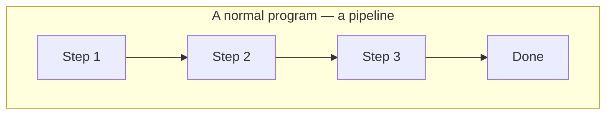
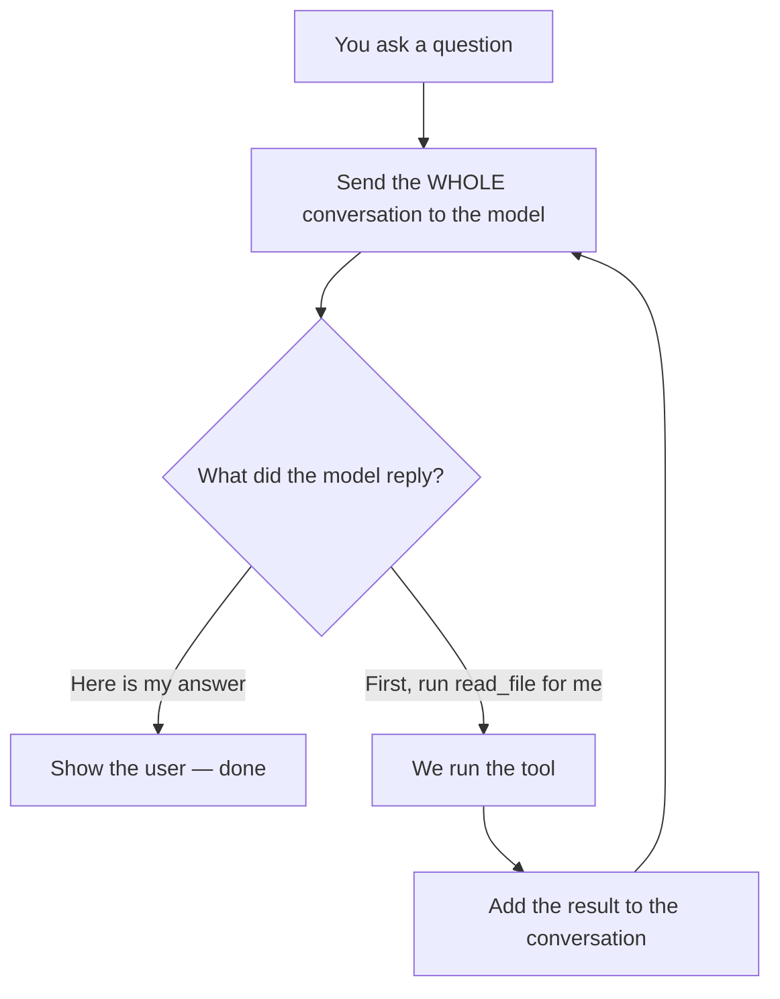
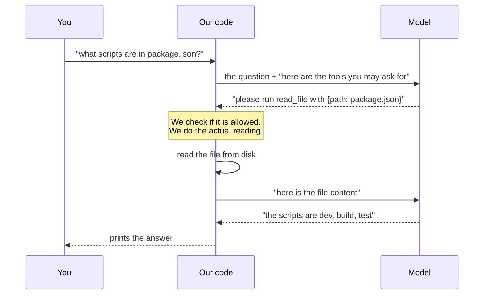
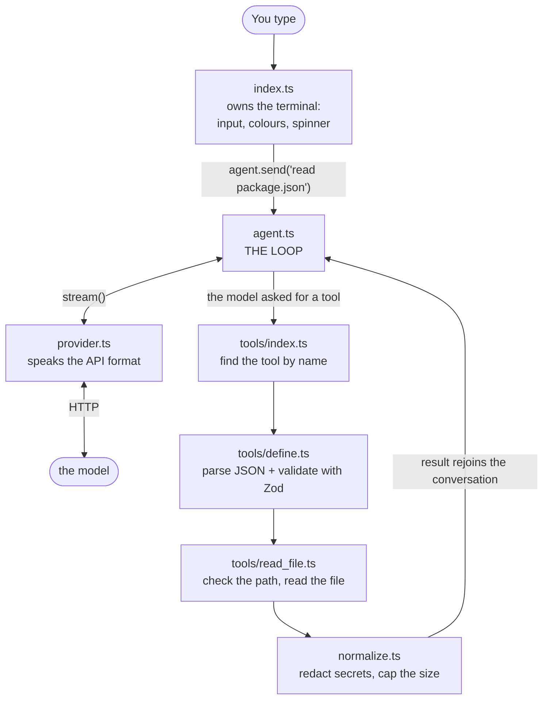
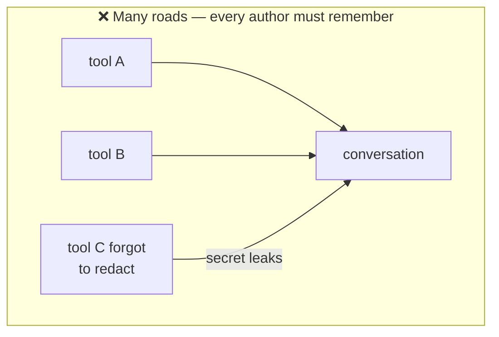
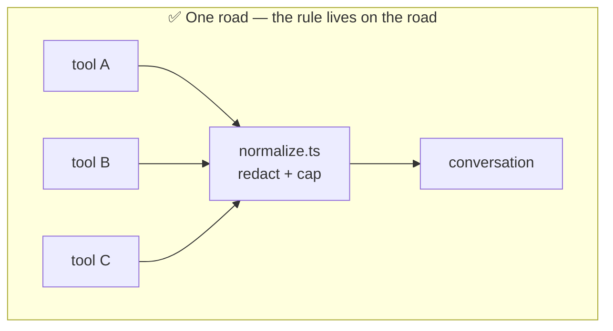

# Day 1 — Start Here

These notes explain **every line of code we wrote on Day 1**, in plain language.

Read them in order. Each file builds on the one before it.

| File | What it covers |
|---|---|
| `00-start-here.md` | The big picture. Read this first. |
| `01-setup-and-typescript.md` | `package.json`, `tsconfig.json`, ES modules, why `.js` in imports |
| `02-config-and-zod.md` | `src/config.ts` — reading and validating environment variables |
| `03-types-and-contracts.md` | `src/types.ts` — the shapes everything agrees on |
| `04-provider-and-streaming.md` | `src/provider.ts` — talking to the model, streaming, tool-call assembly |
| `05-agent-loop.md` | `src/agent.ts` — the heart of the agent |
| `06-security.md` | `src/workspace.ts`, `src/redact.ts`, `src/normalize.ts` |
| `07-tool-system.md` | `src/tools/` — how a tool is defined, validated, and registered |
| `08-cli-rendering.md` | `src/index.ts` — the terminal interface |
| `09-concepts-cheatsheet.md` | Every JS/TS concept used, in one place |
| `10-quiz-and-exercises.md` | Test yourself. Do this before Day 2. |

---

## What did we actually build?

A **terminal coding agent**. You type a question, and a language model answers
— but the model can also *read files from your project* before answering.

That last part is what makes it an "agent" instead of a chatbot.

## The one idea that matters most

Most programs are a **pipeline**. Data goes in one end, moves forward through
steps, comes out the other end. Step 1 → Step 2 → Step 3 → done.

Our agent is a **loop**.





See the arrow going back up? That is the whole difference.

The model can go around that loop many times before answering. It might read
one file, realise it needs another, read that too, and only then answer.

**We never decide how many times the loop runs. The model does.** Our job is
just to keep the loop turning safely.

If you remember one thing from Day 1, remember this shape.

## Why can't the model read the file itself?

It can't. A language model is a function: text goes in, text comes out. It has
no hands. It cannot touch your disk, your network, or your terminal.

So we make a deal with it:

1. We tell the model: *"here is a list of tools you may ask for, and the exact
   shape of arguments each one takes."*
2. Instead of answering, the model can reply: *"please run `read_file` with
   `{"path": "package.json"}`."*
3. **We** run it. We decide whether it's allowed. We do the actual file read.
4. We hand the result back and ask the model to continue.

Here is that deal as a conversation:



Look at who does what. The model **asks**. Our code **acts**.

The model never executes anything. It only ever *asks*. Every actual action
happens in our code, where we can check it first.

This is why the security work in `06-security.md` matters so much — we are the
only thing standing between "the model asked for something" and "it happened".

## The file map

```
src/
├── index.ts        The CLI. Reads your typing, prints output. Nothing else.
├── agent.ts        The loop above. Orchestrates everything.
├── provider.ts     Talks to the model over HTTP. Knows about the API format.
├── config.ts       Reads .env, validates it, hands back clean settings.
├── types.ts        Shared shapes. No logic, just contracts.
│
├── workspace.ts    "Is this path allowed?" Blocks escapes from the project.
├── redact.ts       "Does this text contain a secret?" Removes it if so.
├── normalize.ts    Every tool result passes through here. Redact + size cap.
│
└── tools/
    ├── define.ts     How to build a tool. Parsing + validation live here.
    ├── index.ts      The list of tools that exist. The registry.
    └── read_file.ts  Our first real tool.
```

## How the pieces talk to each other



## The rule behind the design

Notice something about that diagram: there is **exactly one path** from a tool
back into the conversation, and it goes through `normalize.ts`.

That is deliberate, and it's the most important design habit in this codebase:

> When a rule must *always* hold, don't ask every author to remember it.
> Build the code so there is only one road, and put the rule on that road.

We used this three times on Day 1:

- Every tool result is redacted and size-capped → because `normalize.ts` is the
  only way into `#messages`.
- Every tool's arguments are JSON-parsed and validated → because `defineTool()`
  is the only way to make a tool.
- Every file path is checked → because `resolveInWorkspace()` is the only way a
  tool gets an absolute path.

Picture the difference:





A future tool *cannot* skip these. Not "shouldn't" — **cannot**. That is a much
stronger guarantee than a comment saying "remember to redact".

## Vocabulary you'll see everywhere

| Word | Meaning in this project |
|---|---|
| **provider** | The thing that talks to the model over HTTP |
| **model** | The AI itself (we're using GLM-4.6) |
| **tool** | A function the model may ask us to run |
| **tool call** | The model's request: a name + JSON arguments |
| **tool result** | What we send back after running it |
| **turn** | One trip around the loop (one model reply) |
| **message** | One entry in the conversation history |
| **stream** | Receiving the reply piece by piece instead of all at once |
| **delta** | One small piece of a stream |
| **workspace** | Your project folder. The boundary we never cross. |

## Before you continue

Make sure you can answer these. If not, re-read above.

1. Why is the agent a loop and not a pipeline?
2. Can the model read a file by itself? Why not?
3. What are the three "only one road" rules we built?
4. Who decides how many times the loop runs?

Now go to `01-setup-and-typescript.md`.
