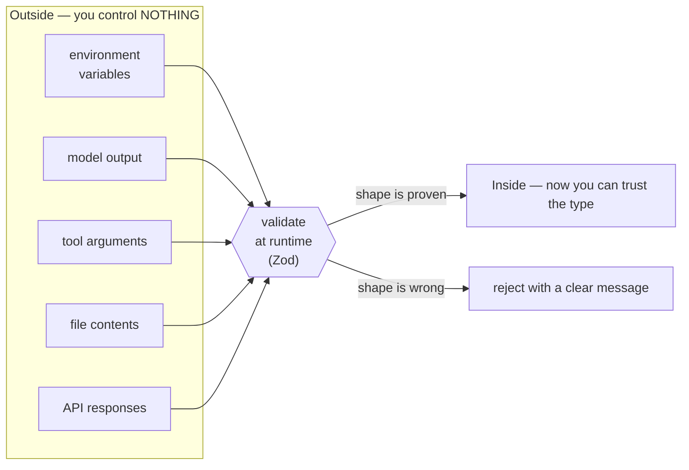
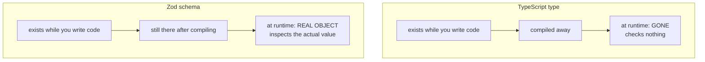

# 02 — Config and Validation (`src/config.ts`)

This file reads your environment variables, checks they make sense, and hands
back a clean object. It is the first "boundary" in the program.

---

## The concept: trust boundaries

A **boundary** is any place where data enters your program from outside. On the
other side of a boundary, you control nothing.

Think of it as a wall around your code. Everything inside is yours. Everything
crossing in must be searched at the gate.



Our boundaries:

| Boundary | Why it's untrusted |
|---|---|
| Environment variables | A human typed them. Typos happen. |
| Model output | An AI generated it. It can be malformed. |
| Tool arguments | Same — model-generated JSON. |
| File contents | Could be anything. |
| API responses | The server might change or fail. |

TypeScript **cannot** help you here. This is the trap:

```ts
const key: string = process.env.OPENAI_API_KEY;
```

TypeScript is happy. But `process.env.OPENAI_API_KEY` is `undefined` if the
variable isn't set. TypeScript's types are **compile-time only** — they vanish
when the code runs. They describe what you *hope* is true.

> **The rule from CLAUDE.md:** *"Validate anything crossing a system boundary —
> don't trust it just because TypeScript has a type for it."*

That's what Zod is for. Zod checks at **runtime**, when the program is actually
running and the real value is in front of it.

---

## The code, piece by piece

### The imports and schema

```ts
import { z } from 'zod';

const EnvSchema = z.object({
  OPENAI_API_KEY: z.string().min(1, 'is required'),
  OPENAI_BASE_URL: z
    .string()
    .min(1, 'is required')
    .refine((v) => URL.canParse(v), 'must be a valid URL'),
  MODEL_NAME: z.string().min(1, 'is required'),
  EXTRA_BODY: z.string().optional(),
});
```

> **Note for later:** on Day 3 we add one more variable here,
> `MAX_CONTEXT_TOKENS`. The shape of this schema is the same; there is just one
> more line. See `day-3/01-the-context-problem.md`.

**What is a schema?** A description of the shape data *must* have. Not a type —
an actual object that exists at runtime and can inspect values.

The difference between a TypeScript type and a Zod schema, in one picture:



Reading it:

- `z.object({...})` — expect an object with these keys
- `z.string()` — this value must be a string
- `.min(1, 'is required')` — at least 1 character. An empty string fails. The
  second argument is the error message shown if it fails.
- `.optional()` — this one may be missing. `EXTRA_BODY` is not required.

### `.refine()` — custom rules

```ts
.refine((v) => URL.canParse(v), 'must be a valid URL')
```

`.refine()` takes a function that returns `true` (valid) or `false` (invalid).

`URL.canParse(v)` is built into Node. It returns `true` if the string is a
usable URL.

```ts
URL.canParse('https://openrouter.ai/api/v1')  // true
URL.canParse('not a url')                     // false
```

**Why `.refine()` instead of Zod's built-in `.url()`?** Zod v4 renamed it. Zod
v3 has `z.string().url()`; v4 prefers `z.url()`. Writing our own check with
`.refine()` works identically on both versions, so an npm update can't break us.

> **Lesson:** when a library is between major versions, prefer the piece that
> isn't changing.

### ⚠️ The bug you actually hit here

The original line was:

```ts
EXTRA_BOdy: z.string().optional(),   // ❌ lowercase "dy"
```

Later the code said `parsed.data.EXTRA_BODY` — which didn't exist, because the
schema declared `EXTRA_BOdy`.

**Why TypeScript caught it:** Zod infers the output type *from the schema
object*. Since the schema had no `EXTRA_BODY` key, the type had no `EXTRA_BODY`
property, so reading it was an error.

This is Zod's real superpower: **one definition produces both the runtime check
and the compile-time type.** They cannot drift apart.

### The Config interface

```ts
export interface Config {
  readonly apiKey: string;
  readonly baseURL: string;
  readonly model: string;
  readonly workspaceRoot: string;
  /** Vendor-specific request-body fields. Opaque to the provider. */
  readonly extraBody: Record<string, unknown>;
}
```

**`readonly`** — once created, these can't be reassigned. `config.apiKey = 'x'`
is a compile error. Config should never change while running.

**`Record<string, unknown>`** — "an object with string keys and values of
unknown type". `unknown` is the safe cousin of `any`:

```ts
let a: any = getData();
a.foo.bar.baz;        // ✅ compiles. 💥 crashes at runtime.

let u: unknown = getData();
u.foo;                // ❌ compile error — check the type first
```

`any` switches type checking **off**. `unknown` keeps it **on** and forces you
to narrow. Our `CLAUDE.md` bans `any` without a justifying comment; `unknown` is
usually what you actually wanted.

### Loading the .env file

```ts
export function loadConfig(): Config {
  // Missing .env is not an error; the vars may come from the shell.
  try {
    process.loadEnvFile('.env');
  } catch {
    // no-op
  }
```

`process.loadEnvFile()` reads `.env` and puts each line into `process.env`.
Built into Node 20.12+, so no `dotenv` package needed.

**Why the empty `catch`?** It throws if `.env` doesn't exist. But that's a
perfectly normal situation — in production you set real environment variables
instead of using a file. So a missing `.env` is *not an error*, and we continue.

An empty `catch {}` is usually a smell. It's fine here **only because we wrote
down why**. If you ever write an empty catch, write the reason next to it.

### Running the validation

```ts
  const parsed = EnvSchema.safeParse(process.env);
```

Two ways to run a Zod schema:

| Method | On failure |
|---|---|
| `.parse(data)` | **throws** an exception |
| `.safeParse(data)` | **returns** `{ success: false, error }` |

We use `safeParse` so we control the error message. `process.env` has dozens of
unrelated variables (`PATH`, `HOME`, ...) — Zod ignores extra keys by default
and only looks at the four we declared.

### The error path — where the security rule lives

```ts
  if (!parsed.success) {
    // Report issue paths and messages only. Never echo the values —
    // one of them is the API key.
    const details = parsed.error.issues
      .map((i) => `  ${i.path.join('.')}: ${i.message}`)
      .join('\n');
    throw new Error(`Invalid environment:\n${details}`);
  }
```

**This is the most security-sensitive code in the file, and it's the error
branch — the branch you're staring at when something is already wrong.**

`parsed.error.issues` is an array like:

```js
[ { path: ['MODEL_NAME'], message: 'is required' } ]
```

We build a message from `path` and `message` **only**. We never print the value.

Think about what the lazy version does:

```ts
console.log(process.env);           // ❌ prints your API key
console.log(parsed.error);          // ❌ may include the value that failed
```

Both leak the key into your terminal, your scrollback, and any log capture.

`i.path.join('.')` turns `['MODEL_NAME']` into `"MODEL_NAME"`. It's an array
because nested objects give nested paths like `['db', 'host']` → `"db.host"`.

Result:

```
Invalid environment:
  MODEL_NAME: is required
```

Tells you exactly what's wrong. Reveals nothing.

### Parsing EXTRA_BODY

```ts
  let extraBody: Record<string, unknown> = {};
  if (parsed.data.EXTRA_BODY) {
    let raw: unknown;
    try {
      raw = JSON.parse(parsed.data.EXTRA_BODY);
    } catch {
      throw new Error('Invalid environment:\n  EXTRA_BODY: must be valid JSON');
    }
    if (typeof raw !== 'object' || raw === null || Array.isArray(raw)) {
      throw new Error('Invalid environment:\n  EXTRA_BODY: must be a JSON object');
    }
    extraBody = raw as Record<string, unknown>;
  }
```

**What is `EXTRA_BODY` for?** Different providers accept different extra fields.
OpenRouter needs `include_reasoning: true` to send thinking tokens. Z.ai doesn't
use that name.

We could have hardcoded `include_reasoning: true` in `provider.ts`. We didn't —
that would make our "OpenAI-compatible provider" secretly an "OpenRouter
provider", breaking the promise that you can swap backends by editing `.env`.

So: config carries an **opaque bag** of extra fields. The provider forwards it
without understanding it.

**The three checks, and why each is needed:**

```ts
typeof raw !== 'object'   // rejects  EXTRA_BODY=5   or  ="hello"
raw === null              // rejects  EXTRA_BODY=null
Array.isArray(raw)        // rejects  EXTRA_BODY=[1,2]
```

That middle one catches JavaScript's oldest wart:

```js
typeof null           // "object"   ← a 1995 bug, kept forever for compatibility
```

Without the explicit `null` check, `EXTRA_BODY=null` would pass as an object and
crash later when spread. **Any time you check `typeof x === 'object'`, you must
also check for `null`.**

`Array.isArray` matters because arrays are objects too, and spreading an array
into a request body produces nonsense.

**`as Record<string, unknown>`** — a *type assertion*: "trust me, it's this
type." Normally dangerous, but safe here because we just proved it with three
runtime checks on the lines above. **An assertion is only honest when a check
sits right before it.**

### The return

```ts
  return {
    apiKey: parsed.data.OPENAI_API_KEY,
    baseURL: parsed.data.OPENAI_BASE_URL,
    model: parsed.data.MODEL_NAME,
    workspaceRoot: process.cwd(),
    extraBody,
  };
}
```

We rename `SCREAMING_CASE` env names to `camelCase` properties. The rest of the
program never sees environment variable names — if you rename a variable later,
only this file changes.

**`process.cwd()`** — "current working directory", the folder you ran the
command from. This becomes the workspace root: the boundary no tool may cross.

**Why capture it once here?** Because `process.cwd()` can *change* while a
program runs. If `workspace.ts` called `process.cwd()` fresh each time, an
attacker who could change the working directory would move the security
boundary. Capturing it once at startup means the boundary is fixed for the
process lifetime.

**`extraBody,`** — shorthand for `extraBody: extraBody`.

---

## Things to remember

1. TypeScript types are compile-time only. They **cannot** validate real data.
2. Validate every boundary: env vars, model output, tool args, API responses.
3. Zod gives you a runtime check *and* a compile-time type from one definition.
4. `safeParse` returns a result; `parse` throws. Prefer `safeParse` when you
   want to control the message.
5. In error messages, print **what** failed, never the **value** that failed.
6. `typeof null === 'object'` — always check for null separately.
7. `unknown` over `any`. `as` only after a real runtime check.
8. Capture security-relevant state (like the workspace root) **once**.

## Try it yourself

```bash
# 1. Blank out MODEL_NAME in .env, then:
npm run dev
# Expect: "Invalid environment:\n  MODEL_NAME: is required"
# Confirm: no key material in the output.

# 2. Set EXTRA_BODY to something broken:
#    EXTRA_BODY={broken
# Expect: "EXTRA_BODY: must be valid JSON"

# 3. Set it to an array:
#    EXTRA_BODY=[1,2,3]
# Expect: "EXTRA_BODY: must be a JSON object"
```

Next: `03-types-and-contracts.md`.
