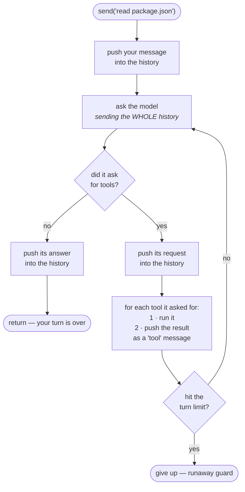

# 05 — The Agent Loop (`src/agent.ts`)

This is the heart of the program. Everything else exists to serve this file.

It is also **small** — about 145 lines. That's on purpose. Our
`ARCHITECTURE.md` says: *"Keep the loop small; let the surrounding interfaces
carry the extensibility."*

---

## The concept, once more



The loop ends when the model stops asking for tools.

Read the diagram once more and notice three things:

1. **The history only ever grows.** Every box that says "push" adds to it, and
   the whole thing is re-sent on the next `ask`. (This is exactly the problem
   Day 3 has to solve.)
2. **We never decide the number of trips.** The model does, by choosing whether
   to ask for a tool.
3. **There is a hard ceiling anyway.** That is `MAX_TURNS`, below.

---

## The code

### Imports and constants

```ts
import { normalizeToolResult } from './normalize.js';
import { getTool, toolSpecs } from './tools/index.js';
import type {
  Message, ModelProvider, ToolCall, ToolResult,
} from './types.js';

/** Runaway-loop guard: a model that keeps calling tools must still terminate. */
const MAX_TURNS = 25;
```

**Why `MAX_TURNS`?** Because "the model decides when to stop" is dangerous if
the model never stops.

A confused model can loop forever: read a file, misread the result, read it
again, repeat. Every iteration is a paid API call and a growing context window.
`MAX_TURNS` puts a hard ceiling on it.

We added this **before** any tool existed. That's the right instinct: build the
safety limit while you're thinking about it, not after it bites you.

> **Note:** this started at 25 and is **30** in the code today. The number is a
> judgement call, not a magic constant — what matters is that a ceiling exists.

### The system prompt

```ts
const SYSTEM_PROMPT = [
  'You are a terminal coding assistant working inside the user\'s workspace.',
  'Use the provided tools to inspect real files rather than guessing.',
  'Tool results are JSON: {"success":true,"content":...} or',
  '{"success":false,"error":...,"retryable":...}. If a call fails, read the',
  'error and correct the arguments instead of repeating the same call.',
  'Be concise and direct.',
].join(' ');
```

Standing instructions, sent as the first message in every conversation.

**Why an array joined with `' '`?** So each line stays inside the editor's width
without adding literal newlines. `.join(' ')` glues them into one paragraph.

**Note the third instruction.** We *tell the model the exact shape of tool
results* and what to do on failure. That's not decoration — without it, a model
that gets `{"success":false,...}` may just call the same tool again. Explaining
the contract reduces that loop significantly.

> **Lesson:** the system prompt is part of the code. When you change what tool
> results look like, update the prompt too.

### Options and fields

```ts
export interface AgentOptions {
  readonly provider: ModelProvider;
  readonly model: string;
  /** Called with each streamed text fragment, for incremental rendering. */
  readonly onText: (text: string) => void;
  /** Called with each streamed reasoning fragment. Display only. */
  readonly onReasoning: (text: string) => void;
  readonly workspaceRoot: string;
  readonly onToolStart: (name: string, argsJson: string) => void;
  readonly onToolEnd: (name: string, result: ToolResult) => void;
}
```

**Dependency injection.** The Agent doesn't create its provider or decide how to
print — those are handed in.

Look at the four `on*` callbacks. The Agent **never calls `console.log`**. It
announces what's happening and lets someone else decide how to display it.

Why this matters:

- Swap the CLI for a web UI → pass different callbacks, Agent unchanged.
- Test the Agent → pass callbacks that record into an array.
- The rule from `ARCHITECTURE.md`: *the agent runtime must not contain
  rendering.*

**`(text: string) => void`** is a function type: takes a string, returns nothing.

```ts
export class Agent {
  readonly #provider: ModelProvider;
  readonly #model: string;
  readonly #onText: (text: string) => void;
  readonly #onReasoning: (text: string) => void;
  readonly #workspaceRoot: string;
  readonly #onToolStart: (name: string, argsJson: string) => void;
  readonly #onToolEnd: (name: string, result: ToolResult) => void;
  readonly #messages: Message[] = [
    { role: 'system', content: SYSTEM_PROMPT },
  ];
```

**`#messages` starts with the system prompt already in it** — so it's impossible
to have a conversation without instructions.

**`readonly #messages: Message[]`** — subtle but worth understanding. `readonly`
means you can't *reassign* the field:

```ts
this.#messages = [];        // ❌ error
this.#messages.push(msg);   // ✅ fine — mutating contents is allowed
```

That's exactly what we want: one array for the lifetime of the Agent, contents
growing as the conversation goes.

### The constructor

```ts
  constructor(options: AgentOptions) {
    this.#provider = options.provider;
    this.#model = options.model;
    this.#onText = options.onText;
    this.#onReasoning = options.onReasoning;
    this.#workspaceRoot = options.workspaceRoot;
    this.#onToolStart = options.onToolStart;
    this.#onToolEnd = options.onToolEnd;
  }
```

Plain copying. **Taking a single `options` object** instead of seven positional
parameters means call sites are readable and argument order can't be mixed up.

Compare:

```ts
new Agent(provider, 'glm-4.6', onText, onReasoning, root, onStart, onEnd);  // 😖
```

### ⭐ `send()` — the loop itself

```ts
  async send(userInput: string): Promise<void> {
    this.#messages.push({ role: 'user', content: userInput });
```

Add what you typed to the history.

```ts
    // The loop, not a pipeline (ARCHITECTURE §1): the model may call tools
    // many times before a final answer. Each pass is one model turn.
    for (let turn = 0; turn < MAX_TURNS; turn++) {
      const { text, toolCalls } = await this.#streamOnce();
```

One iteration = one model reply. `#streamOnce()` does the API call and returns
both the text and any tool requests.

**`const { text, toolCalls } = ...`** is **destructuring** — pulling named
properties out of the returned object into local variables.

```ts
      this.#messages.push(
        toolCalls.length > 0
          ? { role: 'assistant', content: text, toolCalls }
          : { role: 'assistant', content: text },
      );
```

Record what the model said. If it requested tools, attach them.

**Why must the tool calls go in the history?** Because the API requires it. The
conversation has to read as a coherent story:

```
assistant: "I'll read that file"  + tool_calls: [call_abc]
tool:      (result for call_abc)
assistant: "The scripts are..."
```

If you push the tool *result* without the assistant message that requested it,
the provider rejects the conversation as malformed. The `tool` message is an
*answer*, and an answer with no question is invalid.

```ts
      if (toolCalls.length === 0) return;
```

**The exit condition.** No tools requested = the model gave a final answer =
we're done.

```ts
      for (const call of toolCalls) {
        this.#onToolStart(call.name, call.argsJson);
        const result = await this.#runTool(call);
        this.#onToolEnd(call.name, result);

        // ARCHITECTURE §5: the model sees the structured result, so it can
        // tell "the file does not exist" from "the tool is broken".
        this.#messages.push({
          role: 'tool',
          toolCallId: call.id,
          content: JSON.stringify(result),
        });
      }
    }
```

For each requested tool: announce it, run it, announce the outcome, record it.

**`toolCallId: call.id`** — this is what links the result back to the request.
Get it wrong and the model can't tell which answer belongs to which question.

**`JSON.stringify(result)`** — we send the *whole structured result*, not just
the content:

```json
{"success":false,"error":"File not found: nope.txt","retryable":false}
```

The model can now distinguish "the file doesn't exist" from "the tool crashed"
from "your arguments were wrong" — and behave differently for each. If we only
sent the text, it would have to guess.

```ts
    throw new Error(`Exceeded ${MAX_TURNS} turns without a final answer.`);
```

Reached only if the `for` runs all 25 times without returning. The safety net
fired.

### `#runTool()` — the single road

```ts
  /**
   * Dispatch one tool call. Every result leaves here already normalized —
   * redacted and capped — because this is the only path from a tool into
   * #messages.
   */
  async #runTool(call: ToolCall): Promise<ToolResult> {
    const tool = getTool(call.name);
    if (!tool) {
      return normalizeToolResult({
        success: false,
        error: `Unknown tool: "${call.name}".`,
        retryable: false,
      });
    }

    return normalizeToolResult(
      await tool.run(call.argsJson, { workspaceRoot: this.#workspaceRoot }),
    );
  }
```

Small, but it carries a guarantee.

**Models hallucinate tool names.** `getTool` returns `undefined` for anything not
in the registry, and we return a normal failed result. No crash — the model
reads "Unknown tool" and tries something real.

**Both return paths go through `normalizeToolResult`.** That's the "only one
road" idea from `00-start-here.md`. Because this method is the *sole* path from
a tool into `#messages`, redaction and size-capping are guaranteed for every
result — including the error we generated ourselves.

If a future tool forgets about secrets, it doesn't matter. It cannot reach the
conversation without passing through here.

**`{ workspaceRoot: this.#workspaceRoot }`** — the `ToolContext`. Tools get
exactly what they need and nothing more. No access to config, the API key, or
the message history.

### `#streamOnce()` — consuming the stream

```ts
  async #streamOnce(): Promise<{ text: string; toolCalls: ToolCall[] }> {
    let text = '';
    const toolCalls: ToolCall[] = [];

    for await (const event of this.#provider.stream({
      model: this.#model,
      messages: this.#messages,
      tools: toolSpecs(),
    })) {
```

**`tools: toolSpecs()`** — we send the tool list on **every** request. The API is
stateless; it doesn't remember what tools exist from last time.

```ts
      switch (event.type) {
        // Rendered for the human, never accumulated into `text` and so never
        // pushed into #messages. Feeding thinking back as assistant content
        // would inflate every later request and can degrade output.
        case 'reasoning_delta':
          this.#onReasoning(event.text);
          break;
```

**Study this case carefully — the important part is what's missing.**

Compare with the next one:

```ts
        case 'text_delta':
          text += event.text;          // ← accumulated
          this.#onText(event.text);
          break;
```

`text_delta` does **two** things: adds to `text` (which becomes a message) and
notifies the display.

`reasoning_delta` does **one**: notifies the display only.

So reasoning is shown to you but never stored, never sent back. Why:

1. **Cost** — thinking can be longer than the answer. Storing it would make
   every later request bigger and slower.
2. **Quality** — models are trained expecting their own past *answers* in
   history, not their scratch work.

> **The general skill:** when reading code, notice what a branch *doesn't* do.
> The absence of `text +=` here is the entire design decision.

```ts
        case 'tool_call':
          toolCalls.push({
            id: event.id,
            name: event.name,
            argsJson: event.argsJson,
          });
          break;
        case 'done':
          break;
        case 'error':
          throw new Error(event.message);
      }
    }

    return { text, toolCalls };
  }
```

**`case 'done': break;`** — we handle it explicitly and do nothing. Writing the
empty case says *"we thought about this and there's nothing to do"*, which is
different from forgetting it.

**`case 'error': throw`** — the provider converted errors into events so its own
generator could finish cleanly. Here, at the Agent boundary, we convert back to
an exception. `index.ts` catches it and prints one line.

This is a deliberate pattern: **events inside the stream, exceptions at the
boundary.**

---

## Why the loop is so short

Look at what `send()` does *not* contain:

- No HTTP code → `provider.ts`
- No file access → `tools/`
- No printing → `index.ts`
- No redaction or capping → `normalize.ts`
- No path checking → `workspace.ts`
- No JSON parsing or validation → `tools/define.ts`

It only orchestrates. That's why swapping a model, adding a tool, or changing
the UI doesn't touch this file.

> **A good test of design:** if adding a feature forces you to edit the core
> loop, the seams are in the wrong place.

---

## Things to remember

1. The loop runs until the model stops asking for tools.
2. `MAX_TURNS` prevents infinite loops. Always have one.
3. Assistant message with `toolCalls` **must** be pushed before the tool result,
   or the conversation is malformed.
4. `toolCallId` links a result to its request.
5. Send the **whole structured result** so the model can tell failure types
   apart.
6. Reasoning is displayed, never stored.
7. The Agent takes callbacks; it never prints.
8. One dispatch path = guaranteed redaction and capping.
9. Unknown tool names are a normal failure, not a crash.

## Try it yourself

1. Set `MAX_TURNS = 1`, then ask something needing two file reads. Watch the
   guard fire. Set it back.
2. In `#streamOnce`, temporarily add `text += event.text;` to the
   `reasoning_delta` case. Ask a few questions and watch the model's thinking
   pollute its own answers. Remove it.
3. Ask the agent to use a tool that doesn't exist: *"use the delete_everything
   tool"*. Watch it get "Unknown tool" and recover.

Next: `06-security.md`.
