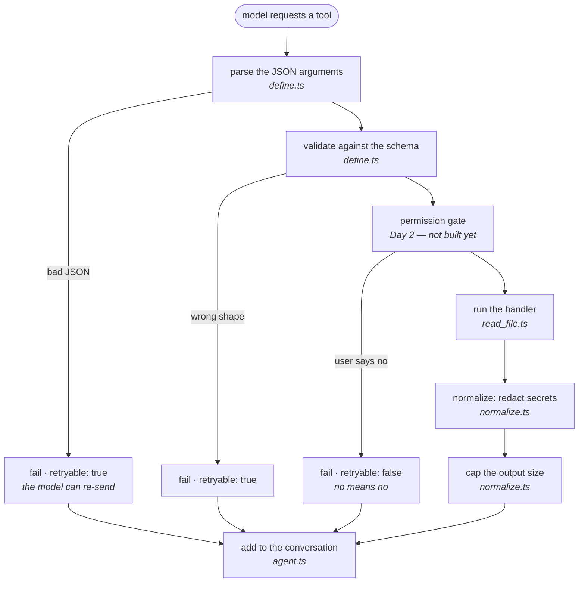
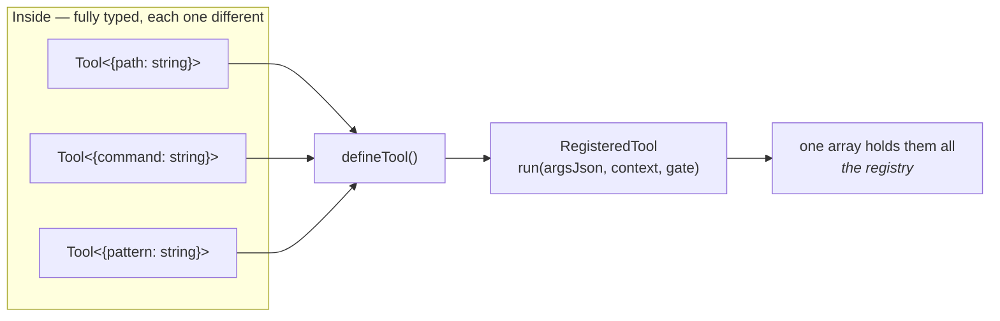

# 07 — The Tool System (`src/tools/`)

Three files:

| File | Job |
|---|---|
| `define.ts` | How to build a tool. Parsing + validation live here. |
| `index.ts` | The registry — the list of tools that exist. |
| `read_file.ts` | Our first actual tool. |

---

## The lifecycle of a tool call

From `ARCHITECTURE.md` §4:



**Never reorder these.** Two orderings in particular are load-bearing:

- **Validation before the handler** — so a tool never receives garbage.
- **Redact before cap** — so a secret sitting on the cut point cannot be
  sliced in half and survive as a fragment that no longer matches the pattern.

And notice every failure path still ends at "add to the conversation". A failed
tool is *information for the model*, never a crash.

---

# Part 1 — `src/tools/define.ts`

## The problem it solves

We need a *list* of tools. But every tool takes different arguments:

- `read_file` takes `{ path: string }`
- `run_command` will take `{ command: string, timeout?: number }`

So their types are all different. How do you put them in one array?

```ts
const tools = [readFileTool, runCommandTool];   // what type is this array?
```

The answer is **type erasure**: wrap each tool so that from the outside they all
look identical, while the typed version stays safe on the inside.



Think of it like putting different-shaped objects into identical boxes. From
outside, every box has the same handle: `run(argsJson, ...)`. Inside the box,
the original shape is still known and still checked.

## The two interfaces

```ts
/** What a tool is allowed to know about its surroundings. */
export interface ToolContext {
  readonly workspaceRoot: string;
}

/** A tool with its input type intact. ARCHITECTURE §3. */
export interface Tool<TInput> {
  readonly name: string;
  readonly description: string;
  readonly inputSchema: z.ZodType<TInput>;
  execute(input: TInput, context: ToolContext): Promise<ToolResult>;
}
```

**`Tool<TInput>` is generic** — `TInput` is a placeholder filled in per tool. For
`read_file` it becomes `{ path: string }`.

Inside `execute`, `input` is fully typed. `input.path` autocompletes;
`input.pahtt` is a compile error.

**`ToolContext` is deliberately tiny.** A tool gets the workspace root and
nothing else — no API key, no config, no message history. If a tool doesn't have
something, it can't leak it.

```ts
/** Input type erased, so the registry can hold a heterogeneous set. */
export interface RegisteredTool {
  readonly name: string;
  readonly description: string;
  /** JSON Schema derived from `inputSchema`. */
  readonly parameters: Record<string, unknown>;
  run(argsJson: string, context: ToolContext): Promise<ToolResult>;
}
```

**`RegisteredTool` has no generic.** `run` takes a plain `string` — the raw JSON
from the model. Every tool becomes this same shape, so they fit in one array.

Compare the two:

| | `Tool<TInput>` | `RegisteredTool` |
|---|---|---|
| Input | typed `TInput` | raw `string` |
| Who uses it | tool authors | the agent loop |
| Generic? | yes | no |

`defineTool()` converts the first into the second.

## defineTool

```ts
export function defineTool<TInput>(tool: Tool<TInput>): RegisteredTool {
  const parameters = z.toJSONSchema(tool.inputSchema) as Record<
    string,
    unknown
  >;
  // Providers reject unknown top-level keys in a function's parameter schema.
  delete parameters['$schema'];
```

**`z.toJSONSchema()`** — built into Zod v4. Converts a Zod schema into JSON
Schema, which is what the model API expects.

This is genuinely important. Without it you'd write the schema **twice**:

```ts
// ❌ two sources of truth that will drift apart
const InputSchema = z.object({ path: z.string() });

const parameters = {
  type: 'object',
  properties: { path: { type: 'string' } },
  required: ['path'],
};
```

Add a field to one and forget the other, and the model is told about a parameter
that isn't validated, or vice versa. With `toJSONSchema()`, **one definition
produces both.** They cannot disagree.

**`delete parameters['$schema']`** — Zod adds a `$schema` key naming the JSON
Schema version. Some providers reject unknown top-level keys, so we strip it.
A small, real-world compatibility detail.

### run() — the enforced chokepoint

```ts
    async run(argsJson, context): Promise<ToolResult> {
      // Arguments arrive as a model-generated JSON string. CLAUDE.md: always
      // parse inside a try/catch.
      let raw: unknown;
      try {
        raw = JSON.parse(argsJson.trim() === '' ? '{}' : argsJson);
      } catch {
        return {
          success: false,
          error: `Arguments were not valid JSON. Received: ${argsJson.slice(0, 200)}`,
          retryable: true,
        };
      }
```

**Why `try`/`catch`?** `JSON.parse` throws on malformed input, and models
*do* produce malformed JSON — truncated output, a stray comma, an unescaped
quote. Without this, one bad generation kills your whole session.

**`argsJson.trim() === '' ? '{}' : argsJson`** — some providers send `""` for a
tool with no arguments. `JSON.parse("")` throws; `JSON.parse("{}")` gives an
empty object. This converts one to the other.

**`raw: unknown`** — `JSON.parse` officially returns `any`. We immediately
declare it `unknown` so TypeScript keeps forcing us to check it.

**`.slice(0, 200)`** — include some of the bad input so the model can see its
mistake, but not a megabyte of it.

**`retryable: true`** — this is fixable. The model should re-send valid JSON.

```ts
      const parsed = tool.inputSchema.safeParse(raw);
      if (!parsed.success) {
        const detail = parsed.error.issues
          .map((i) => `${i.path.join('.') || '(root)'}: ${i.message}`)
          .join('; ');
        return {
          success: false,
          error: `Invalid arguments: ${detail}`,
          retryable: true,
        };
      }
```

Valid JSON is not enough — `{"wrong": 1}` parses fine but isn't what `read_file`
needs. Zod checks the *shape*.

**`|| '(root)'`** — when the error is about the whole object rather than a
field, `path` is empty and `join` gives `''`. This substitutes a readable label.

The message the model receives:

```
Invalid arguments: path: Invalid input: expected string, received undefined
```

Specific enough for it to correct itself.

```ts
      try {
        return await tool.execute(parsed.data, context);
      } catch (err) {
        // A tool bug or unexpected I/O failure. Reported to the model as a
        // result rather than thrown, so one broken tool cannot end the
        // session. Not silent — the user sees it in the transcript.
        return {
          success: false,
          error: err instanceof Error ? err.message : String(err),
          retryable: false,
        };
      }
    },
  };
}
```

**`parsed.data` is fully typed** as `TInput`. Zod validated it, so `execute`
receives exactly what its signature promises.

**The outer `catch`** is for unexpected failures — a bug in the tool, a disk
error. We convert to a failed result rather than crashing.

`retryable: false` — retrying a crash won't help.

> **Note the honesty in that comment.** `ARCHITECTURE.md` §5 says unexpected
> errors *may* throw. We chose to catch, and wrote down the trade-off: one
> broken tool shouldn't end your session, and the failure is still visible.
> That's a decision, not an accident.

## The big idea

Every tool call in the system goes through this `run`. So:

- JSON parsing is **always** in a try/catch
- Validation **always** happens
- Crashes are **always** contained

Not because tool authors remember. Because `defineTool` is the **only** way to
make a tool, and it does these things for you.

> Design guarantees you can't forget beat documentation you must remember.

---

# Part 2 — `src/tools/index.ts`

```ts
import type { ToolSpec } from '../types.js';
import type { RegisteredTool } from './define.js';
import { readFileTool } from './read_file.js';

/**
 * Source of truth for what the model can call. A tool that is not in this
 * array does not exist as far as the agent is concerned.
 */
const TOOLS: readonly RegisteredTool[] = [readFileTool];

const BY_NAME = new Map(TOOLS.map((tool) => [tool.name, tool]));

export function getTool(name: string): RegisteredTool | undefined {
  return BY_NAME.get(name);
}

/** The tool list as sent to the model. */
export function toolSpecs(): ToolSpec[] {
  return TOOLS.map((tool) => ({
    name: tool.name,
    description: tool.description,
    parameters: tool.parameters,
  }));
}

export type { RegisteredTool, Tool, ToolContext } from './define.js';
```

**`TOOLS`** is the single list. Adding a tool = writing the file, importing it,
adding it here. Three steps, one obvious place.

**`BY_NAME`** — a Map for fast lookup by name. Built once at startup.

```ts
TOOLS.map((tool) => [tool.name, tool])
// → [['read_file', readFileTool]]
```

The `Map` constructor accepts exactly that: an array of `[key, value]` pairs.

**`getTool` returns `RegisteredTool | undefined`.** The `undefined` is
deliberate. Models hallucinate tool names, and the type forces `agent.ts` to
handle that (it does — "Unknown tool").

**Why a separate `define.ts`?** If `defineTool` lived in `index.ts`, then
`read_file.ts` would import from `index.ts`, and `index.ts` imports
`read_file.ts` — a **circular import**. ES modules can sometimes cope, but it's
fragile and causes confusing "undefined is not a function" errors at startup.
Splitting the definition helpers into their own file breaks the cycle.

**`export type { ... } from ...`** — re-exporting so other files can import from
`./tools/index.js` without knowing about `define.ts`.

---

# Part 3 — `src/tools/read_file.ts`

```ts
import { readFile } from 'node:fs/promises';
import { z } from 'zod';
import {
  isSensitivePath, resolveInWorkspace, WorkspaceError,
} from '../workspace.js';
import { defineTool } from './define.js';

const InputSchema = z.object({
  path: z
    .string()
    .min(1)
    .describe('File path, relative to the workspace root.'),
});
```

**`.describe()`** — this text goes into the JSON Schema and is read **by the
model**. It's not a code comment; it's documentation for the AI.

Write these carefully. A vague description means the model uses the tool wrongly.

```ts
export const readFileTool = defineTool({
  name: 'read_file',
  description:
    'Read a UTF-8 text file from the workspace. Paths are relative to the ' +
    'workspace root. Reading outside the workspace is refused.',
  inputSchema: InputSchema,
```

The `description` is also for the model. Note it states the **limitation** too —
telling the model up front that escapes are refused means it won't waste turns
trying.

### Path checking

```ts
  async execute(input, context) {
    let absolute: string;
    try {
      absolute = await resolveInWorkspace(context.workspaceRoot, input.path);
    } catch (err) {
      if (err instanceof WorkspaceError) {
        return { success: false, error: err.message, retryable: false };
      }
      throw err;
    }
```

**The very first thing** the tool does — before touching the disk.

**`if (err instanceof WorkspaceError)`** — we handle *our* error and convert it
to a polite refusal. Anything else (`throw err`) propagates up to `defineTool`'s
catch. We don't swallow errors we didn't anticipate.

**`retryable: false`** — a path outside the workspace is refused permanently.
Retrying is pointless, and we don't want the model probing.

```ts
    if (isSensitivePath(absolute)) {
      // Step 4 turns this into an ASK_USER prompt. Until the gate exists,
      // refusing outright is the safe default.
      return {
        success: false,
        error: `Refused: "${input.path}" looks like a credential file.`,
        retryable: false,
      };
    }
```

**"Safe default while incomplete."** The eventual design asks *you* whether to
allow it. That gate isn't built yet — so until it is, we refuse.

We did not leave it open with a TODO. **When a security feature is unfinished,
fail closed.**

### Reading

```ts
    try {
      return { success: true, content: await readFile(absolute, 'utf8') };
    } catch (err) {
      const code = (err as NodeJS.ErrnoException).code;
      if (code === 'ENOENT') {
        return {
          success: false,
          error: `File not found: ${input.path}`,
          retryable: false,
        };
      }
      if (code === 'EISDIR') {
        return {
          success: false,
          error: `"${input.path}" is a directory, not a file.`,
          retryable: false,
        };
      }
      return {
        success: false,
        error: err instanceof Error ? err.message : String(err),
        retryable: false,
      };
    }
  },
});
```

**`'utf8'`** — return a string, not raw bytes.

**`NodeJS.ErrnoException`** — Node's filesystem errors carry a `code` property
with a standard Unix error name:

| Code | Meaning |
|---|---|
| `ENOENT` | Error NO ENTry — no such file |
| `EISDIR` | Error IS DIRectory |
| `EACCES` | Error ACCESs — permission denied |

**Why translate them?** `ENOENT: no such file or directory, open
'/Users/you/project/nope.txt'` is noisy and leaks your full directory structure
into model context. `File not found: nope.txt` says the same thing, shorter and
cleaner.

**The final fallback** handles anything we didn't anticipate, so no filesystem
error can escape as an exception.

---

## Adding a new tool — the recipe

1. Create `src/tools/my_tool.ts`
2. Define an input schema with `z.object({...})`, using `.describe()` on fields
3. Call `defineTool({ name, description, inputSchema, execute })`
4. In `execute`, call `resolveInWorkspace()` for any path
5. Return `{ success: true, content }` or `{ success: false, error, retryable }`
6. Import it in `src/tools/index.ts` and add it to `TOOLS`

You get for free: JSON parsing, validation, crash containment, redaction,
output capping, and the JSON Schema sent to the model.

---

## Things to remember

1. Type erasure lets a registry hold differently-typed tools.
2. `z.toJSONSchema()` — one schema, both validation and the model-facing spec.
3. Parse and validate in **one** wrapper so no tool can skip it.
4. Malformed args → `retryable: true`. Missing file → `retryable: false`.
5. `.describe()` and `description` are written **for the model**.
6. Check paths **first**, before any I/O.
7. Unfinished security feature → **fail closed**.
8. Translate OS error codes into short, clean messages.
9. Split `define.ts` from `index.ts` to avoid a circular import.

## Try it yourself

Ask the agent to call a tool with wrong arguments and watch it recover:

```
call read_file with a number instead of a path
```

Then look at what it received: `Invalid arguments: path: Invalid input:
expected string, received number` — and it will correct itself on the next turn.

Next: `08-cli-rendering.md`.
