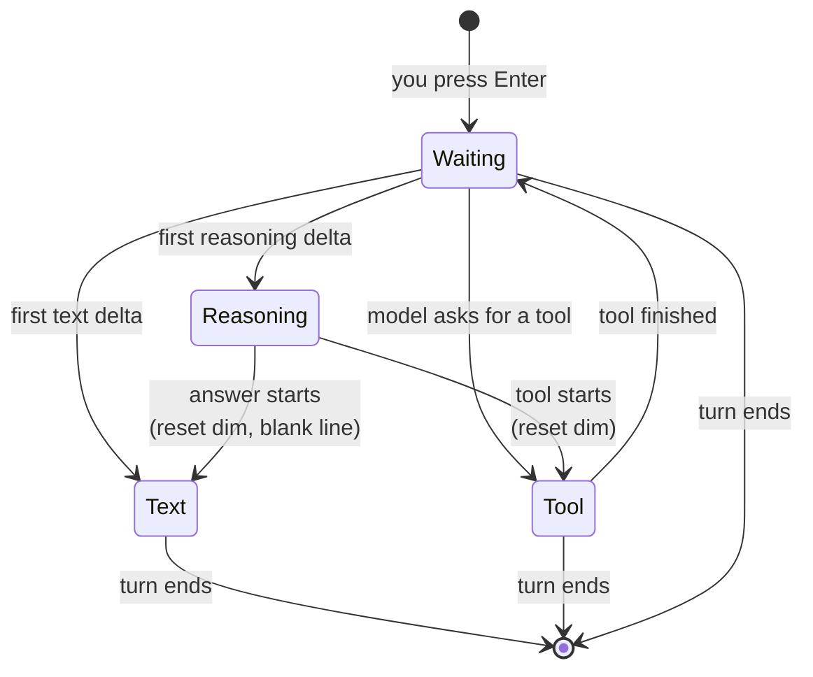

# 08 — The CLI (`src/index.ts`)

The entry point. It owns **the terminal** — reading your typing and writing
output — and nothing else.

No agent logic. No HTTP. No file access. Per `ARCHITECTURE.md` §2, the CLI layer
owns "input, rendering, streaming display, approval prompts, cancellation" and
must not contain business logic.

---

## Concept 1 — ANSI escape codes

Terminals interpret certain character sequences as *instructions* rather than
text. They all start with `ESC [`, written in JavaScript as `\x1b[`.

| Code | Effect |
|---|---|
| `\x1b[0m` | Reset all formatting |
| `\x1b[2m` | Dim |
| `\x1b[31m` | Red |
| `\x1b[32m` | Green |
| `\x1b[36m` | Cyan |
| `\x1b[K` | Clear from cursor to end of line |
| `\r` | Carriage return — move to column 0 **without** a new line |

Usage is always: turn on, write, turn off.

```ts
stdout.write('\x1b[32m✓\x1b[0m done');   // green tick, then normal "done"
```

**`\r` is the key to the spinner.** It moves the cursor back to the start of the
current line so the next write overwrites it. That's how one line animates
instead of printing hundreds of lines.

**⚠️ If you turn a colour on and never reset it, it leaks.** Every subsequent
line in the user's shell stays dim — even after your program exits — until they
run `reset`. This is why `end()` exists.

## Concept 2 — Closures

```ts
function createRenderer() {
  let spinner: NodeJS.Timeout | null = null;
  let inReasoning = false;

  return {
    waiting() { /* can read and write spinner */ },
    text() { /* can read and write inReasoning */ },
  };
}
```

The returned functions still have access to `spinner` and `inReasoning` after
`createRenderer()` has finished. That captured scope is a **closure**.

The variables are genuinely private — no code outside can reach them. It's a
class-like object without the `class` keyword.

## Concept 3 — The renderer is a little state machine

The renderer has to know what it is currently printing, because moving between
states needs cleanup — stop the spinner, close the dim block, and so on.



Every arrow leaving `Reasoning` has to **reset the dim colour first**. Miss one
and the user's shell stays dim forever. That is why `end()` runs in a `finally`
— it is the arrow that must fire no matter what happened.

---

## The code

### Imports

```ts
import * as readline from 'node:readline/promises';
import { stdin, stdout } from 'node:process';
import { loadConfig } from './config.js';
import { OpenAICompatibleProvider } from './provider.js';
import { Agent } from './agent.js';
import { registerSecret } from './redact.js';
import type { ToolResult } from './types.js';
```

**`node:readline/promises`** — the promise-based version, so we can `await
rl.question(...)` instead of using callbacks.

**The `node:` prefix** explicitly means "Node's built-in module". Without it,
Node would first look for a package called `readline` in `node_modules`. The
prefix is faster and prevents a malicious package from shadowing a builtin.

### The renderer

```ts
/**
 * Owns every byte written to stdout during a turn: the waiting spinner, dimmed
 * reasoning, and the answer. ARCHITECTURE §2 — rendering belongs to the CLI,
 * not the agent runtime.
 */
function createRenderer() {
  const frames = ['⠋', '⠙', '⠹', '⠸', '⠼', '⠴', '⠦', '⠧', '⠇', '⠏'];
  let spinner: NodeJS.Timeout | null = null;
  let inReasoning = false;
```

**`frames`** — Braille characters. Cycling them looks like a rotating dot.

**`inReasoning`** — are we currently inside a dim "thinking" block? Needed
because turning dim on and off must be balanced.

```ts
  const clearSpinner = (): void => {
    if (!spinner) return;
    clearInterval(spinner);
    spinner = null;
    stdout.write('\r\x1b[K'); // return to column 0, clear to end of line
  };
```

**`if (!spinner) return;`** — safe to call even when no spinner is running.
That's deliberate: every other method calls this first without checking.

**`\r\x1b[K`** — go to column 0, then erase the line. Without the erase, leftover
characters from `⠹ thinking…` would still be visible under whatever prints next.

**`setInterval` returns a handle** that you must pass to `clearInterval`. Forget
that and the timer runs forever, keeping Node alive after you'd expect it to
exit.

```ts
    waiting(): void {
      if (!stdout.isTTY) return;
      let i = 0;
      spinner = setInterval(() => {
        stdout.write(`\r${frames[i++ % frames.length] ?? ''} thinking…`);
      }, 80);
    },
```

**`stdout.isTTY`** — is output going to a real terminal? If it's piped to a file
or another program (`npm run dev > out.txt`), there's no cursor to move, and
animation frames would fill the file with garbage. So we skip it entirely.

**`i++ % frames.length`** — cycles 0,1,2...9,0,1,2... forever. `%` is remainder.

**`?? ''`** — required by `noUncheckedIndexedAccess`, which types array access as
possibly `undefined`. Here the modulo guarantees it's in range, but the compiler
can't prove that, so we supply a fallback.

**`80`** milliseconds per frame — fast enough to look smooth.

```ts
    reasoning(text: string): void {
      // Don't open a dim block for whitespace — models often emit a stray
      // newline of "reasoning" even when they did none.
      if (!inReasoning && text.trim() === '') return;
      clearSpinner();
      if (!inReasoning) {
        stdout.write('\x1b[2m'); // dim
        inReasoning = true;
      }
      stdout.write(text);
    },
```

**The whitespace guard was a real fix.** In our first test the output contained
an empty dim block — the model had emitted a lone newline as "reasoning". This
skips opening a block for whitespace, but note the `!inReasoning` part: once a
real block is open, whitespace *inside* it is written normally (blank lines
between thoughts should be preserved).

**Dim is written once**, when the block opens — not before every fragment.

```ts
    text(text: string): void {
      clearSpinner();
      if (inReasoning) {
        stdout.write('\x1b[0m\n\n'); // reset, then separate from the answer
        inReasoning = false;
      }
      stdout.write(text);
    },
```

The transition from thinking to answering: reset the dim, add a blank line, then
print normally. This is what visually separates the model's scratch work from
its actual reply.

```ts
    toolStart(name: string, argsJson: string): void {
      clearSpinner();
      if (inReasoning) {
        stdout.write('\x1b[0m\n');
        inReasoning = false;
      }
      const args =
        argsJson.length > 120 ? `${argsJson.slice(0, 120)}…` : argsJson;
      stdout.write(`\n\x1b[36m⚒ ${name}\x1b[0m \x1b[2m${args}\x1b[0m\n`);
    },
```

Prints the cyan `⚒ read_file {"path": "package.json"}` line.

**The 120-character truncation** is for *display only*. The tool still receives
the full arguments — this just stops a huge argument blob from flooding your
screen.

**Transparency matters here.** You can see every action the agent takes, as it
takes it. An agent that acts invisibly is one you can't supervise.

```ts
    toolEnd(result: ToolResult): void {
      stdout.write(
        result.success
          ? `  \x1b[32m✓\x1b[0m \x1b[2m${result.content.length} chars\x1b[0m\n\n`
          : `  \x1b[31m✗\x1b[0m \x1b[2m${result.error}\x1b[0m\n\n`,
      );
    },
```

Green tick with a size, or red cross with the reason.

Notice this works *because* `ToolResult` is a discriminated union — inside the
true branch TypeScript knows `content` exists; in the false branch it knows
`error` exists. No casts.

```ts
    /** Must run on every path, including errors, or dim leaks into the shell. */
    end(): void {
      clearSpinner();
      if (inReasoning) {
        stdout.write('\x1b[0m');
        inReasoning = false;
      }
      stdout.write('\n\n');
    },
  };
}
```

The safety net. Whatever state we were in — spinner running, dim open — this
puts the terminal back to normal.

### main()

```ts
async function main(): Promise<void> {
  const config = loadConfig();

  // Scrub the exact key from anything a tool returns, on top of the
  // pattern heuristics in redact.ts.
  registerSecret(config.apiKey);
```

**`registerSecret` is called immediately after loading config**, before anything
else can run. From this point on, if the API key ever appears in a tool result,
`redact()` removes it.

Why is this needed? Your key is in `.env`. `.env` is blocked by name — but the
same key might appear in a shell history file, a note, or a config sample. Belt
and braces.

```ts
  const render = createRenderer();
  const agent = new Agent({
    provider: new OpenAICompatibleProvider(config),
    model: config.model,
    workspaceRoot: config.workspaceRoot,
    onText: (text) => render.text(text),
    onReasoning: (text) => render.reasoning(text),
    onToolStart: (name, argsJson) => render.toolStart(name, argsJson),
    onToolEnd: (_name, result) => {
      render.toolEnd(result);
      render.waiting(); // back to waiting on the model
    },
  });
```

**This is where everything is wired together** — the *composition root*. It's the
only place that knows about all the pieces at once.

`Agent` never imports the renderer. It just calls the callbacks it was given.

**`onToolEnd` restarts the spinner** because after a tool finishes we go back
around the loop and wait for the model again. Without it you'd stare at a frozen
screen during the second model call.

**`_name`** — the leading underscore marks a parameter we accept but don't use.

```ts
  // baseURL and model are not secrets. apiKey is never printed.
  console.log(`krimicode — ${config.model} @ ${config.baseURL}`);
  console.log('/exit or Ctrl-C to quit.\n');
```

Showing which model and endpoint you're using is genuinely useful — it's how
you'd notice you're pointed at the wrong provider. The comment states clearly
which fields are safe to display.

### The REPL

**REPL** = Read, Eval, Print, Loop.

```ts
  const rl = readline.createInterface({ input: stdin, output: stdout });
  try {
    for (; ;) {
      let line: string;
      try {
        line = (await rl.question('> ')).trim();
      } catch {
        break; // stdin closed: Ctrl-D, or piped input exhausted.
      }
      if (!line) continue;
      if (line === '/exit') break;
```

**`for (;;)`** — loop forever, until something `break`s.

**The inner try/catch was a real bug fix.** When input ends — you press Ctrl-D,
or a piped command runs out — `rl.question()` rejects with "readline was
closed". Originally that escaped to the top-level handler and printed an ugly
error with exit code 1. Now it's a clean `break`.

**`if (!line) continue;`** — pressing Enter on an empty line just re-prompts.

```ts
      render.waiting();
      try {
        await agent.send(line);
      } catch (err) {
        const msg = err instanceof Error ? err.message : String(err);
        const hint = /ECONNREFUSED|fetch failed|ENOTFOUND/i.test(msg)
          ? ` (could not reach ${config.baseURL})`
          : '';
        console.error(`\nerror: ${msg}${hint}\n`);
      } finally {
        render.end();
      }
    }
  } finally {
    rl.close();
  }
}
```

**The whole turn is wrapped.** An error prints one line and the REPL keeps
going — you don't lose your session because one request failed.

**The `hint`** came from a real debugging session. We had `OPENAI_BASE_URL` still
set to the `.env.example` placeholder `http://localhost:8000/v1`, and the error
was just "connection error" — technically true, completely unhelpful.

Naming the URL it failed to reach makes the error **self-diagnosing**. `baseURL`
is safe to print; the key is not.

**⭐ `finally { render.end(); }`** — the most important line in the file.

`finally` runs whether the block succeeded, threw, or returned. If we only
called `render.end()` on the success path, then an error mid-stream would leave
the spinner spinning over your error message and the terminal stuck in dim.

**Rule: any code that changes global terminal state must restore it in a
`finally`.**

Same for `rl.close()` in the outer `finally` — always release the readline
interface.

### Entry point

```ts
main().catch((err) => {
  console.error(err instanceof Error ? err.message : String(err));
  process.exit(1);
});
```

**`main()` is async**, so it returns a Promise. An unhandled rejection prints an
ugly stack trace, so we catch it.

**`.message` only** — again, never dump the whole error object.

**`process.exit(1)`** — non-zero means failure. Shell scripts and CI check this.
`0` means success.

---

## Things to remember

1. ANSI codes must be **reset**, or formatting leaks into the user's shell.
2. `\r` returns to column 0 — that's how in-place animation works.
3. Check `stdout.isTTY` before animating; piped output has no cursor.
4. Closures give private state without a class.
5. `finally` for anything that must be undone. Terminal state especially.
6. Use `node:` prefix for built-in modules.
7. The composition root is the one place that knows all the pieces.
8. Show every tool call. An agent you can't watch is one you can't trust.
9. Make errors self-diagnosing — name the thing that failed.
10. Never print the API key. Base URL and model name are fine.

## Try it yourself

1. Delete `\x1b[0m` from `end()`, run, cause an error, and see your shell go
   permanently dim. Run `reset` to fix it. Put the code back. Now you'll never
   forget a reset.
2. Run `npm run dev > out.txt`, type a question, then open `out.txt`. No spinner
   frames — that's `isTTY` working.
3. Change the spinner interval from `80` to `500` and watch it stutter.

Next: `09-concepts-cheatsheet.md`.
