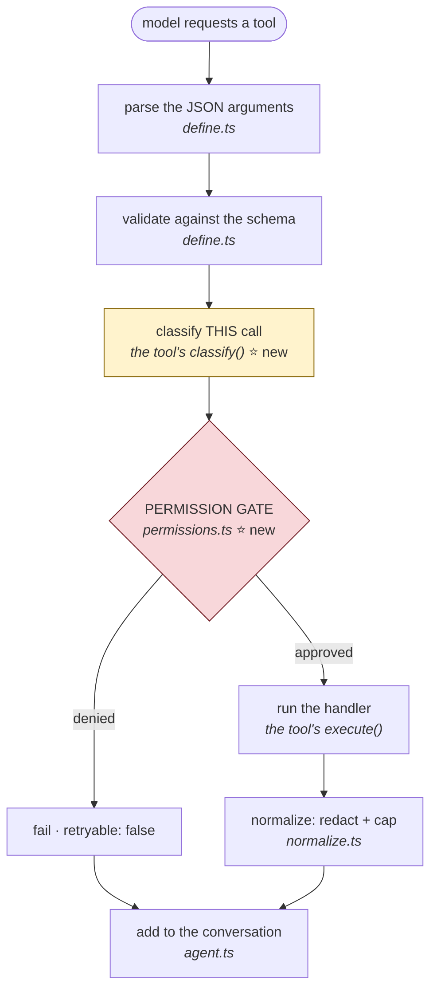

# Day 2 — Start Here

Day 1 built an agent that could **read**. Day 2 gives it the ability to
**change things** — and everything here follows from that one difference.

Read Day 1 first if you haven't. These notes assume it.

| File | What it covers |
|---|---|
| `00-start-here.md` | What changed and why. Read this first. |
| `01-permission-gate.md` | `src/permissions.ts` — asking the human |
| `02-running-processes.md` | `src/exec.ts` — spawning, killing, and not getting hacked |
| `03-edit-file.md` | `src/tools/edit_file.ts` — exact string replacement |
| `04-discovery-tools.md` | `list_files`, `search_code`, and command injection |
| `05-git-and-test-tools.md` | `git_status`, `git_diff`, `run_tests` |
| `06-terminal-io.md` | Bracketed paste, and rendering a diff you can trust |
| `07-testing.md` | The test suite, and the three real bugs it caught |
| `08-concepts-cheatsheet.md` | New concepts, one page |
| `09-quiz-and-exercises.md` | Test yourself |

---

## The one idea that matters most

On Day 1 the worst thing a bug could do was **show you wrong information**.

From Day 2 onward, the worst thing a bug can do is **delete your work, run a
command you didn't want, or leak a secret to a third party.**

That changes the engineering. Every design decision on Day 2 answers one
question:

> *When this goes wrong — and it will — what is the damage?*

You'll see the same three answers repeatedly:

1. **Ask a human first** (the permission gate)
2. **Fail closed** — when unsure or unfinished, refuse
3. **Make the dangerous thing impossible to express**, not merely discouraged

That third one is the strongest, and it's worth understanding the difference.
"Remember to escape the pattern" is a rule people forget. Passing arguments as
an array so a shell never sees them means there is *nothing to escape*. Same
outcome, but one relies on vigilance and the other doesn't.

## What the agent can do now

| Tool | Class | Asks first? |
|---|---|---|
| `list_files` | READ | no |
| `search_code` | READ | no |
| `read_file` | READ (or READ_SENSITIVE) | only for credential files |
| `git_status` | READ | no |
| `git_diff` | READ | no |
| `edit_file` | WRITE (or DESTRUCTIVE) | **yes** |
| `run_tests` | EXECUTE | **yes** |
| `run_command` | EXECUTE (or DESTRUCTIVE) | **yes** |

The split is not "which tools are scary" — it's **can this change anything?**
`git_status` reads git; it never alters it. `run_tests` runs arbitrary code
from `package.json`, so it asks, even though it *feels* harmless.

## The new shape of a tool call

Day 1's lifecycle grew one step:



Two things about where the gate sits:

**After validation** — so the prompt describes a *real* call. You should never
be asked to approve something that was going to fail anyway.

**Inside `defineTool`, not inside each tool** — so no tool can skip it. Same
"one road" idea as Day 1's redaction. A tool author cannot forget the gate,
because the gate isn't theirs to remember.

## New files

```
src/
├── permissions.ts     the gate: classification, allow/deny/ask, session memory
├── exec.ts            the only place that spawns a process
├── paste.ts           bracketed paste, so a paste doesn't submit itself
├── render.ts          diff rendering for the approval prompt
└── tools/
    ├── edit_file.ts     exact string replacement
    ├── list_files.ts    walk the tree
    ├── search_code.ts   ripgrep / grep
    ├── git_status.ts    working tree state
    ├── git_diff.ts      what changed
    ├── run_tests.ts     the project's own suite
    └── run_command.ts   arbitrary shell
```

Plus `src/tests/` — 156 tests, no framework.

## A question to hold onto

As you read, keep asking: **what stops this from being abused?**

Sometimes the answer is the permission gate. Sometimes it's the workspace
boundary. Sometimes it's that the dangerous form simply cannot be written —
which is the best answer of the three, and the one Day 2 reaches for most.

Now go to `01-permission-gate.md`.
