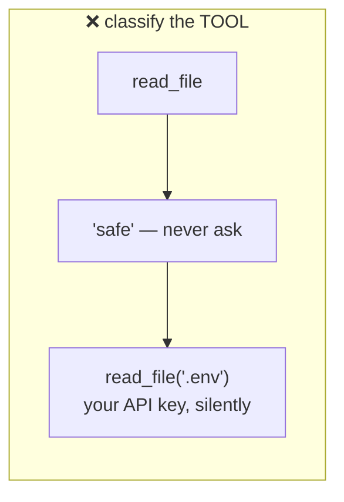
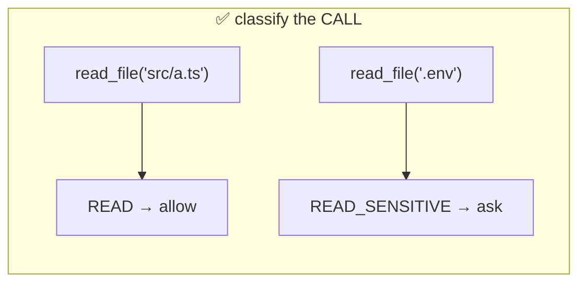
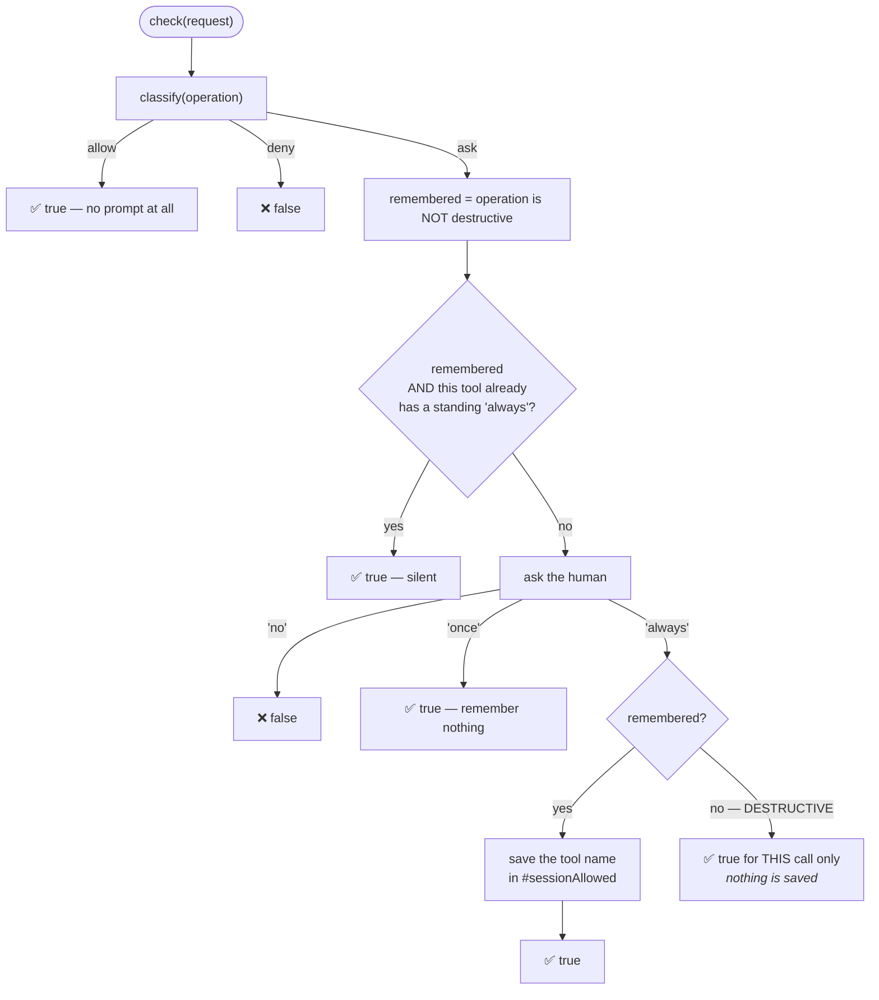
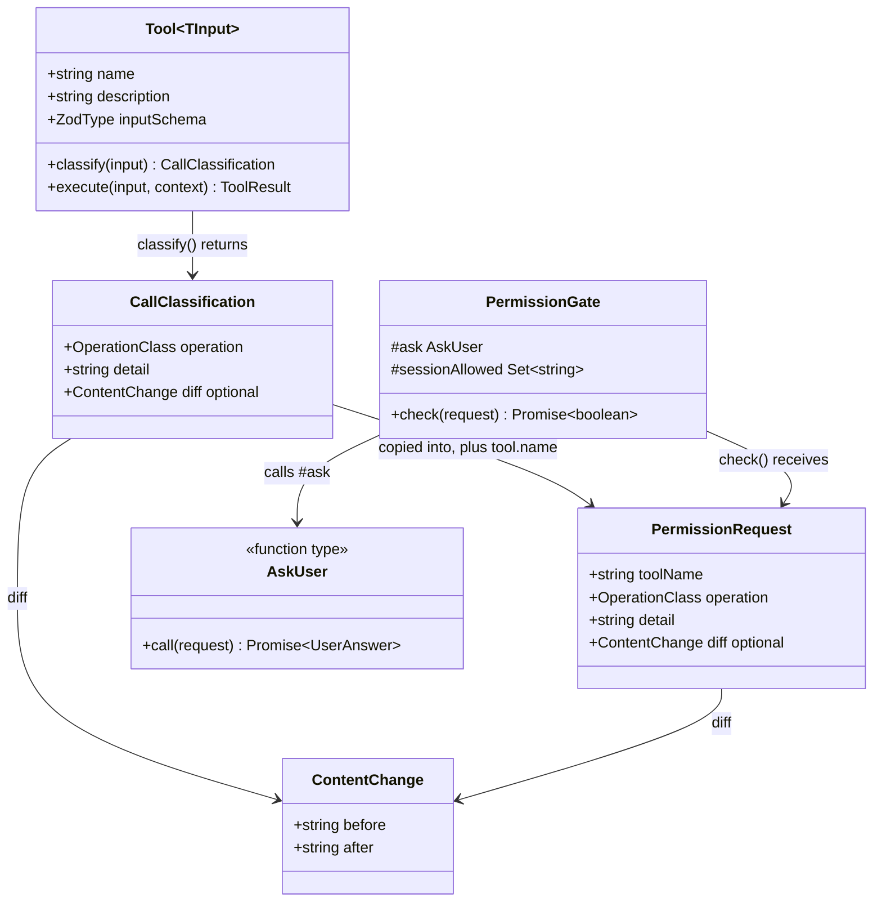
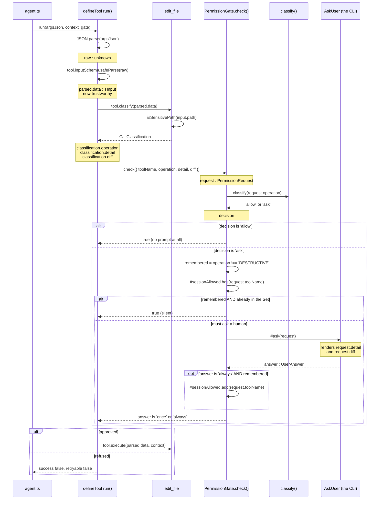
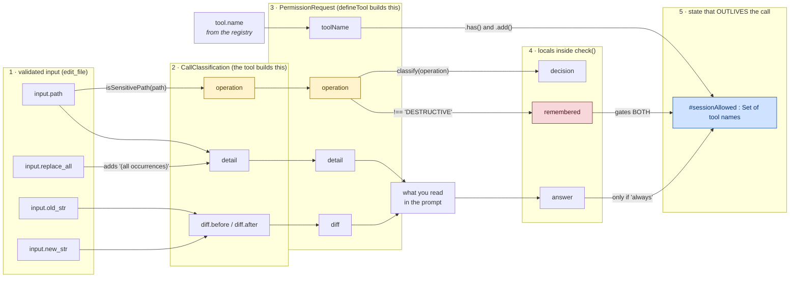

# 01 — The Permission Gate (`src/permissions.ts`)

The gate decides whether a tool call runs. It is small — about 90 lines — and
almost all of the interesting parts are about **what it refuses to do**.

---

## Concept 1 — Classification, not a list of scary tools

A naive gate would be:

```ts
const DANGEROUS = ['edit_file', 'run_command'];   // ❌
if (DANGEROUS.includes(toolName)) ask();
```

This breaks immediately. `read_file` on `src/a.ts` is harmless; `read_file` on
`.env` is not. `edit_file` on a source file is routine; `edit_file` on `.env` is
serious. **The tool name doesn't determine the risk — the call does.**





**Same tool. Different risk. The argument is what decides.**

So instead each *call* is classified:

```ts
export type OperationClass =
  | 'READ'
  | 'READ_SENSITIVE'
  | 'WRITE'
  | 'EXECUTE'
  | 'DESTRUCTIVE'
  | 'GIT_STATE_CHANGE';
```

And the policy maps class → decision:

```ts
export function classify(operation: OperationClass): Decision {
  switch (operation) {
    case 'READ':
      return 'allow';
    case 'READ_SENSITIVE':
    case 'WRITE':
    case 'EXECUTE':
    case 'DESTRUCTIVE':
    case 'GIT_STATE_CHANGE':
      return 'ask';
  }
}
```

**Note there is no `default` case.** `OperationClass` is a union of six strings
and all six are handled, so TypeScript proves the function always returns. Add a
seventh class later and this stops compiling until you decide its policy — which
is exactly what you want for a security decision. A `default: return 'ask'`
would have silently swallowed it.

## Concept 2 — Dependency injection, and why the gate has no `console.log`

```ts
/** Supplied by the CLI. The gate never touches stdin or stdout itself. */
export type AskUser = (request: PermissionRequest) => Promise<UserAnswer>;

export class PermissionGate {
  readonly #ask: AskUser;
  constructor(ask: AskUser) {
    this.#ask = ask;
  }
}
```

The gate does not know a terminal exists. It is handed a function that answers
questions.

Two payoffs, and the second is bigger than it looks:

1. **ARCHITECTURE §2 holds** — approval prompts belong to the CLI layer.
2. **It is testable.** Every rule below is verified with a scripted `AskUser`
   that returns canned answers, with no TTY anywhere. A gate that called
   `readline` directly could only be tested by driving a real terminal, which
   in practice means it wouldn't be tested at all.

> **The general lesson:** if a piece of logic reaches out to the outside world
> itself, you can't test it. If it *receives* the outside world as a parameter,
> you can. Hard-to-test code is usually badly-shaped code, not code that needs a
> cleverer test.

---

## The code

### What a request carries

```ts
export interface PermissionRequest {
  readonly toolName: string;
  readonly operation: OperationClass;
  /** The target, in one short line: a path, or a command. */
  readonly detail: string;
  readonly diff?: ContentChange;
}
```

**`diff` is structured, not pre-formatted text.** The gate could have taken a
ready-made string with colours in it, and originally it did. That was wrong:
formatting is the CLI's job. Handing over `{ before, after }` lets the CLI
decide how to draw it — which is what made the readable diff in
`06-terminal-io.md` possible without touching this file.

### The decision

```ts
async check(request: PermissionRequest): Promise<boolean> {
  const decision = classify(request.operation);
  if (decision === 'allow') return true;
  if (decision === 'deny') return false;

  const remembered = request.operation !== 'DESTRUCTIVE';

  if (remembered && this.#sessionAllowed.has(request.toolName)) return true;

  const answer = await this.#ask(request);

  if (answer === 'always' && remembered) {
    this.#sessionAllowed.add(request.toolName);
    return true;
  }
  // An "always" on a destructive op still approves this one call, no more.
  return answer === 'once' || answer === 'always';
}
```

The whole decision as a picture:



Follow the two paths out of `SAVE`. That fork is the whole safety property:
**"always" on a destructive call approves the call and remembers nothing.**

Read it line by line.

**`if (decision === 'allow') return true;`** — plain reads never reach the
prompt. If they did, you'd approve twenty times per question and stop reading
them, which destroys the value of the prompts that matter.

**`#sessionAllowed`** is a `Set` of tool *names*. Saying "always" to `edit_file`
does not silence `run_command`. This is scoping: an approval covers the thing
you approved, not everything.

### ⭐ The `remembered` flag — the most important four lines

```ts
const remembered = request.operation !== 'DESTRUCTIVE';
```

ARCHITECTURE §8 says: *"Destructive operations are never silently automatic."*

That one boolean enforces it in **two** places:

1. `remembered && this.#sessionAllowed.has(...)` — a standing approval is not
   even *consulted* for a destructive call.
2. `answer === 'always' && remembered` — answering "always" to a destructive
   call does not record anything.

So:

```
you: edit_file on src/a.ts  → "always"    ✅ remembered
     edit_file on src/b.ts  → runs silently
     edit_file on .env      → asks anyway  ← DESTRUCTIVE
```

The same tool, already blessed, still stops. Because what was classified as
dangerous was the *call*, not the tool.

**Why write it as a variable rather than two separate checks?** Because both
places must agree. If you wrote the condition twice and later relaxed one, you'd
have a gate that refuses to use a standing approval but happily records one —
broken in a way that's invisible until it matters.

**The last line is subtle:**

```ts
return answer === 'once' || answer === 'always';
```

An "always" on a destructive operation still approves **this** call. It just
doesn't get remembered. The user said yes; we honour the yes, and forget it.

---

## How a tool declares its class

In `src/tools/define.ts`:

```ts
export interface Tool<TInput> {
  /**
   * Classify this call. Runs after validation, before the gate, so the input
   * is trustworthy and the prompt can describe exactly what will happen.
   */
  classify(input: TInput): CallClassification;
}
```

`read_file` uses it like this:

```ts
classify(input) {
  return isSensitivePath(input.path)
    ? { operation: 'READ_SENSITIVE', detail: `${input.path}  — credential file` }
    : { operation: 'READ', detail: input.path };
}
```

Same tool, two classes, decided by the argument.

`run_command` does the same with a pattern list:

```ts
const destructive = DESTRUCTIVE.some((re) => re.test(input.command));
return {
  operation: destructive ? 'DESTRUCTIVE' : 'EXECUTE',
  detail: input.command,
};
```

> **Be honest about what that list is.** It catches `rm -rf`, `sudo`,
> `git push --force`, pipe-to-shell. It is a *heuristic*, not a wall — a
> determined command dodges it. Its real job is narrower and worth stating
> precisely: it guarantees those cases are **re-confirmed every single time**,
> because the gate refuses to let a standing approval cover DESTRUCTIVE.
>
> A security control you describe accurately is useful. One you describe as
> stronger than it is becomes dangerous, because people trust it too far.

## Where the gate is called

```ts
// ARCHITECTURE §4: parse -> validate -> PERMISSION GATE -> handler.
const classification = tool.classify(parsed.data);
const approved = await gate.check({
  toolName: tool.name,
  operation: classification.operation,
  detail: classification.detail,
  ...(classification.diff ? { diff: classification.diff } : {}),
});
if (!approved) {
  return {
    success: false,
    error: `Denied by the user: ${classification.detail}`,
    retryable: false,
  };
}
```

Inside `defineTool`, so **every** tool passes through it.

**`retryable: false`** on denial matters. Marking it retryable would invite the
model to ask again immediately — turning "no" into a prompt loop. A refusal is
final for that call.

### The gate is deliberately absent from ToolContext

```ts
export interface ToolContext {
  readonly workspaceRoot: string;
}
```

A tool receives the workspace root and nothing else. It cannot see the gate, so
it cannot consult it, re-run it, or work around it. By the time `execute` runs,
the decision is already made and unchangeable.

That is least privilege: a component that never receives a capability cannot
misuse it.

> **Note for later:** on Day 3 `ToolContext` gains one more field, `signal?`,
> so a running command can be cancelled. Still no gate.

---

## ⭐ The full journey — every function, every field

Everything above explained the pieces one at a time. This section puts them
together: **which function calls which, and which field of which interface
each one touches.**

### 1 · The cast

Five shapes are involved. Three are data, one is a function type, one is a
class that holds state.



Notice `CallClassification` and `PermissionRequest` are **almost identical**.
The only difference is `toolName`.

That is on purpose. A tool describes *its own call* and genuinely does not know
its registered name — `defineTool` adds it. **A tool cannot lie about which
tool it is.**

### 2 · The call chain

Now the order things actually happen in, with the variable each step produces:



Read the `alt` blocks as forks in the road. Only one branch runs.

### 3 · ⭐ Where every field comes from, and where it goes

This is the picture the code alone does not give you. Follow any single field
left to right.



Three things worth pausing on:

**`input.path` is used twice, for two different purposes.** Once to decide the
`operation` (is this a credential file?), once to build the human-readable
`detail`. One field, two jobs.

**`operation` is the busiest field in the system.** It is produced by the tool,
copied into the request, and then read **twice more** inside `check()` — once
by `classify()` to get the decision, once to compute `remembered`. Everything
hangs off it.

**`#sessionAllowed` is the only thing in blue** because it is the only thing
that survives after `check()` returns. Everything else is created and thrown
away within a single call. That is why it is the only place a bug can *persist*.

### 4 · A worked trace

Same tool, three calls, in order. Watch the variables change.

**Call 1 — `edit_file` on `src/agent.ts`, you answer `always`**

| Step | Variable | Value |
|---|---|---|
| `tool.classify` | `classification.operation` | `'WRITE'` |
| | `classification.detail` | `'src/agent.ts'` |
| | `classification.diff` | `{ before: '...', after: '...' }` |
| `check` | `request.toolName` | `'edit_file'` |
| | `decision` | `'ask'` |
| | `remembered` | `true` |
| | `#sessionAllowed.has('edit_file')` | `false` → must ask |
| | `answer` | `'always'` |
| | `#sessionAllowed` after | `{ 'edit_file' }` ← **changed** |
| | returns | `true` |

**Call 2 — `edit_file` on `src/config.ts`**

| Step | Variable | Value |
|---|---|---|
| `check` | `decision` | `'ask'` |
| | `remembered` | `true` |
| | `#sessionAllowed.has('edit_file')` | `true` → **return early** |
| | `answer` | *never computed — no prompt shown* |
| | returns | `true` |

**Call 3 — `edit_file` on `.env`**

| Step | Variable | Value |
|---|---|---|
| `tool.classify` | `classification.operation` | `'DESTRUCTIVE'` ← `isSensitivePath` |
| `check` | `decision` | `'ask'` |
| | `remembered` | **`false`** |
| | `#sessionAllowed.has(...)` | *never consulted — `remembered` is false* |
| | `answer` | `'always'` (say you answer that) |
| | `#sessionAllowed` after | `{ 'edit_file' }` ← **unchanged** |
| | returns | `true`, for this one call only |

Call 3 is the whole safety property in one row: the standing approval from
call 1 exists, the Set still contains `'edit_file'`, and **it is simply not
looked at**, because `remembered` is `false`.

Then a fourth call to `.env` would ask again. And a fifth. Every time.

---

## Things to remember

1. Classify the **call**, not the tool. The same tool can be READ or DESTRUCTIVE.
2. An exhaustive `switch` with no `default` forces you to decide the policy for
   any new class.
3. Inject the way you ask the user. It keeps layers clean *and* makes the logic
   testable.
4. Scope standing approvals — per tool, never global.
5. Destructive operations are never covered by a standing approval.
6. When one rule needs enforcing in two places, compute it once.
7. Denial is `retryable: false`, or "no" becomes a loop.
8. Don't hand a component a capability it doesn't need.
9. Describe heuristics accurately. Overstating a control is worse than not
   having it.

## Try it yourself

1. Add a `'NETWORK'` class to `OperationClass` and don't touch `classify`.
   Run `npm run typecheck`. The error you get is the safety property in action.
2. Delete `&& remembered` from the recording branch. Run `npm test` — the
   destructive test fails and tells you why.
3. Run the agent, approve `edit_file` with `a`, edit two files silently, then
   ask it to edit `.env`. Watch it stop.

Next: `02-running-processes.md`.
