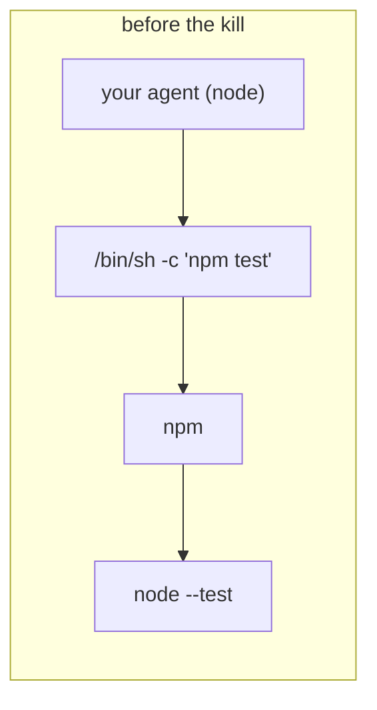
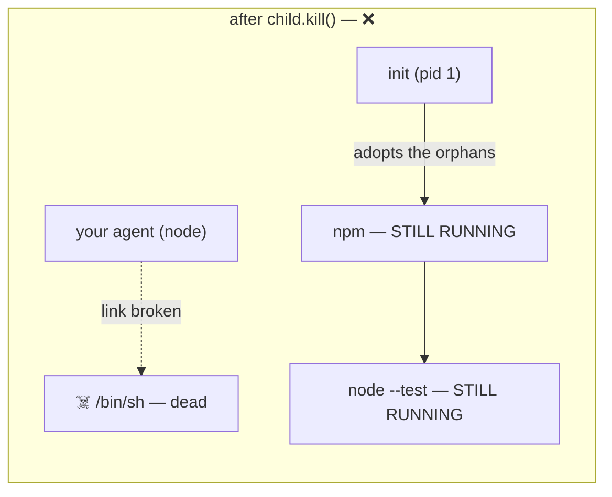
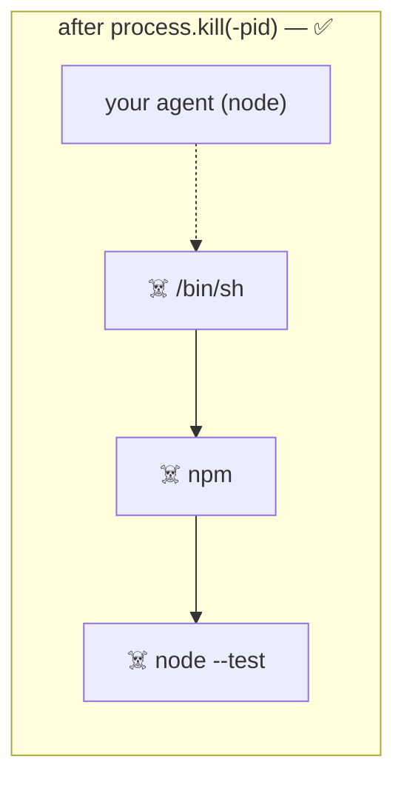
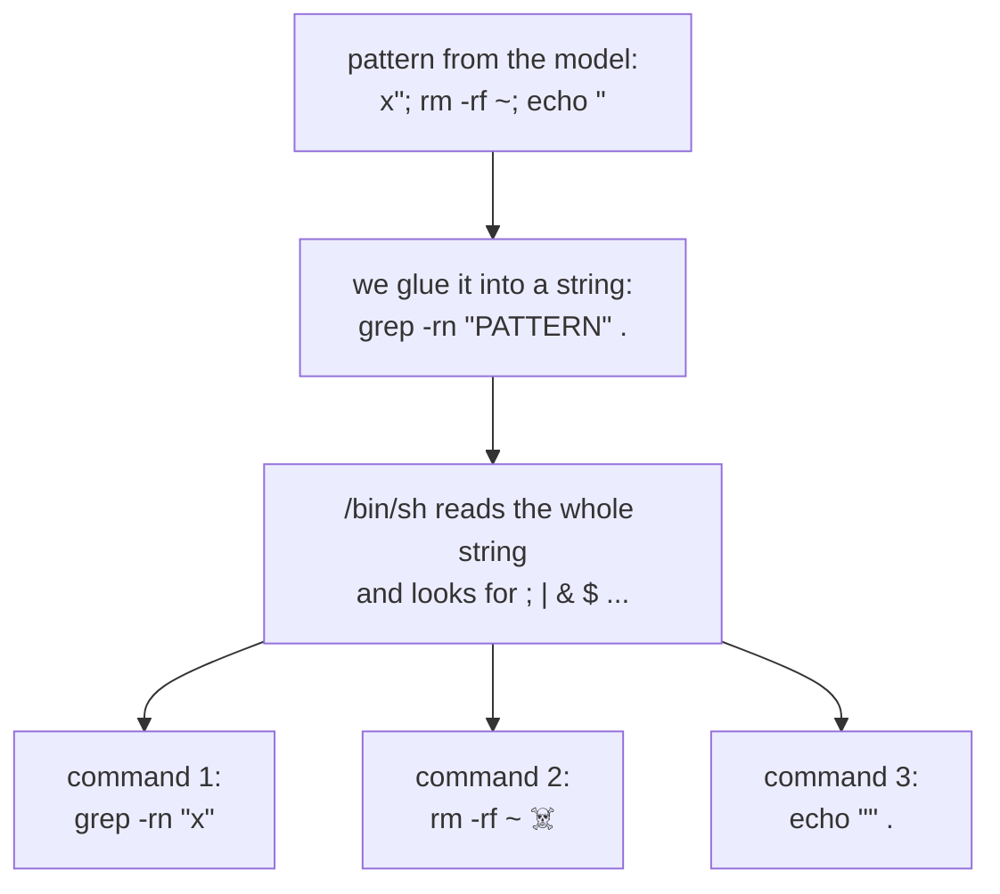
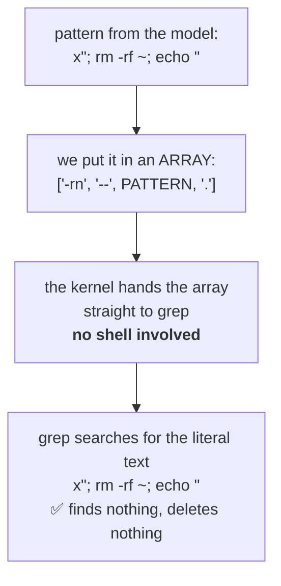

# 02 — Running Processes (`src/exec/exec.ts`)

This file is the **only** place in the codebase that spawns a process
(a CLAUDE.md non-negotiable). Every tool that needs to run something —
`run_command`, `search_code`, `git_status`, `git_diff`, `run_tests` — comes
through here.

It is also where two genuinely dangerous mistakes live, and both are worth
understanding properly.

---

## Concept 1 — Processes, children, and grandchildren

When you run a command, you create a **process**. That process can create
others. They form a tree:

```
your agent (node)
└── /bin/sh -c "npm test"          ← the child we spawned
    └── npm
        └── node --test            ← grandchildren
```

The trap: **killing a process does not kill its children.**

```ts
child.kill('SIGTERM');   // kills only /bin/sh
```





`sh` dies. `npm` and `node` keep running, now **orphaned** — reparented to init,
invisible to you, still burning CPU. Run that a few dozen times during a long
session and you have a machine full of zombie test runners.

The fix kills the whole **group**, not one process:



### Process groups

Unix gives every process a **process group id (pgid)**. Signals can be sent to a
whole group at once, using a *negative* pid:

```ts
process.kill(-pid, 'SIGTERM');   // the group led by `pid`
```

For that to work, the child must be a group *leader*, which is what this does:

```ts
const child = spawn(file, [...args], {
  detached: true,   // new process group, so we can kill the whole tree
  ...
});
```

`detached: true` puts the child in a new group with `pgid === child.pid`. Its
children inherit that group. So `kill(-child.pid)` reaches every descendant.

```ts
function killGroup(pid: number, signal: NodeJS.Signals): void {
  try {
    process.kill(-pid, signal);
  } catch {
    // Already exited, or the group is gone. Nothing left to kill.
  }
}
```

**Why the empty catch?** There's an unavoidable race: the process may exit
between deciding to kill it and doing so. `process.kill` then throws ESRCH — but
the outcome we wanted (it isn't running) already happened. Nothing to do.

Note this is a *justified* empty catch, with the reason written down. That's the
bar — see `02-config-and-zod.md` from Day 1.

### Proving it

This isn't theory. Day 2's test runs both approaches side by side:

```
child.kill('SIGTERM')            →  2 orphaned processes survived
process.kill(-pid, 'SIGTERM')    →  0
```

The test in `src/tests/exec/exec.test.ts` spawns `sleep N & sleep N`, times it out,
and asserts nothing matching survives. If someone "simplifies" `killGroup` to
`child.kill()`, that test fails.

### Escalation

```ts
const timer = setTimeout(() => {
  timedOut = true;
  const pid = child.pid;
  if (pid === undefined) return;

  killGroup(pid, 'SIGTERM');
  // Escalate for anything that ignores SIGTERM. unref() so this timer
  // alone cannot keep the process alive.
  setTimeout(() => killGroup(pid, 'SIGKILL'), GRACE_MS).unref();
}, timeoutMs);
```

**SIGTERM is polite** — "please shut down", and a program can catch it to clean
up. **SIGKILL cannot be caught or ignored.** So: ask nicely, wait 3 seconds,
then insist.

**`.unref()`** tells Node "this timer alone should not keep the process alive".
Without it, exiting immediately after a command would hang for 3 seconds waiting
on a timer whose only job is cleanup.

---

## Concept 2 — Shell versus argv, and command injection

This is the single most important security idea in Day 2.

### Two ways to run a program

```ts
// Through a shell — the string is parsed by /bin/sh
spawn('/bin/sh', ['-c', 'grep foo src/']);

// Directly — arguments are separate strings, no shell involved
spawn('grep', ['foo', 'src/']);
```

The shell gives you pipes, redirection, globbing, `&&`. It also **interprets
metacharacters**: `;` `|` `&` `$` `` ` `` `>` all mean something.

### The attack

Imagine `search_code` built a shell string:

```ts
runCommand(`grep -rn "${pattern}" .`, { cwd });   // ❌ NEVER DO THIS
```

Now the model sends this pattern:

```
x"; rm -rf ~; echo "
```

The command becomes:

```sh
grep -rn "x"; rm -rf ~; echo "" .
```



Three commands. The second one deletes your home directory. The model didn't
have to be malicious — it could have read that text in a file it was
summarising.

**This is command injection**, and it is one of the oldest and most reliably
catastrophic bugs there is.

### The fix that actually works

Not escaping. **Not using a shell.**

```ts
export function runProgram(
  file: string,
  args: readonly string[],
  options: RunCommandOptions,
): Promise<CommandResult> {
  return spawnAndCollect(file, args, options);
}
```



Compare the two diagrams. In the first, a shell *reads* the pattern and looks
for punctuation. In the second, **nothing reads it at all** — it is handed
across as one opaque string.

Each argument goes to `execve` as its own string. The kernel hands `grep` an
array. **No shell ever sees the pattern**, so there are no metacharacters to
escape — `;` is just a semicolon, `rm -rf ~` is just text to search for.

> **Escaping is a rule you must remember. Argv is a shape where the mistake
> cannot be expressed.** Prefer the second whenever you can.

### Both entry points

```ts
/**
 * Only for commands the user has approved as a whole. Never build one of these
 * by interpolating model-supplied text — use `runProgram` instead.
 */
export function runCommand(command: string, options): Promise<CommandResult> {
  return spawnAndCollect('/bin/sh', ['-c', command], options);
}
```

`runCommand` keeps the shell, because `run_command` genuinely needs pipes and
redirection — and the *whole* command is shown to you and approved before it
runs. The danger isn't the shell; it's a shell command assembled from parts you
never saw.

**The rule:** any argument that came from the model → `runProgram`.

### The `--` separator

Even without a shell, one problem remains: an argument beginning with `-` is
read as a *flag*.

```ts
args.push('--', input.pattern, target);
```

`--` means "everything after this is data, not options". Without it, a search
for `--version` would make grep print its version instead of searching. Tested
in `discovery.test.ts`.

---

## The rest of the file

### Bounded output collection

```ts
function createCollector(limit: number) {
  let text = '';
  let dropped = 0;

  return {
    push(chunk: string): void {
      const room = limit - text.length;
      if (room <= 0) {
        dropped += chunk.length;
        return;
      }
      ...
    },
    value(): string {
      return dropped > 0
        ? `${text}\n[... ${dropped} more characters dropped ...]`
        : text;
    },
  };
}
```

**Why cap while collecting instead of truncating at the end?** Because
`yes | head -c 400000` — or worse, `yes` with no limit — would fill memory
before you ever got to truncate it. This bounds memory *during* the run.

Note this is a different cap from `normalize.ts`. Two layers, two purposes:

| Cap | Where | Purpose |
|---|---|---|
| `maxOutputChars` | exec.ts, while running | protect **memory** |
| `MAX_CHARS` | normalize.ts, after | protect the **context window** |

### Stripping secrets from the child environment

```ts
const SECRET_ENV_NAME = /(?:KEY|TOKEN|SECRET|PASSWORD|PASSWD|CREDENTIAL)/i;

function childEnv(): NodeJS.ProcessEnv {
  const env: NodeJS.ProcessEnv = {};
  for (const [name, value] of Object.entries(process.env)) {
    if (SECRET_ENV_NAME.test(name)) continue;
    env[name] = value;
  }
  return env;
}
```

Think about what happens without this. Your `OPENAI_API_KEY` is in
`process.env`. Child processes inherit the environment. So:

```
run_command("env")
```

...dumps your API key into the command output, which flows straight back into
model context and over the network. Not an attack — just `env`.

So any variable whose *name* looks secret-bearing is removed from the child.
Broad by design: a false positive means a command can't see one variable; a
false negative means a leaked credential.

### A non-zero exit is not an exception

```ts
resolve({
  success: !timedOut && exitCode === 0,
  ...
});
```

`exit 42` is a *result*. `npm test` failing is a *result* — arguably the most
useful result there is. These come back as `CommandResult` with
`success: false`, and the model reads them and reacts.

Exceptions are for things that shouldn't happen. A failing test isn't one.

### `'close'`, not `'exit'`

```ts
// 'close' rather than 'exit': it fires after the stdio streams have
// flushed, so no trailing output is lost.
child.on('close', (code) => finish(code));
```

`exit` fires when the process ends. `close` fires when its output pipes are also
drained. Listening to `exit` loses the last chunk of output — including, very
often, the error message you actually needed.

### The `settled` guard

```ts
let settled = false;
const finish = (exitCode, spawnError?) => {
  if (settled) return;
  settled = true;
  ...
};
```

Both `'error'` and `'close'` can fire. A Promise can only resolve once —
resolving twice is silently ignored, which hides bugs. The flag makes
"first one wins" explicit.

---

## Things to remember

1. Killing a process does **not** kill its children.
2. `detached: true` + `process.kill(-pid, sig)` kills the whole group.
3. SIGTERM first, SIGKILL after a grace period. `.unref()` the escalation timer.
4. **Never interpolate model text into a shell string.** Use argv.
5. `--` stops flag parsing so data starting with `-` stays data.
6. Cap output while collecting, not after — memory is spent during the run.
7. Strip secret-shaped env vars from children. `env` would leak them otherwise.
8. Non-zero exit = result, not exception.
9. `'close'` not `'exit'`, or you lose trailing output.
10. Guard multi-path resolution with a `settled` flag.

## Try it yourself

1. Change `killGroup` to use `child.kill(signal)` instead. Run `npm test` —
   watch the orphan test fail. Put it back.
2. In `search_code.ts`, temporarily switch `runProgram` to a `runCommand` with
   the pattern interpolated. Run `npm test`. The injection test will create a
   file called `INJECTED` and fail. **Revert immediately.**
3. Run the agent and ask it to `run_command("env")`. Approve it. Search the
   output for your API key — it isn't there.

Next: `03-edit-file.md`.
