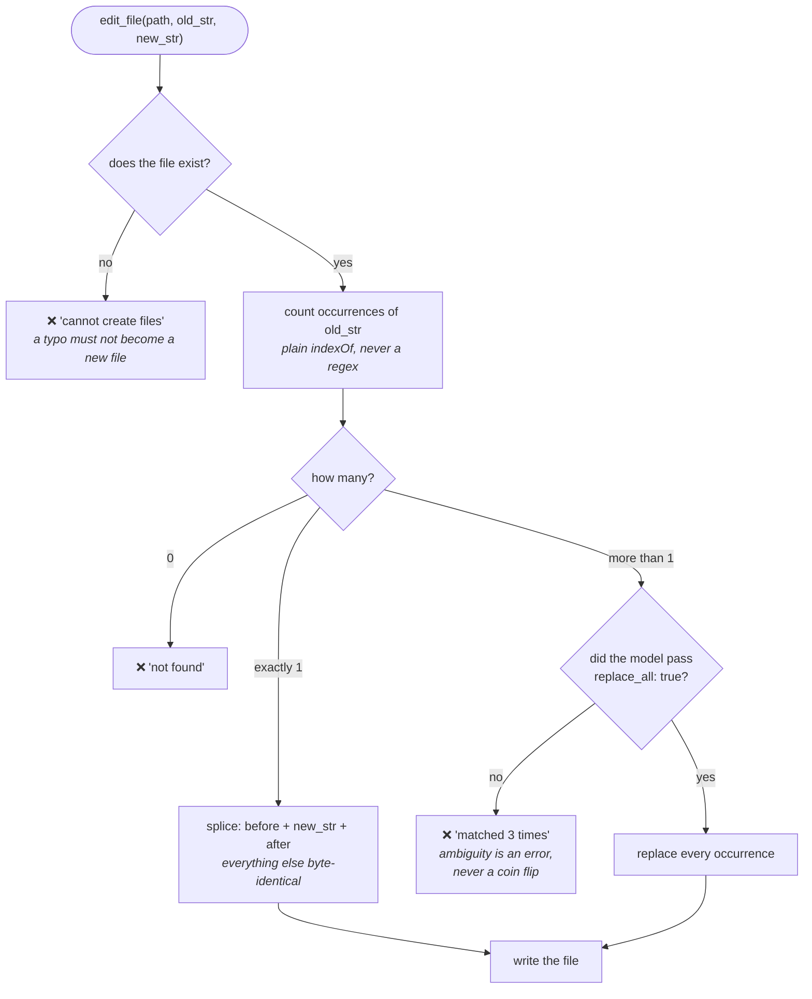

# 03 — Editing Files (`src/tools/edit_file.ts`)

The first tool that changes your code. ARCHITECTURE §6 gives it five rules, and
every one exists because of a specific way editing goes wrong.

---

## Why not just let the model rewrite the file?

The obvious design: model reads the file, model produces the new file, we write
it. It's simpler and it's what a lot of early tools did.

It fails badly:

- **Silent damage.** The model regenerates 400 lines to change one, and quietly
  drops a function it didn't think was important. You won't notice for weeks.
- **Cost and latency.** Rewriting a large file means emitting the whole thing.
- **Unreviewable.** "Here is the entire new file" is not something you can
  meaningfully approve. "Change line 12 from X to Y" is.

So CLAUDE.md makes it a non-negotiable:

> `edit_file` always does exact string replacement (`old_str -> new_str`), never
> a full-file rewrite.

The model says *what to find* and *what to put there*. We do the surgery.

---

## The five rules

All five as one decision tree — every path either edits exactly what you meant,
or refuses and explains why. **There is no path that guesses.**



### §6.1 — The file must exist, and `old_str` must be in it

```ts
let content: string;
try {
  content = await readFile(absolute, 'utf8');
} catch (err) {
  const code = (err as NodeJS.ErrnoException).code;
  if (code === 'ENOENT') {
    return {
      success: false,
      error: `File not found: ${input.path}. edit_file cannot create files.`,
      retryable: false,
    };
  }
  ...
}
```

**Why refuse to create files?** Consider a typo:

```json
{ "path": "src/agnet.ts", "old_str": "...", "new_str": "..." }
```

If `edit_file` created missing files, this writes a new file called `agnet.ts`,
reports **success**, and `agent.ts` is untouched. The model believes the job is
done. You find out much later.

Failing loudly turns a silent wrong outcome into an obvious error the model can
correct. **A tool that can't fail is a tool that lies to you.**

### §6.2 — Ambiguity is an error, never a guess

```ts
const occurrences = countOccurrences(content, input.old_str);

if (occurrences > 1 && input.replace_all !== true) {
  return {
    success: false,
    error:
      `old_str appears ${occurrences} times in ${input.path}. Include ` +
      'more surrounding context to make it unique, or pass ' +
      'replace_all: true to change every occurrence.',
    retryable: true,
  };
}
```

This is the most important rule in the file.

If `old_str` matches three times, which one did the model mean? Picking the
first is a **coin flip that silently corrupts your code**. The edit "succeeds",
the wrong line changes, and nothing tells you.

So: refuse, say how many matches there were, and offer the two ways forward.

**`retryable: true`** is right here — the model can add surrounding context to
make the string unique and try again. Notice the error message *teaches* it how.

`replace_all` exists but must be **explicitly** opted into. The dangerous
behaviour is available; it just can't happen by accident.

### The counter avoids regex entirely

```ts
/** Non-overlapping literal occurrences. No regex — old_str is never a pattern. */
function countOccurrences(haystack: string, needle: string): number {
  let count = 0;
  let index = haystack.indexOf(needle);
  while (index !== -1) {
    count++;
    index = haystack.indexOf(needle, index + needle.length);
  }
  return count;
}
```

Why not `content.match(new RegExp(old_str, 'g'))`?

Because `old_str` is **code**, and code is full of regex metacharacters. A
string like `arr[0]` or `foo(bar)` or `a.b` would be interpreted as a *pattern*,
matching things it shouldn't and missing the literal text you wanted. `.` alone
matches any character.

`indexOf` is literal. Nothing is interpreted. Same reasoning as
`split(secret).join()` in Day 1's `redact.ts`.

**`index + needle.length`** makes matches non-overlapping. Searching `aaa` for
`aa` gives 1, not 2. Overlapping matches can't both be replaced anyway.

### §6.3 — Splice, never regenerate

```ts
let updated: string;
let changedAt: number;
if (input.replace_all === true) {
  changedAt = content.indexOf(input.old_str);
  updated = content.split(input.old_str).join(input.new_str);
} else {
  changedAt = content.indexOf(input.old_str);
  updated =
    content.slice(0, changedAt) +
    input.new_str +
    content.slice(changedAt + input.old_str.length);
}
```

The single-match branch is the whole idea in three lines:

```
[ everything before ] + [ new text ] + [ everything after ]
```

Every other byte is carried across untouched — trailing newlines, tabs versus
spaces, `\r\n`, unusual Unicode. A test pins this down with a deliberately
fussy file:

```ts
const fussy = 'line one\n\n\tindented\n\nlast\n';
```

Edit one part, assert the rest is byte-identical.

`split().join()` for `replace_all` is again the literal form — no regex.

### §6.4 — Write only after approval

`edit_file` contains **no permission code at all**. It declares what kind of
call this is:

```ts
classify(input) {
  const scope = input.replace_all === true ? ' (all occurrences)' : '';
  const diff = { before: input.old_str, after: input.new_str };

  return isSensitivePath(input.path)
    ? {
        operation: 'DESTRUCTIVE',
        detail: `${input.path}${scope}  — credential file`,
        diff,
      }
    : { operation: 'WRITE', detail: `${input.path}${scope}`, diff };
}
```

...and `defineTool` enforces it. By the time `execute` runs, approval already
happened. A test asserts a denied edit leaves the file byte-identical.

**Why is editing `.env` DESTRUCTIVE rather than WRITE?** Because DESTRUCTIVE is
never covered by a standing "always". You can approve `edit_file` once for
convenience and still be stopped before it writes to a credential file. Same
tool, different class, decided by the argument.

**`diff` is passed as structured data**, so the approval prompt can show you the
actual change. Approving a write you can't see isn't consent.

### §6.5 — Report enough to know it landed

```ts
const line = content.slice(0, changedAt).split('\n').length;
return {
  success: true,
  content:
    `Replaced ${occurrences} occurrence${occurrences === 1 ? '' : 's'} in ` +
    `${input.path}, first at line ${line}. ` +
    `File went from ${content.length} to ${updated.length} characters.`,
};
```

Three facts: how many, where, and how the size changed. Enough for the model to
sanity-check its own work — if it expected one replacement and got four, the
size delta says so.

**The line number** is computed by counting newlines *before* the change:
`slice(0, changedAt).split('\n').length`. Cheap, and much more useful to a human
reading the transcript than a character offset.

---

## Two extra guards

### The no-op check

```ts
if (input.old_str === input.new_str) {
  return {
    success: false,
    error: 'old_str and new_str are identical; nothing would change.',
    retryable: true,
  };
}
```

Runs before anything else. Models sometimes emit an edit where both sides match
— usually a sign of confusion. Writing the file unchanged would report success
and teach the model that its confused edit worked.

### Workspace resolution first

```ts
absolute = await resolveInWorkspace(context.workspaceRoot, input.path);
```

Before opening anything. `../../etc/hosts` is refused before a file handle
exists.

---

## Things to remember

1. Exact string replacement, never full-file regeneration.
2. Refuse to create files — a typo must fail, not silently write elsewhere.
3. Multiple matches = error, never "pick the first".
4. `replace_all` must be opted into explicitly.
5. Use `indexOf`, not regex — `old_str` is code, full of metacharacters.
6. Splice around the match so every other byte survives.
7. Approval happens in `defineTool`; the tool only *declares* its class.
8. Credential files are DESTRUCTIVE so no standing approval covers them.
9. Return what changed, where, and by how much.
10. `retryable: true` when the model can fix its own arguments.

## Try it yourself

1. Ask the agent to change something that appears twice. Read the error — then
   notice it tells the model exactly how to succeed.
2. Change `indexOf` to a `RegExp`, then edit a line containing `arr[0]`. Watch
   it fail to match. Revert.
3. Delete the `occurrences > 1` check so it silently picks the first match. Run
   `npm test` — the §6.2 test catches it.
4. After any real edit, run `git diff`. That is the habit `edit_file` is
   designed around.

Next: `04-discovery-tools.md`.
