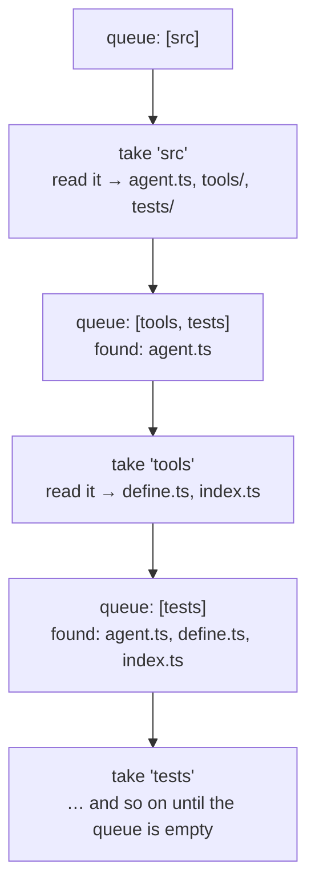

# 04 — Discovery: `list_files` and `search_code`

Before these, the agent was **blind**. It could read a file only if it already
knew the path. Ask "where is the permission logic?" and it had to guess.

These two tools are the biggest single jump in usefulness in the whole project,
and `search_code` is where the command-injection lesson from `02` gets applied
for real.

---

# Part 1 — `list_files`

## Walking a tree without recursion

```ts
async function walk(
  root: string,
  dir: string,
  recursive: boolean,
): Promise<WalkResult> {
  const entries: string[] = [];
  const queue: string[] = [dir];
  let truncated = false;

  while (queue.length > 0) {
    const current = queue.shift();
    if (current === undefined) break;
    ...
    if (recursive) queue.push(full);
  }

  return { entries, truncated };
}
```

This is **breadth-first search** using an explicit queue rather than recursive
function calls.

Watch the queue work. Take from the **front**, add to the **back**:



The whole tree gets visited, but **the function never calls itself.** The
"remembering where to go next" lives in a plain array instead of in the call
stack.

Why a queue instead of recursion?

- **No stack overflow** on a deep tree.
- **Breadth-first order** — you see the top of the tree before descending, which
  is what's useful when you're orienting yourself.
- **Easy to stop.** The entry cap below just returns; unwinding a deep
  recursion mid-walk is fussier.

`queue.shift()` takes from the front (FIFO = breadth-first). `queue.pop()` would
make it depth-first.

## `readdir` with `withFileTypes`

```ts
listing = await readdir(current, { withFileTypes: true });
...
if (entry.isDirectory()) { ... }
```

Without that option you get strings and have to `stat()` each one — an extra
syscall per entry. With it you get `Dirent` objects that already know what they
are.

## Skipping the noise

```ts
const SKIP = new Set([
  'node_modules', '.git', 'dist', 'build', 'coverage',
  '.next', '.cache', '.turbo', '.venv', '__pycache__',
]);
```

```ts
if (SKIP.has(entry.name)) {
  entries.push(`${shown}/  (skipped)`);
  continue;
}
```

**Note it still lists the directory, marked `(skipped)`.** Hiding it entirely
would let the model conclude `node_modules` doesn't exist and reason from a
false premise. Saying "it's here, I didn't look inside" is honest and more
useful.

`Set` rather than an array because `.has()` is O(1) and this runs per entry.

**This is not a security boundary.** It's about signal — `node_modules` in a
Node project is hundreds of thousands of files, and a recursive listing that
spent its budget there would be worthless. `workspace.ts` handles security.

## The entry cap

```ts
const MAX_ENTRIES = 1_000;
...
if (entries.length >= MAX_ENTRIES) {
  truncated = true;
  return { entries, truncated };
}
```

Same reasoning as every other cap: a recursive walk of a big repo could produce
100,000 lines and bury the conversation. The `truncated` flag becomes an
explicit note in the output, so the model knows the list is partial.

## Unreadable directories don't abort the walk

```ts
try {
  listing = await readdir(current, { withFileTypes: true });
} catch {
  continue; // unreadable subdirectory; skip rather than abort the walk
}
```

One permission-denied directory shouldn't destroy the whole listing. Skip it,
keep going — partial results beat none.

---

# Part 2 — `search_code`

## The security decision that shaped this tool

`search_code` takes a **pattern from the model** and passes it to a search
program. That is exactly the shape of a command-injection bug.

If it had been built the obvious way:

```ts
runCommand(`grep -rn "${input.pattern}" .`, { cwd });   // ❌
```

...then this pattern:

```
x"; rm -rf ~; echo "
```

...deletes your home directory. See `02-running-processes.md` for the full
mechanics.

So the tool uses `runProgram` — argv, no shell:

```ts
const [program, args] = useRipgrep
  ? (['rg', ripgrepArgs(input, target)] as const)
  : (['grep', grepArgs(input, target)] as const);

const result = await runProgram(program, args, {
  cwd: context.workspaceRoot,
  timeoutMs: SEARCH_TIMEOUT_MS,
});
```

The pattern is one element of an array. No shell sees it. There is nothing to
escape because nothing is being parsed.

There's a test that proves it, and it's worth reading:

```ts
test('SECURITY: a shell-metacharacter pattern is data, never code', async () => {
  const canary = join(root, 'INJECTED');
  const result = await search({
    pattern: `x"; touch ${canary}; echo "`,
    literal: true,
  });

  assert.equal(result.success, true, 'should complete as an ordinary search');
  await assert.rejects(
    () => import('node:fs/promises').then((fs) => fs.stat(canary)),
    'the injected command created a file — the pattern reached a shell',
  );
});
```

If someone reroutes this through `runCommand` later, `INJECTED` gets created and
the test fails. **That is what a security test looks like: it makes the
vulnerability reappear if the fix is removed.**

## And `--` for the other half of the problem

Even with no shell, an argument starting with `-` is read as a flag:

```ts
args.push('--', input.pattern, target);
```

Searching for `--version` without `--` prints the version instead of searching.
Also tested.

## Why this is classified READ

```ts
classify(input) {
  // READ, not EXECUTE: the program is fixed and every argument is passed
  // through execve as data, never interpreted by a shell.
  const where = input.path ?? '.';
  return { operation: 'READ', detail: `"${input.pattern}" in ${where}` };
}
```

`search_code` spawns a process, which sounds like EXECUTE. But:

- the **program** is fixed (`rg` or `grep`), not chosen by the model
- the **arguments** are data, never code
- it **changes nothing**

Prompting for every search would mean approving a dozen times per question,
which trains you to stop reading prompts. That would make the gate *less* safe
overall, not more.

> **A prompt that fires constantly is a prompt nobody reads.** Where to draw the
> line is a real judgement call, and the reasoning belongs in a comment.

## Probing for ripgrep once

```ts
let ripgrepAvailable: boolean | null = null;

async function hasRipgrep(cwd: string): Promise<boolean> {
  if (ripgrepAvailable === null) {
    const probe = await runProgram('rg', ['--version'], { cwd, timeoutMs: 5_000 });
    ripgrepAvailable = probe.success;
  }
  return ripgrepAvailable;
}
```

ripgrep is much faster and respects `.gitignore`, but isn't installed
everywhere. Rather than requiring it, we probe once and cache.

Three states, which is why the type is `boolean | null`:

| Value | Meaning |
|---|---|
| `null` | haven't checked |
| `true` | available |
| `false` | not installed, use grep |

Using plain `false` for "haven't checked" would re-probe on every search.

> **A real gotcha we hit:** `which rg` in an interactive shell said ripgrep was
> installed, but `spawn` got ENOENT. The shell had a *function* named `rg`;
> there was no binary. `spawn` with argv doesn't use the shell, so it doesn't
> see aliases or functions. **Always check availability the way your code will
> actually invoke it.**

## Two argument builders

```ts
function ripgrepArgs(input, target): string[] {
  const args = ['--line-number', '--no-heading', '--color', 'never', '--text'];
  if (input.literal === true) args.push('--fixed-strings');
  if (input.case_insensitive === true) args.push('--ignore-case');
  if (input.glob !== undefined) args.push('--glob', input.glob);
  for (const dir of SKIP_DIRS) args.push('--glob', `!${dir}/`);
  args.push('--', input.pattern, target);
  return args;
}
```

`grepArgs` does the same with BSD/GNU grep flags (`-r -n -I`, `-F`/`-E`, `-i`,
`--include=`, `--exclude-dir=`). Two vocabularies, one behaviour.

`--color never` / `--no-heading` matter: we want plain `path:line:text` for the
model, not terminal formatting.

## Exit code 1 is an answer, not a failure

```ts
// Both tools exit 1 for "no matches", which is an answer, not a failure.
if (result.exitCode === 1 && result.stdout === '') {
  return {
    success: true,
    content: `No matches for "${input.pattern}" in ${target}.`,
  };
}
```

Both grep and ripgrep use exit 1 for "found nothing" and 2 for "something went
wrong". Treating 1 as failure would report a successful search as broken, and
the model would retry pointlessly.

**Read the exit-code conventions of anything you shell out to.** They differ,
and "non-zero means error" is often wrong.

## Capping results

```ts
const limit = input.max_results ?? 100;
const lines = result.stdout.split('\n').filter((line) => line !== '');
const shown = lines.slice(0, limit);
const note =
  lines.length > limit
    ? `\n\n[... ${lines.length - limit} more matches; raise max_results or narrow the search ...]`
    : '';
```

Same pattern as everywhere else: cap, and *say* you capped, including how to get
more. A silent cap makes the model think it saw everything.

---

## Things to remember

1. Breadth-first with a queue — no stack overflow, better ordering, easy to cap.
2. `readdir({ withFileTypes: true })` avoids a `stat` per entry.
3. Show skipped directories rather than hiding them.
4. Any model-supplied argument → `runProgram`, never a shell string.
5. A security test should recreate the vulnerability if the fix is removed.
6. `--` stops flag parsing.
7. READ vs EXECUTE is about *effect*, not about whether a process spawns.
8. A prompt that fires constantly gets ignored — that's a security cost.
9. Probe for external tools the way your code invokes them, not via your shell.
10. grep/ripgrep exit 1 = "no matches", not an error.
11. Cap, and say that you capped.

## Try it yourself

1. `list_files` with `recursive: true` at the root. Find the `(skipped)` markers.
2. Ask the agent something that needs discovery: *"where is MAX_TURNS defined
   and what uses it?"* Watch it search, then read, then answer.
3. Search for `foo(bar)` with and without `literal: true`. The difference is
   regex interpretation.
4. Read the injection test in `src/tests/discovery.test.ts` and make sure you
   can explain what it proves.

Next: `05-git-and-test-tools.md`.
