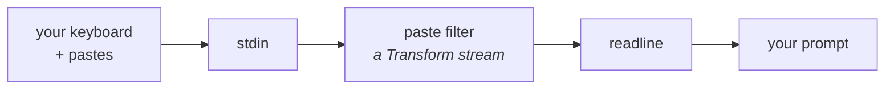
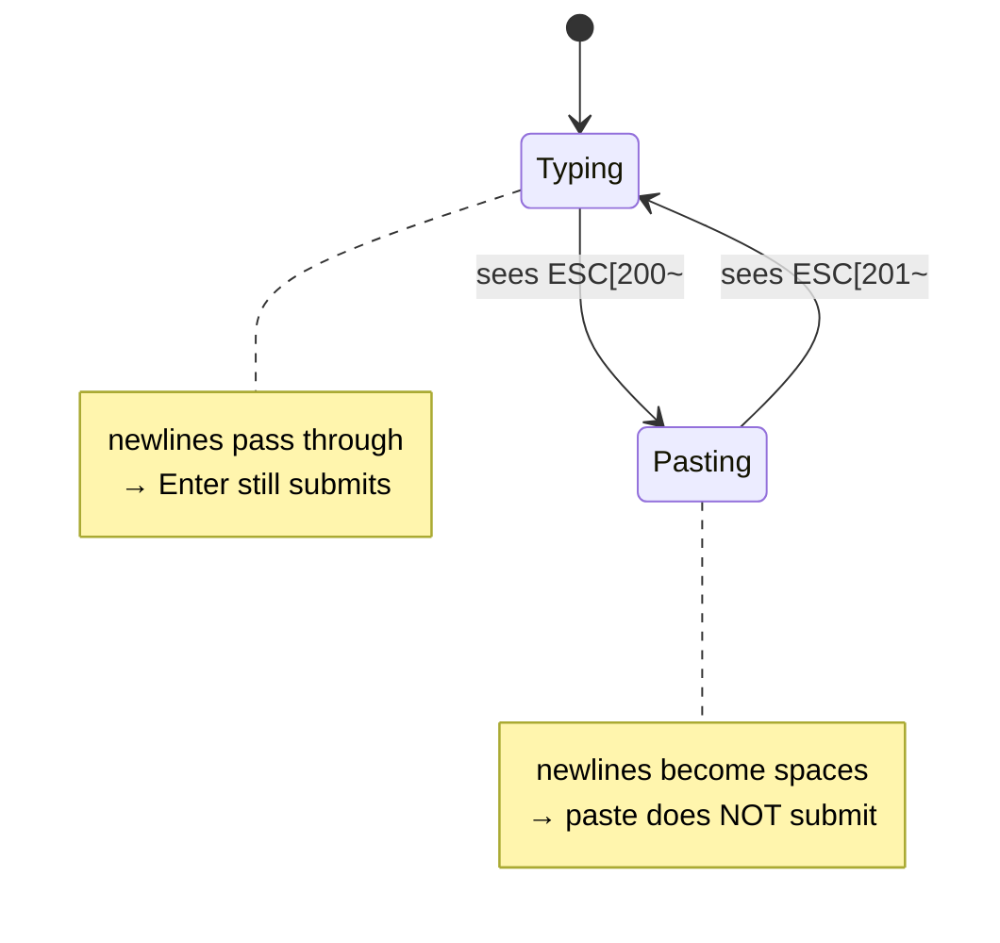
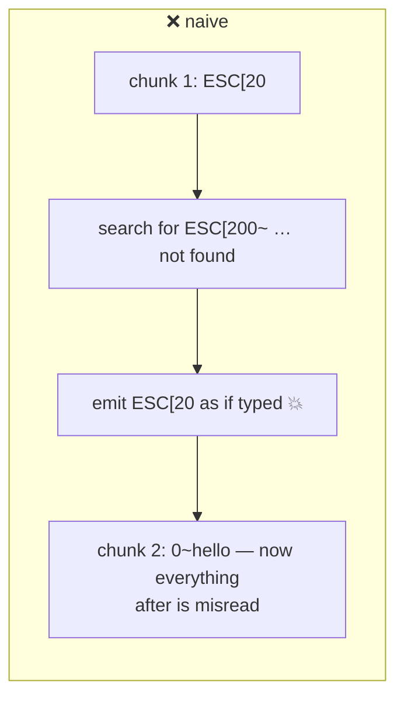
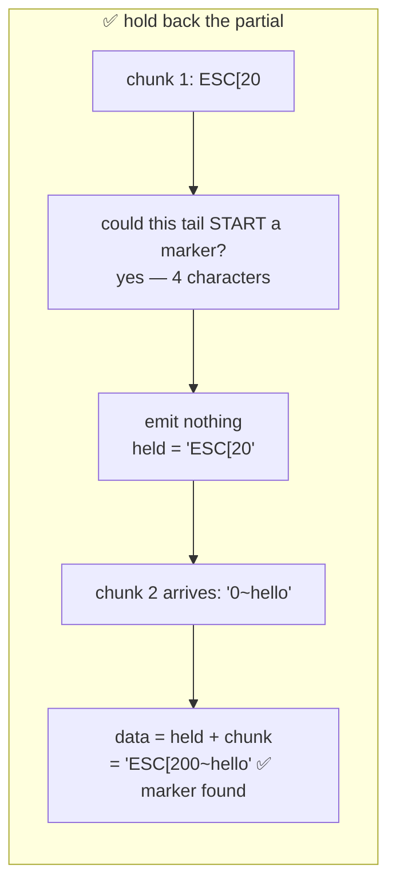

# 06 — Terminal I/O (`src/paste.ts`, `src/render.ts`)

Two problems that look cosmetic and aren't:

1. Pasting multi-line text submitted it immediately
2. The approval prompt showed a diff you couldn't read

The second one is a **security** bug wearing a UI costume, and it's the more
interesting of the two.

---

# Part 1 — Bracketed paste (`src/paste.ts`)

## The problem

Paste three lines into the REPL and it submits after the first one. The other
two land as separate prompts.

**Why:** a terminal sends pasted text as if you had typed it, character by
character — newlines included. `readline` sees a newline and does what a newline
means: submit the line. It has no way to know those keystrokes came from a
paste.

## Bracketed paste mode

Terminals support a mode where pasted text is wrapped in markers:

```
\x1b[200~   ...pasted content...   \x1b[201~
```

You turn it on by writing an escape sequence:

```ts
export const ENABLE_BRACKETED_PASTE = '\x1b[?2004h';
export const DISABLE_BRACKETED_PASTE = '\x1b[?2004l';
```

`h` = set (high), `l` = reset (low). Now a newline *inside* the markers is
distinguishable from a newline you typed.

## Filtering the stream

`readline` doesn't understand these markers, so we sit between it and stdin:

```ts
const rl = readline.createInterface({
  input: interactive ? stdin.pipe(createPasteFilter()) : stdin,
  output: stdout,
  terminal: interactive,
});
```

`createPasteFilter()` is a **Transform stream** — a stream that takes input,
changes it, and emits the result. Data flows:



The filter sits **in the middle** and rewrites the stream as it passes. readline
never learns that pastes exist — it just stops seeing newlines it should not act
on.

Inside the filter is a tiny state machine:



The filter tracks whether it is inside a paste, and converts newlines there into
spaces:

```ts
/** Newlines inside a paste must not reach readline, or it submits the line. */
function flatten(pasted: string): string {
  return pasted.replace(/\r\n|\r|\n/g, ' ');
}
```

Typed newlines pass through untouched, so Enter still submits.

## ⭐ The hard part: markers split across reads

This is the bit that's easy to get wrong.

Streams deliver **arbitrary chunks**. There is no guarantee a 6-byte marker
arrives in one piece. You might get:

```
chunk 1: "\x1b[20"
chunk 2: "0~hello\nworld\x1b[201~"
```

A naive `indexOf(PASTE_START)` finds nothing in chunk 1, emits `\x1b[20` to
readline as if it were typed, and then misreads everything after.





The fix is to hold back any trailing bytes that *could* be the start of a
marker:

```ts
function partialMarkerLength(text: string, marker: string): number {
  const max = Math.min(marker.length - 1, text.length);
  for (let length = max; length > 0; length--) {
    if (marker.startsWith(text.slice(text.length - length))) return length;
  }
  return 0;
}
```

"How many characters at the end of `text` form a prefix of `marker`?"

For `"abc\x1b[20"` and marker `"\x1b[200~"`, the answer is 4 — `\x1b[20` is a
prefix. So we emit `abc`, keep `\x1b[20` in `held`, and prepend it to the next
chunk.

We check from **longest to shortest** so we find the longest possible partial
match rather than a shorter coincidental one.

```ts
transform(chunk: Buffer, _encoding, callback): void {
  let data = held + chunk.toString('utf8');
  held = '';
  ...
}
```

Every chunk starts by re-attaching what was held back.

**The general lesson: any stream parser must handle a token split across chunk
boundaries.** This applies to HTTP parsing, protocol decoding, and log tailing.
It is the single most common bug in hand-written stream parsers, and it usually
only shows up under load, when chunks get split differently.

Tested by feeding a marker **one byte at a time**:

```ts
test('a marker split one byte at a time survives', async () => {
  const chunks = [...`${START}a\nb${END}`];
  assert.equal(await filter(chunks), 'a b');
});
```

## Raw mode and terminal restoration

```ts
const interactive = Boolean(stdin.isTTY);
if (interactive) {
  stdin.setRawMode(true);
  stdout.write(ENABLE_BRACKETED_PASTE);
}
```

**Raw mode** delivers keystrokes immediately instead of line-by-line. Needed
because readline now sees the *filter*, not the real TTY, so it can't set raw
mode itself.

```ts
} finally {
  rl.close();
  // Restore the terminal, whatever happened. Leaving bracketed paste or raw
  // mode on would corrupt the user's shell after we exit.
  if (interactive) {
    stdout.write(DISABLE_BRACKETED_PASTE);
    stdin.setRawMode(false);
    stdin.pause();
  }
}
```

**If you change global terminal state, you must restore it in a `finally`.**
Crash without restoring and the user's shell is left in raw mode — no line
editing, no Ctrl-C — until they run `reset`. You broke their terminal, not just
your program.

## `terminal: interactive` — a bug I introduced

I first wrote `terminal: true` unconditionally. That made readline emit
cursor-control codes (`\x1b[1G\x1b[0J`) into **piped** output, which is not a
terminal and has no cursor:

```
[1G[0J> [3G/exit
```

Correct version:

```ts
// Forced on when interactive, because readline sees the filter rather than
// the TTY and would otherwise skip line editing. Left off for a pipe, or
// readline emits cursor-control codes into non-terminal output.
terminal: interactive,
```

Two paths, two behaviours. Worth remembering that `isTTY` checks exist for a
reason and blanket-overriding them has consequences.

## The tradeoff, stated honestly

Newlines inside a paste become **spaces**. For prose prompts that's invisible.
If you paste code and need the line breaks, this loses them.

The alternative — preserving newlines in the buffer — needs a custom line editor
rather than `readline`, which is a much larger piece of work. This is a
deliberate, documented limitation, not an oversight.

---

# Part 2 — Rendering a diff you can trust (`src/render.ts`)

## The bug

The first approval prompt looked like this:

```
permission: write
  Edit "src/agent.ts"
      - /** Runaway-loop guard: a model that keeps calling tools must st… (+1 more lines)
      + /** Runaway-loop guard: a model that keeps calling tools must st… (+1 more lines)
  allow? [y]es / [n]o / [a]lways:
```

The `-` and `+` lines are **identical**.

Both `old_str` and `new_str` started with the same long comment line, and both
were truncated at the same column — so the truncation cut away the only part
that differed.

**This is not a cosmetic problem.** The entire purpose of that prompt is
informed consent. A prompt that cannot show you what will change is worse than
no prompt: it looks like a safeguard while providing none, and it trains you to
approve without reading.

## The fix: drop what's identical

```ts
const head = commonPrefixLength(beforeLines, afterLines);
const reversedB = [...beforeLines].reverse();
const reversedA = [...afterLines].reverse();
const tail = Math.min(
  commonPrefixLength(reversedB, reversedA),
  beforeLines.length - head,
  afterLines.length - head,
);

let removed = beforeLines.slice(head, beforeLines.length - tail);
let added = afterLines.slice(head, afterLines.length - tail);
```

Count identical lines from the **start**, then identical lines from the **end**
(by reversing and reusing the same helper). What remains is the change.

**Why `Math.min` with three arguments?** To stop head and tail overlapping. If
`before` is `a\nb` and `after` is `a\nb\nc`, the head consumes both shared
lines; without clamping, the tail would count them again and produce negative
slice bounds.

Result:

```
    - const MAX_TURNS = 25;
    + const MAX_TURNS = 30;
    (1 unchanged line hidden)
```

The shared comment is gone. You see the change.

## Character-level trimming for one-line edits

When both sides are a single line sharing a long prefix, line-level trimming
doesn't help:

```ts
if (removed.length === 1 && added.length === 1 && onlyRemoved && onlyAdded) {
  let shared = 0;
  while (
    shared < onlyRemoved.length &&
    shared < onlyAdded.length &&
    onlyRemoved[shared] === onlyAdded[shared]
  ) {
    shared++;
  }
  if (shared > 24) {
    const cut = shared - 8; // keep a little context before the change
    removed = [`…${onlyRemoved.slice(cut)}`];
    added = [`…${onlyAdded.slice(cut)}`];
  }
}
```

```
- …_HERE = 25;
+ …_HERE = 30;
```

**`shared - 8`** keeps a few characters before the difference so you have
context. **`> 24`** means don't bother unless it actually saves something.

## The regression test

```ts
test('REGRESSION: the two sides must not render identically', () => {
  const shared = 'x'.repeat(200);
  const out = lines(`${shared}\nold`, `${shared}\nnew`);
  const removed = out.find((line) => line.startsWith('-'));
  const added = out.find((line) => line.startsWith('+'));
  assert.notEqual(removed?.slice(1), added?.slice(1));
});
```

It doesn't assert a specific format — that would break on any styling change.
It asserts **the property that was violated**: the two sides must differ.

> **Write regression tests against the property, not the output.** A test that
> pins exact formatting fails on cosmetic edits and gets deleted. A test that
> pins meaning survives.

## Balanced escape sequences

```ts
test('output is coloured but every sequence is closed', () => {
  const raw = renderDiff('a', 'b', '  ');
  const opens = (raw.match(/\x1b\[(?:2|31|32)m/g) ?? []).length;
  const resets = (raw.match(/\x1b\[0m/g) ?? []).length;
  assert.equal(opens, resets, 'an unclosed sequence would leak colour into the shell');
});
```

An unclosed colour code doesn't end with your program — it leaks into the
user's shell until they run `reset`.

## The layering that made this possible

The gate passes **structured** data:

```ts
export interface PermissionRequest {
  readonly diff?: ContentChange;   // { before, after }
}
```

Not a pre-formatted string. So `permissions.ts` emits no ANSI codes and knows
nothing about terminal width, and the entire diff rewrite happened in
`render.ts` **without touching the gate at all**.

That's ARCHITECTURE §2 paying off concretely: rendering lives in the CLI layer,
so rendering can be changed in the CLI layer.

---

## Things to remember

1. Terminals send pastes as keystrokes; bracketed paste marks the boundaries.
2. Stream parsers **must** handle tokens split across chunks. Hold back partials.
3. Restore global terminal state in a `finally`, always.
4. Don't blanket-override `isTTY` behaviour — piped output has no cursor.
5. A prompt that can't show the change provides no consent.
6. Trim identical leading/trailing lines so the difference is visible.
7. Clamp head+tail so they can't overlap.
8. Regression tests should assert the **property**, not the exact output.
9. Unclosed ANSI codes leak into the user's shell.
10. Pass structured data across layers; let the display layer format it.

## Try it yourself

1. Paste three lines into the REPL. It should wait for you to press Enter.
2. Delete `stdout.write(DISABLE_BRACKETED_PASTE)` from the `finally`, run, quit,
   then paste something in your shell. Note the `200~` markers. Run `reset`.
3. In `renderDiff`, delete the head/tail trimming and ask the agent to edit a
   line under a long comment. You'll reproduce the original bug exactly.
4. Run `npm run dev > out.txt`, type a question, and check `out.txt` for stray
   escape codes. That's `terminal: interactive` working.

Next: `07-testing.md`.
