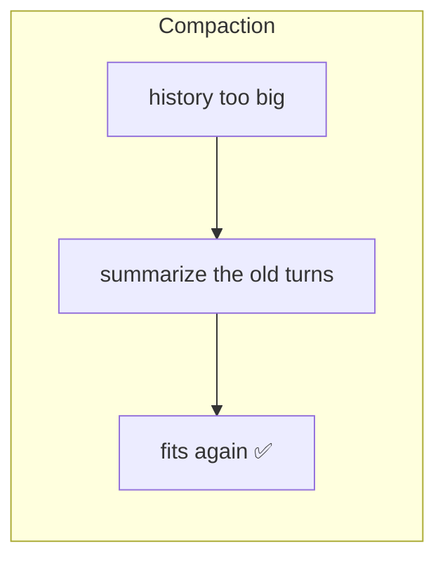
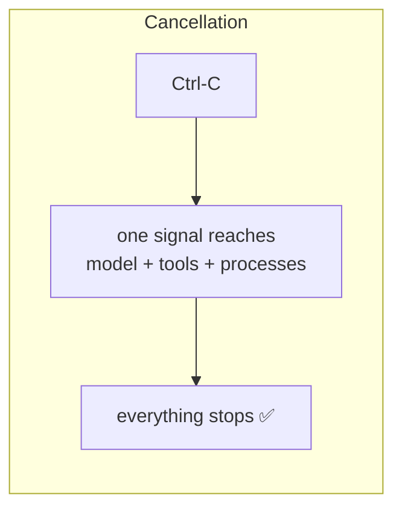

# Day 3 — Start Here

Day 1 asked: **how does an agent work?**
Day 2 asked: **what happens when it goes wrong?**

Day 3 asks a harder question:

> **What happens when it keeps working — for a long time?**

Everything we built so far works beautifully for ten minutes. Day 3 is about
the two things that break at minute forty.

---

## The two problems

### Problem 1 — the conversation never stops growing

Every message you send is added to a list. Every reply is added. Every tool
result is added. And here is the part people miss:

> **The whole list is sent to the model on every single request.**

Not the last message. The whole thing. Every time.

So turn 40 sends turn 1 again. And turn 2. And turn 3. The request gets bigger
and bigger, until one day the model says *"too big"* and refuses.

And then — this is the cruel part — the **next** request contains the same
oversized list, so it fails too. And the next. The session is dead. You cannot
even ask it "what happened?", because that question gets appended to the same
dead list.

**One failure, and the whole conversation is unrecoverable.**

### Problem 2 — you cannot stop it

You ask the agent to do something. It starts. You immediately realise you asked
the wrong thing.

You press Ctrl-C.

Nothing useful happens. The model keeps generating — and keeps charging you. If
a command was running, it keeps running. You have no brake pedal.

---

## What we built

| Problem | Fix | Where |
|---|---|---|
| History grows forever | **Compaction** — fold old turns into a summary | `src/context.ts` |
| No way to stop | **Cancellation** — one signal, all the way down | everywhere |





Two subsystems. Both touch code you already know, which is why they come now
and not earlier.

---

## The one idea behind Day 3

Both features share a shape. Learn it once, see it twice:

> **You are allowed to throw things away — but only at a point where the
> structure stays valid.**

Compaction throws away old messages. Cancellation throws away pending work.

Both are easy to get *almost* right, and being almost right is fatal in the
exact same way: you leave the conversation in a shape the model cannot read,
and then **nothing works ever again**.

Hold that sentence. Chapters 03 and 05 are both about the same trap, wearing
two different costumes.

---

## Read in this order

| File | What it gives you |
|---|---|
| `01-the-context-problem.md` | Why history grows, and why failing is permanent |
| `02-counting-tokens.md` | Measuring something you cannot measure exactly |
| `03-where-to-cut.md` | ⭐ The most important chapter in Day 3 |
| `04-writing-the-summary.md` | Turning old turns into a paragraph |
| `05-cancellation.md` | One signal, four layers, one nasty trap |
| `06-testing-what-you-cannot-see.md` | Fake providers, and breaking code on purpose |
| `07-concepts-cheatsheet.md` | One page, everything new |
| `08-quiz-and-exercises.md` | Test yourself |

---

## The state of the project

```
206 tests, all passing
8 tools
~3,000 lines of source
```

New file this time: **`src/context.ts`**. Changed files: `agent.ts` (a real
restructure), `exec.ts`, `provider.ts`, `config.ts`, `index.ts`,
`tools/define.ts`, and five tools that spawn processes.

Next: `01-the-context-problem.md`.
