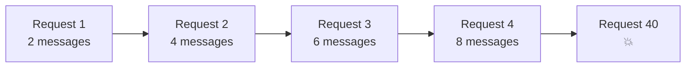
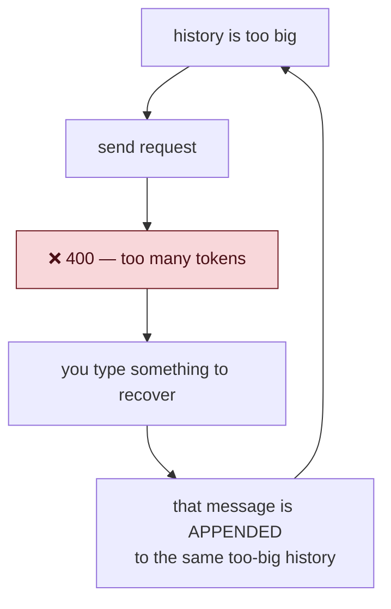
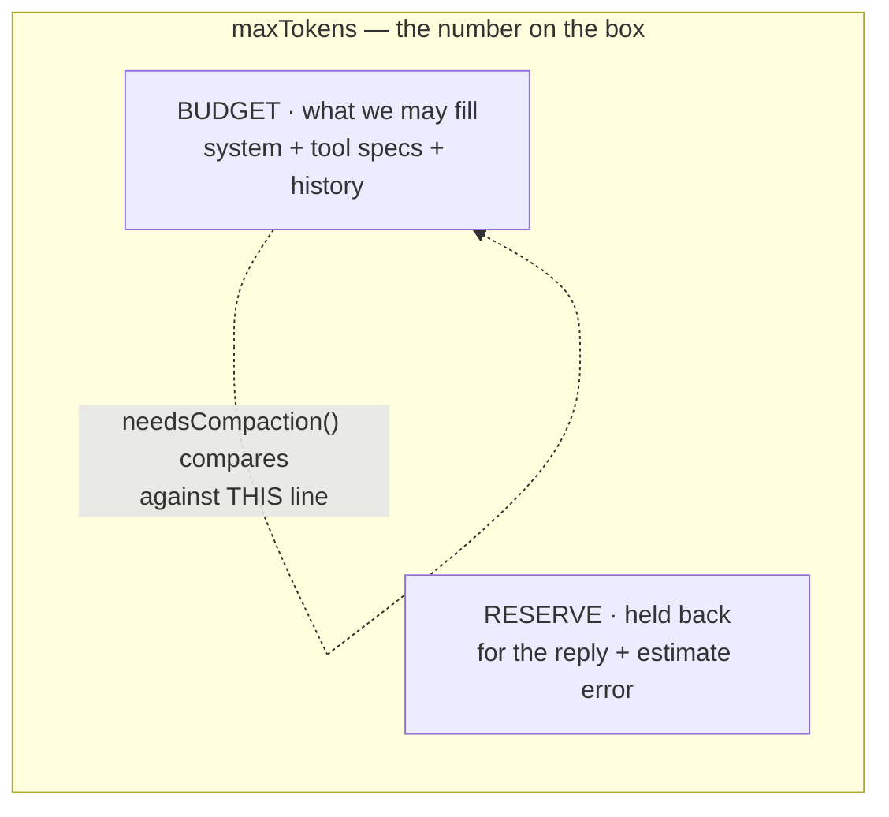

# 01 — The Context Problem

Before any code, you need to feel the problem in your gut. Otherwise the
solution looks like over-engineering.

---

## The model has no memory

This surprises everyone at first.

The model does **not** remember your last message. It does not remember
anything. It is a function: text goes in, text comes out. Nothing is stored
between calls.

So how does a conversation work?

**We re-send the entire history every time.** That is the whole trick.

```
Request 1:  [system, user1]
Request 2:  [system, user1, assistant1, user2]
Request 3:  [system, user1, assistant1, user2, assistant2, user3]
Request 4:  [system, user1, assistant1, user2, assistant2, user3, assistant3, user4]
```



The "memory" you experience is an illusion we create by repeating ourselves.

That is exactly what `#history` in `agent.ts` is — the tape we replay.

---

## Now add tools

A plain chat grows slowly. An **agent** grows fast, because tool results go
into history too.

Watch what one small request costs:

```
you:        "fix the failing test"                    ~10 tokens
assistant:  calls run_tests                           ~20 tokens
tool:       80,000 characters of test output      ~26,000 tokens  ← !!
assistant:  calls read_file                           ~20 tokens
tool:       the whole file                         ~3,000 tokens
assistant:  calls edit_file                          ~200 tokens
tool:       "ok"                                      ~10 tokens
assistant:  calls run_tests again                     ~20 tokens
tool:       more output                           ~26,000 tokens
```

**One request. Roughly 55,000 tokens.** And every one of them is re-sent on the
next request, and the one after that, forever.

Three or four requests like that and a 128,000-token window is gone.

> A chat grows like a diary. An agent grows like a diary that copies the
> entire filing cabinet into itself every time it writes a line.

---

## Why the failure is permanent

This is the part that makes it urgent, not just untidy.

Suppose we do nothing. Eventually:

```
Request 40  →  provider: 400 Bad Request — too many tokens
```

Annoying. But you shrug and type again:

```
Request 41  =  [everything from request 40] + [your new message]
            →  400 Bad Request — too many tokens
```

**It is worse.** You added a message to a list that was already too big.

```
Request 42  →  400
Request 43  →  400
```



**Look at that loop.** Every attempt to fix it makes it worse. This is a trap
with no exit.

There is no way out from inside the conversation. Every attempt to recover
makes the thing bigger. You must throw away the entire session and start over.

Compare with a normal bug:

| | Normal bug | Running out of context |
|---|---|---|
| You get | an error | an error |
| You retry | it might work | **guaranteed to fail again** |
| Recovery | possible | impossible from inside |
| Cost | annoyance | the whole session |

> **This is the difference between a bug and a disaster.** A bug gives you an
> error. A disaster takes the recovery path away too.

Now the design pressure makes sense:

**We must shrink the history *before* the failure — because after the failure,
shrinking is no longer possible.**

---

## The context window

The **context window** is the maximum number of tokens one request may contain.
It covers everything:

```
┌──────────────────── the context window ────────────────────┐
│ system prompt │ tool specs │ conversation history │ reply  │
└─────────────────────────────────────────────────────────────┘
```

Two things people forget:

1. **The tool specs count.** We send the JSON Schema for all 8 tools on every
   request. That is not free.
2. **The reply counts.** The model needs room to *answer*. If you fill the
   window exactly to the edge, there is nowhere for the answer to go.

So the usable space is always less than the number on the box.



**We never aim at `maxTokens`. We aim at `budget`.**

That is why the policy has a `reserveTokens`:

```ts
export function defaultPolicy(maxTokens: number): CompactionPolicy {
  return {
    maxTokens,
    reserveTokens: Math.max(1_000, Math.min(16_000, Math.floor(maxTokens * 0.2))),
    keepRecentTurns: 2,
  };
}
```

Read it in plain English: **hold back 20% — but never less than 1,000 tokens
and never more than 16,000.**

Why clamp both ends?

- Without the floor, a tiny window reserves almost nothing and the reply has
  nowhere to go.
- Without the ceiling, a 1,000,000-token window would reserve 200,000 tokens
  for a reply that will be 500 tokens long. Pure waste.

```ts
export function budgetTokens(policy: CompactionPolicy): number {
  return policy.maxTokens - policy.reserveTokens;
}
```

**The budget, not the window, is the number we actually respect.**

---

## How big *is* the window?

Here is an awkward truth: **we cannot ask.**

There is no standard endpoint in the OpenAI-compatible API that says "my window
is 200,000 tokens." Different backends, different models, no common answer. And
this project must work against any endpoint — that was the whole point of using
an OpenAI-*compatible* interface.

So it becomes configuration:

```ts
MAX_CONTEXT_TOKENS: z.coerce
  .number()
  .int('must be a whole number')
  .min(4_000, 'must be at least 4000')
  .optional(),

const DEFAULT_MAX_CONTEXT_TOKENS = 128_000;
```

Three details worth noticing:

**`z.coerce.number()`** — everything in the environment is a string. `"32000"`
is not `32000`. Without coercion you would get a string where the code expects
a number, and `maxTokens * 0.2` would quietly do something absurd.

**`.min(4_000)`** — a window of `8` would put every conversation permanently
over budget. It would compact on every request, forever. Reject nonsense at the
boundary instead of behaving strangely later.

**Erring low is safe; erring high is fatal.** If you set it too low, you pay
for one extra summary. If you set it too high, you get the death spiral. So
when unsure, **guess small**.

---

## Things to remember

1. The model has no memory. History is re-sent in full, every request.
2. Agents grow much faster than chats, because tool output lands in history.
3. Running out of context is not a normal error — it removes the recovery path.
4. Therefore: shrink **before** the limit, never after.
5. The window holds system prompt + tool specs + history + **the reply**.
6. Always reserve room. Clamp the reserve at both ends.
7. You cannot ask an endpoint for its window size. Make it config.
8. Guess the window **low**. Low costs a summary; high costs the session.

## Try it yourself

1. Open `src/context.ts` and find `defaultPolicy`. Work out `budgetTokens` by
   hand for `maxTokens` of 8,000 / 128,000 / 1,000,000. Notice the clamps
   biting at both ends.
2. In `.env`, set `MAX_CONTEXT_TOKENS=4000`. Run the agent and ask two or three
   questions. You should see the compaction line appear almost immediately.
3. Set `MAX_CONTEXT_TOKENS=8` and run it. Read the error. That is `.min(4_000)`
   protecting you.
4. Explain to yourself, out loud, why a 400 on request 40 also breaks request
   41. If that feels obvious now, this chapter worked.

Next: `02-counting-tokens.md`.
