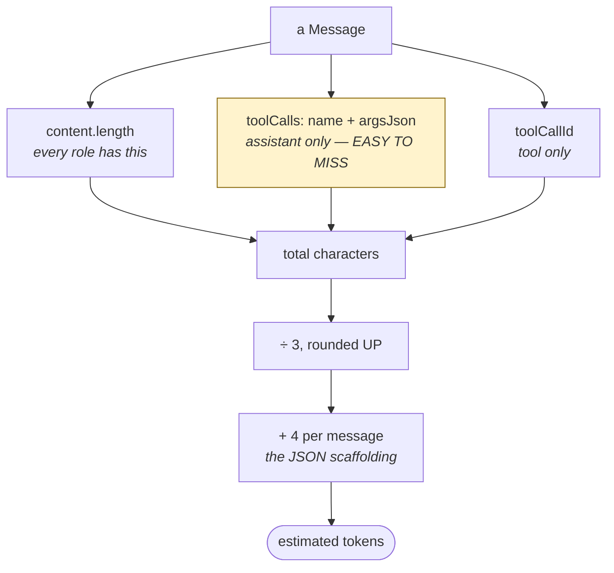

# 02 — Counting Tokens

To stay under a budget you must measure the thing. But tokens are surprisingly
hard to measure. This chapter is about doing a **deliberately imperfect job**,
and why that is the right call.

---

## What is a token?

Not a character. Not a word. Something in between.

A tokenizer chops text into pieces the model recognises:

```
"hello world"      →  ["hello", " world"]              2 tokens
"antidisestablish" →  ["anti", "dis", "establish"]     3 tokens
"{"path":"a.ts"}"  →  ["{", "\"", "path", "\"", ":", ...]  many tokens
```

Notice the last one. **Code and JSON tokenize badly.** All those braces, quotes
and colons each cost a token. Prose is efficient; JSON is expensive.

Rough real-world numbers:

| Kind of text | Characters per token |
|---|---|
| English prose | ~4 |
| Source code | ~3 |
| Dense JSON | ~2–3 |

---

## Why we do not use a real tokenizer

There *are* libraries that count exactly. We deliberately did not use one.

**Reason 1 — the right answer depends on the model.** Every model family
tokenizes differently. A library that counts correctly for one is wrong for
another.

**Reason 2 — we do not know which model we are talking to.** The whole point of
this project is that the endpoint can be swapped. Today OpenRouter, tomorrow a
self-hosted model. An exact tokenizer for the wrong model is **worse than an
estimate** — it is a wrong answer delivered with total confidence.

**Reason 3 — we do not need exactness.** We are not billing anyone. We only
need to know *"are we getting close?"*

> Precision you cannot trust is not precision. It is decoration.

So:

```ts
const CHARS_PER_TOKEN = 3;
const PER_MESSAGE_TOKENS = 4;
```

---

## Lean in the safe direction

This is the key move. Read the comment from the code:

> *Deliberately low, which over-estimates the token count: compacting slightly
> early is cheap, whereas discovering the real limit costs a failed request.*

Work it through. For 3,000 characters of prose:

- **Reality** (4 chars/token): 750 tokens
- **Our estimate** (3 chars/token): 1,000 tokens

We think it is bigger than it is. So we compact a little sooner than strictly
necessary.

What does that cost? One extra summarization, occasionally.
What does the opposite cost? The session.

**When your measurement is uncertain, make the error land on the safe side.**
That is not a hack — it is the entire discipline of estimating under
uncertainty, and it shows up everywhere from timeouts to disk quotas.

---

## The function

```ts
export function estimateTokens(messages: readonly Message[]): number {
  let chars = 0;
  for (const message of messages) {
    chars += message.content.length;
    if (message.role === 'assistant') {
      for (const call of message.toolCalls ?? []) {
        chars += call.name.length + call.argsJson.length;
      }
    } else if (message.role === 'tool') {
      chars += message.toolCallId.length;
    }
  }
  return (
    Math.ceil(chars / CHARS_PER_TOKEN) + messages.length * PER_MESSAGE_TOKENS
  );
}
```

Line by line.

**`chars += message.content.length`** — every message has a `content`. All four
roles. Start there.

**The `assistant` branch** — this is the one that is easy to forget.

A tool call is not in `content`. It lives in a separate field:

```ts
{ role: 'assistant', content: '', toolCalls: [{ id, name, argsJson }] }
```

`content` might be an **empty string** while `argsJson` is 900 characters of
arguments. If you only counted `content`, you would estimate *zero* for a
message that costs 300 tokens on the wire.

That is why there is a test for exactly this:

```ts
test('tool call arguments are counted, not just message content', () => {
  // Args are a real part of the request; ignoring them was how the estimate
  // could read "well under budget" for a request that then got rejected.
```

**The `tool` branch** — `toolCallId` is a real string that really gets sent.
Small, but free to count.

**`messages.length * PER_MESSAGE_TOKENS`** — this one is subtle and important.

Every message costs something *besides* its text. On the wire it becomes
something like:

```json
{"role":"assistant","content":"ok"}
```

The braces, the word `"role"`, the word `"content"` — all tokens. Roughly 4 per
message.

Why does this matter? Imagine 500 messages of one word each. Text-only counting
says ~500 tokens. Reality is ~2,500. **Many small messages are much more
expensive than one big one**, and only the per-message term captures that.

**`Math.ceil`** — round up, never down. Same principle: lean toward "bigger".

All four ingredients in one picture:



---

## When it is checked

```ts
export function needsCompaction(
  messages: readonly Message[],
  policy: CompactionPolicy,
): boolean {
  return estimateTokens(messages) > budgetTokens(policy);
}
```

And in the agent:

```ts
for (let turn = 0; turn < MAX_TURNS; turn++) {
  ...
  await this.#compactIfNeeded(signal);
```

Read that carefully — the check is **inside the loop**, not before it.

Why? Because one user turn can run up to 30 tool calls. Each can return 30,000
capped characters. A single turn can blow the window open all by itself,
without you typing anything.

Checking once per user message would be checking the wrong thing.

> **Check the budget wherever the thing can grow — not wherever it feels
> natural.**

---

## Things to remember

1. A token is a chunk of text. Code and JSON tokenize worse than prose.
2. Exact counting needs the model's own tokenizer — which you do not have when
   the model is swappable.
3. An exact count for the wrong model is worse than an honest estimate.
4. Choose 3 chars/token so you **over**-estimate. Cheap error, safe direction.
5. Count tool call arguments. `content` can be empty while args are huge.
6. Add a per-message cost. Many small messages are expensive.
7. `Math.ceil`, never floor.
8. Check the budget before **every** request, not once per user message.

## Try it yourself

1. In a scratch file, call `estimateTokens` on one 3,000-character message,
   then on 100 messages of 30 characters. Same total text. Compare the results
   and explain the gap.
2. Delete the `assistant` branch from `estimateTokens` and run `npm test`. Read
   which test fails and what its comment says.
3. Change `CHARS_PER_TOKEN` to `10` and run the agent with a small
   `MAX_CONTEXT_TOKENS`. You have just told the code the history is tiny when
   it is not. Predict what breaks before you try it.
4. Take a real `argsJson` from a tool call in your terminal, count characters,
   divide by 3. Then eyeball the JSON and ask whether 3 feels generous or tight
   for that particular string.

Next: `03-where-to-cut.md`.
