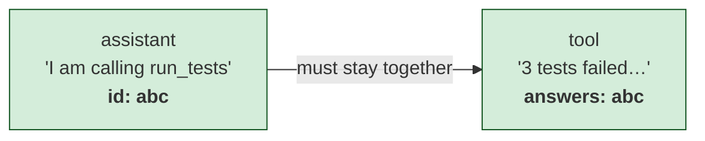
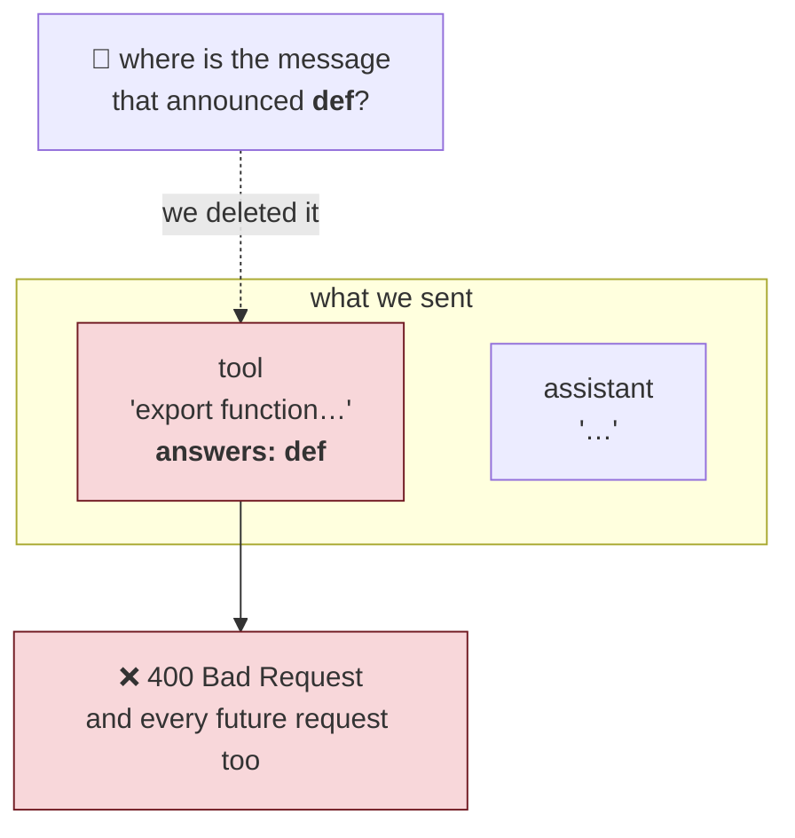
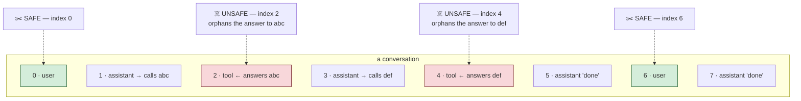
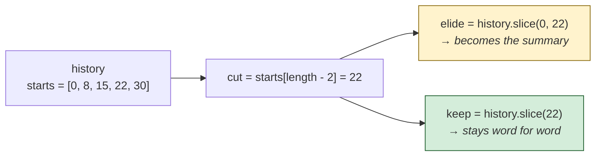
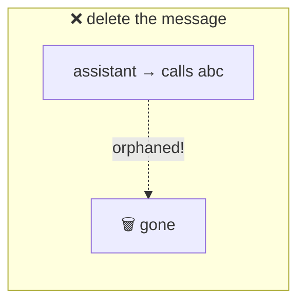
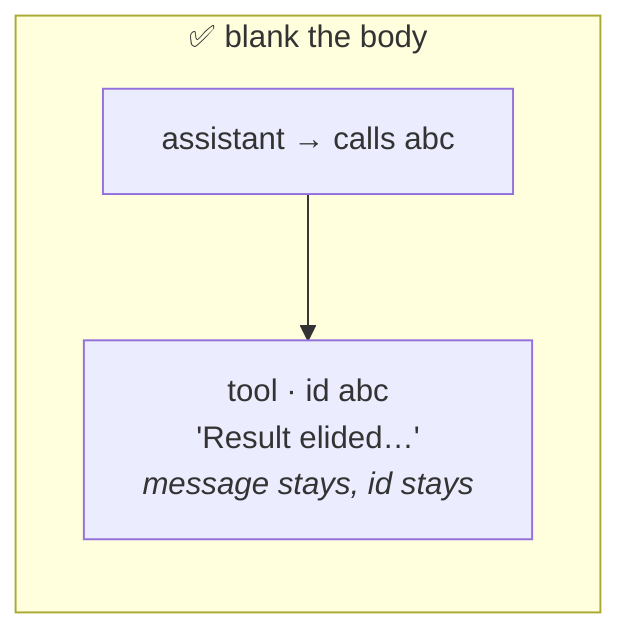

# 03 — Where To Cut ⭐

This is the most important chapter in Day 3. If you only remember one thing
from today, remember this one.

The question looks easy: *history is too long, so drop some of the old
messages.* Which ones?

Get it wrong and you destroy the session permanently.

---

## The shape of a conversation

First, look at what history actually contains. Not a neat back-and-forth —
something lumpier:

```
0  user        "fix the failing test"
1  assistant   (no text)  → calls run_tests
2  tool        "3 tests failed..."
3  assistant   (no text)  → calls read_file
4  tool        "export function add..."
5  assistant   (no text)  → calls edit_file
6  tool        "ok"
7  assistant   "Fixed — the addition was inverted."
8  user        "now update the README"
9  assistant   ...
```

Notice something. Messages 1 and 2 belong together. So do 3 and 4, and 5 and 6.

**A tool call and its result are one unit.** Message 1 says *"I am calling
run_tests, call id `abc`."* Message 2 says *"here is the answer to call
`abc`."*

They are welded together by that id.



Think of it as a **question and its answer**. The answer alone makes no sense.

---

## The rule that breaks everything

Here is the rule every OpenAI-compatible provider enforces:

> **Every `tool` message must be preceded by an `assistant` message that
> announced a tool call with a matching id.**

Break it and you do not get a warning. You get:

```
400 Bad Request
```

Now remember Chapter 01. A 400 caused by malformed history is **permanent**,
because the malformed history is still there on the next request. And the next.

**One bad cut and the conversation can never be used again.**

---

## Watch it happen

Suppose we naively decide "drop the oldest 3 messages":

```
DROPPED  0  user        "fix the failing test"
DROPPED  1  assistant   → calls run_tests  (id: abc)
DROPPED  2  tool        "3 tests failed..."  (answers abc)
         3  assistant   → calls read_file  (id: def)
         4  tool        "export function..."  (answers def)
```

That happened to work. Now try "drop the oldest 4":

```
DROPPED  0  user
DROPPED  1  assistant   → calls run_tests  (id: abc)
DROPPED  2  tool        (answers abc)
DROPPED  3  assistant   → calls read_file  (id: def)   ← the announcement
         4  tool        "export function..."  (answers def)   ← ORPHAN
```

Message 4 says *"here is the answer to call `def`"*.

Nothing in the history mentions `def` any more. We deleted the sentence that
introduced it.



**The model receives an answer to a question that was never asked.**

400. Forever.

> This is called an **orphaned tool result**. Burn the phrase into your memory.
> It is the single most dangerous bug in this entire project.

---

## The insight

We need cut points that can **never** produce an orphan. Not "usually." Never.

Look at the conversation again and ask: where is it always safe?

```
0  user      ← here?
1  assistant → calls run_tests
2  tool
3  assistant → calls read_file
4  tool
5  assistant "done"
8  user      ← here?
```

Think about what a `user` message *means*.

A user message is the start of a fresh request. Everything before it is
**finished business** — every tool call raised in those turns already got its
answer, or the agent would never have come back to ask you for input.

So:

- Everything **before** a user message is complete and self-contained.
- Everything **from** a user message onward is complete and self-contained.

Cutting there splits the conversation into two valid halves. It cannot orphan
anything, because there is nothing half-finished at that point.

> **Cut only at a `user` message.**
>
> Not because it usually works. Because at that exact position, nothing is
> mid-sentence.



Only the green rows are legal cut points. And notice **they are exactly the
`user` rows** — that is not a coincidence, it is the property we are relying on.

---

## The code

```ts
export function planCompaction(
  history: readonly Message[],
  policy: CompactionPolicy,
): CompactionPlan | null {
  const starts: number[] = [];
  for (let i = 0; i < history.length; i++) {
    if (history[i]?.role === 'user') starts.push(i);
  }

  if (starts.length <= policy.keepRecentTurns) return null;

  const cut = starts[starts.length - policy.keepRecentTurns];
  if (cut === undefined || cut === 0) return null;

  return { elide: history.slice(0, cut), keep: history.slice(cut) };
}
```

Small function. Let us walk it.

**Step 1 — find every possible cut point.**

```ts
if (history[i]?.role === 'user') starts.push(i);
```

For our example: `starts = [0, 8]`. Those are the only two positions where
cutting is safe.

**Step 2 — refuse if there is nothing safe to remove.**

```ts
if (starts.length <= policy.keepRecentTurns) return null;
```

`keepRecentTurns` is 2. If there are only 2 user turns, both must be kept, so
there is nothing left to elide. Return `null`, meaning **"I have no safe move."**

Notice what it does *not* do: it does not cut anyway, somewhere unsafe, because
the budget demanded it. **Being over budget is bad; corrupting history is
worse.** When the only options are "imperfect" and "broken," pick imperfect.

**Step 3 — pick the cut.**

```ts
const cut = starts[starts.length - policy.keepRecentTurns];
```

Count back 2 from the end of the list of user turns. If
`starts = [0, 8, 15, 22, 30]`, then `starts.length - 2` is index 3, giving
`cut = 22`.

Everything before message 22 gets summarized. Message 22 onward is kept exactly
as it is — the last two user turns, untouched.

**Step 4 — the two guards.**

```ts
if (cut === undefined || cut === 0) return null;
```

`undefined` keeps TypeScript happy (`noUncheckedIndexedAccess` means indexing
an array might give you nothing).

`cut === 0` matters more: cutting at 0 means eliding **nothing**. We would do
all the work of summarizing an empty list and change not a single thing. Refuse.

**Step 5 — split.**

```ts
return { elide: history.slice(0, cut), keep: history.slice(cut) };
```

Clean split. No overlap, no gap.



---

## Why keep two turns and not one?

```ts
keepRecentTurns: 2,
```

ARCHITECTURE §7 says: *never blindly truncate from the start if it would lose
live task state.*

Plain English: **whatever you are working on right now must survive.**

Keeping one turn keeps only the message you just typed. But conversations
reference backwards constantly:

```
you:  "read src/agent.ts"
agent: (reads it, explains it)
you:  "now add a comment to that function"
```

"That function" only means something because of the previous turn. Keep one
turn and the agent has no idea what "that" refers to.

Two turns is the smallest number that preserves *"the thing we were just
talking about."*

---

## What if even two turns is too big?

It can happen. One turn with 30 tool calls, each returning 30,000 characters.
No cut point helps, because we are not allowed to remove either turn.

There is one last move:

```ts
export function shrinkToolResults(
  messages: readonly Message[],
  budget: number,
): Message[] {
  const out = [...messages];
  if (estimateTokens(out) <= budget) return out;

  for (let i = 0; i < out.length; i++) {
    const message = out[i];
    if (message === undefined || message.role !== 'tool') continue;
    if (message.content === ELIDED_TOOL_RESULT) continue;

    out[i] = {
      role: 'tool',
      toolCallId: message.toolCallId,
      content: ELIDED_TOOL_RESULT,
    };
    if (estimateTokens(out) <= budget) break;
  }

  return out;
}
```

**Read what it does very carefully. It does not delete anything.**





The **skeleton** of the conversation survives; only the **flesh** is removed.

It replaces the tool result's *body* with a marker, while keeping:

- the message itself
- its `role: 'tool'`
- its `toolCallId`

Why? Say it with me: **deleting a tool message orphans its assistant call.**

The message must survive. Only the contents go. The skeleton of the
conversation stays intact while the flesh is removed.

**`if (message.content === ELIDED_TOOL_RESULT) continue;`** — skip ones already
blanked, or we would "free" the same message repeatedly and never make progress.

**Oldest first** (`i = 0` upward) — recent results are the ones the model is
still reasoning about. Old ones it has already used and moved past.

**`break` as soon as we fit** — free just enough, then stop. No reason to
destroy more than necessary.

---

## The marker is not a random string

```ts
export const ELIDED_TOOL_RESULT = JSON.stringify({
  success: false,
  error: 'Result elided to stay within the context window.',
  retryable: false,
});
```

Remember what the system prompt promises the model:

> *Tool results are JSON: `{"success":true,"content":...}` or
> `{"success":false,"error":...,"retryable":...}`*

If we shoved in a bare string like `[removed]`, the model would hit something
that does not match the shape it was told to expect. Best case it is confused.
Worst case it decides the tool system is broken.

Instead it reads a perfectly normal failed call, with a plain-English reason.
It understands immediately: *that result is gone, and re-running will not bring
it back* (`retryable: false`).

> **Do not break your own contract just because you are in a hurry.** Emergency
> data should still look like data.

---

## The test that guards all of this

```ts
test('SECURITY: a cut never orphans a tool message from its assistant call', () => {
  for (let turns = 3; turns <= 12; turns++) {
    const plan = planCompaction(history(turns), POLICY);
    assert.ok(plan, `expected a plan for ${turns} turns`);

    const announced = new Set<string>();
    for (const message of plan.keep) {
      if (message.role === 'assistant') {
        for (const call of message.toolCalls ?? []) announced.add(call.id);
      } else if (message.role === 'tool') {
        assert.ok(
          announced.has(message.toolCallId),
          `orphaned tool result ${message.toolCallId} at ${turns} turns`,
        );
      }
    }
  }
});
```

Notice the technique. It does not check "the cut was at index 22." It **walks
the result and checks the rule itself**: every answer must have a question
before it.

And it does this for 3 turns, 4 turns, all the way to 12 — because a bug like
this often only appears at one particular length.

> **Test the rule, not one example of the rule.**

---

## Things to remember

1. A tool call and its result are welded together by an id.
2. A `tool` message with no matching announcement is an **orphaned tool
   result** → 400 → permanent death.
3. Only cut at a `user` message. Nothing is mid-sentence there.
4. If no safe cut exists, return `null` and do nothing. Over budget beats
   corrupted.
5. Keep the last **two** user turns, so "that function" still means something.
6. Last resort: blank tool result *bodies*, never delete tool *messages*.
7. Blank oldest first, and stop the moment you fit.
8. Make the replacement look like a real tool result. Keep your own contract.
9. Test the invariant across many lengths, not one lucky case.

## Try it yourself

1. Draw a 4-turn conversation with tool calls on paper. Mark every `user`
   index. Cut at each one and check by eye that no orphan appears. Then cut
   somewhere else and find the orphan.
2. In `planCompaction`, change the cut-point test from `'user'` to
   `'assistant'`. Run `npm test`. Read the failure message.
3. Change `keepRecentTurns` to `1`. Run the agent, ask it to read a file, then
   say "explain that again." Watch it lose the thread.
4. In `shrinkToolResults`, change the blanking so it **deletes** the message
   instead (`out.splice(i, 1)`). Run `npm test`, read what breaks, and revert.
5. Explain to yourself why `cut === 0` deserves its own guard.

Next: `04-writing-the-summary.md`.
