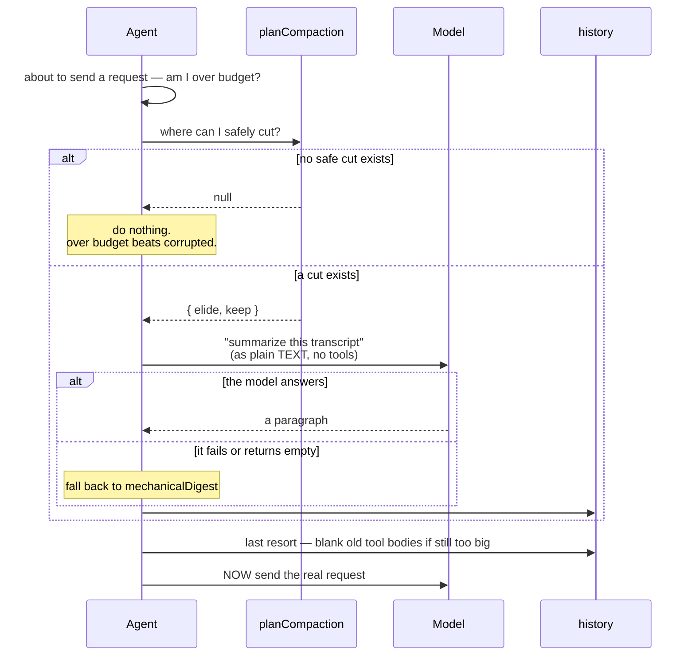
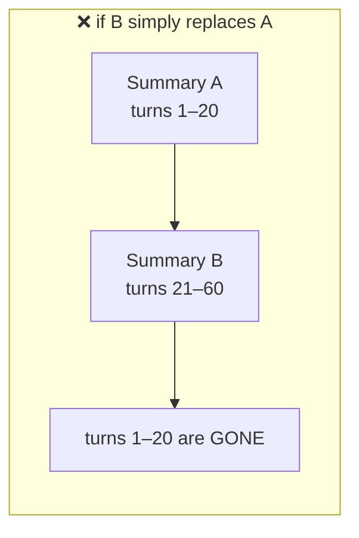
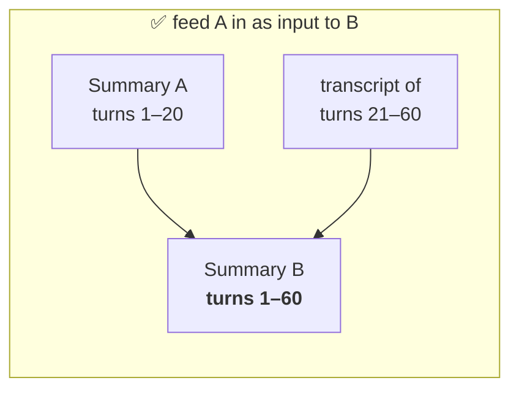
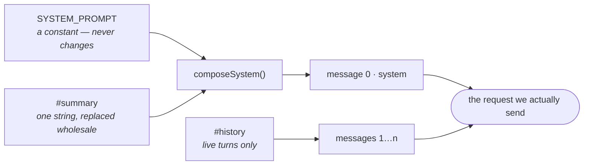

# 04 — Writing the Summary

We now know **which** messages to remove. This chapter is about what replaces
them.

Throwing old turns away entirely would work — the request would fit — but the
agent would develop amnesia. It would forget the file it just edited and the
decision you just made together.

ARCHITECTURE §7 is explicit:

> *When context nears the usable limit, summarize older material but never
> blindly truncate from the start if it would lose live task state.*

So: **summarize, don't delete.**

---

## Who writes the summary?

The model does. We ask it.

That feels odd at first — we are calling the model to help us call the model.
But nothing else can read twenty turns of conversation and write a useful
paragraph about them.

```ts
async #summarize(
  elided: readonly Message[],
  signal: AbortSignal | undefined,
): Promise<{ text: string; fallback: boolean }> {
```

An extra request, costing time and money, in the middle of your turn. That is
the price, and it is worth it — the alternative is the session dying.

The whole compaction sequence:



---

## ⭐ How the old turns are sent

Here is a genuinely non-obvious decision.

We want the model to summarize messages 0–21. The obvious move is to send them
**as messages**. Just pass them along.

**That is a trap.**

Remember Chapter 03. The elided range routinely starts or ends mid-turn. If we
hand those messages to the model as messages, we can be handing over an
orphaned tool result — and we get the exact 400 we have spent all this effort
avoiding. While trying to prevent it. In the recovery code.

The fix is neat:

> **Turn the messages into plain text and put the text inside one normal user
> message.**

Structure cannot be violated if there is no structure.

```ts
export function renderTranscript(elided: readonly Message[]): string {
  return elided
    .map(renderMessage)
    .filter((line) => line !== '')
    .join('\n');
}
```

And `renderMessage`:

```ts
function renderMessage(message: Message): string {
  switch (message.role) {
    case 'system':
      return '';
    case 'user':
      return `USER: ${clip(message.content)}`;
    case 'assistant': {
      const parts: string[] = [];
      if (message.content.trim() !== '') {
        parts.push(`ASSISTANT: ${clip(message.content)}`);
      }
      for (const call of message.toolCalls ?? []) {
        parts.push(`  -> called ${call.name}(${clip(call.argsJson, 400)})`);
      }
      return parts.join('\n');
    }
    case 'tool':
      return `  <- ${clip(message.content, 600)}`;
  }
}
```

The output looks like this:

```
USER: fix the failing test
  -> called run_tests({})
  <- {"success":false,"error":"3 tests failed..."}
  -> called read_file({"path":"src/add.ts"})
  <- {"success":true,"content":"export function add..."}
ASSISTANT: Fixed — the addition was inverted.
```

A human can read that. So can the model. And it is **just text** — a `tool`
line here is a line of prose, not a protocol message. Nothing can be malformed.

Two details:

**`case 'system': return ''`** — the system message is never in history (we
rebuild it every request), so this branch never really fires. It exists because
the `switch` must cover every case. TypeScript enforces that, which is the same
exhaustiveness trick as `classify()` from Day 2.

**`clip(...)`** — every piece is length-limited:

```ts
const MAX_TRANSCRIPT_CHARS_PER_MESSAGE = 2_000;

function clip(text: string, max = MAX_TRANSCRIPT_CHARS_PER_MESSAGE): string {
  return text.length <= max ? text : `${text.slice(0, max)}… [clipped]`;
}
```

Tool results get 600 characters, arguments get 400, prose gets 2,000. Why so
tight? Because we are compacting *because* we ran out of room. Sending 200,000
characters to the summarizer would fail for exactly the reason we are here.

---

## The summarizer's instructions

```ts
const SUMMARIZER_PROMPT = [
  'You are compacting the history of a coding session so it fits in a smaller',
  'context window. Summarize the transcript below in under 400 words.',
  'Preserve, in this order of priority: what the user is trying to achieve;',
  'decisions made and the reasons given; files created or modified and what',
  'changed in each; commands run and their outcomes; anything still unfinished',
  'or unresolved. Drop pleasantries, restated file contents, and reasoning that',
  'led nowhere. Write plain prose and short lists, no preamble, no offer to',
  'help. If a previous summary is included, merge it with the newer material',
  'into one continuous summary rather than describing the two separately.',
].join(' ');
```

Look at what this prompt does that a lazy one ("summarize this") would not:

- **A length limit.** Otherwise you might get 3,000 words and gain nothing.
- **A priority order.** When it must drop something, we have told it what to
  drop last. Goals and unfinished work outrank chit-chat.
- **What to drop explicitly.** "Reasoning that led nowhere" is exactly the
  material that clogs a long session.
- **"no preamble, no offer to help."** Otherwise you pay tokens forever for
  *"Certainly! Here is a summary of the conversation:"*
- **Merge instructions.** More on this next.

> **A prompt is an interface.** Vague in, vague out.

---

## Compacting twice

The second compaction is where a naive design quietly loses everything.

Turn 40: we summarize turns 1–20 → **Summary A**.
Turn 80: we summarize turns 21–60 → **Summary B**.

If B simply replaces A, everything from turns 1–20 is gone.

So the previous summary is fed in as part of the input:

```ts
export function buildSummaryRequest(
  previousSummary: string | null,
  elided: readonly Message[],
  policy: CompactionPolicy,
): Message[] {
  const previous =
    previousSummary === null
      ? ''
      : `Previous summary of still earlier turns:\n${previousSummary}\n\n`;

  const body = `${previous}Transcript:\n${renderTranscript(elided)}`;

  const max = Math.floor((budgetTokens(policy) * CHARS_PER_TOKEN) / 2);

  return [
    { role: 'system', content: SUMMARIZER_PROMPT },
    { role: 'user', content: clip(body, max) },
  ];
}
```





The new summary is built from *old summary + new material*, which is why the
prompt says "merge it into one continuous summary."

Each summary is a little lossier than the last. That is unavoidable — you
cannot compress forever without losing something. But nothing vanishes in one
step, which is the important part.

**`const max = ...budget * 3 / 2`** — the summarization request must itself fit
in the window. It gets half the budget, since it is the only thing in that
request. (`budget * CHARS_PER_TOKEN` converts tokens back to characters, then
halve it.)

---

## Where the summary lives

Now the summary exists. Where do we put it?

Three options, and the choice matters:

| Option | Problem |
|---|---|
| A second `system` message | Many self-hosted chat templates accept only **one** system message, and only in first position. Breaks the "swap the backend" promise. |
| A `user` message | It reads as something *you* said. The model may treat your summary as a new instruction. |
| **Fold it into the existing system prompt** | ✅ |

```ts
export function composeSystem(
  basePrompt: string,
  summary: string | null,
): Message {
  return {
    role: 'system',
    content:
      summary === null
        ? basePrompt
        : `${basePrompt}\n\n${SUMMARY_HEADER}\n${summary}`,
  };
}
```

One system message. Always. Works on every backend.

And the header tells the model exactly what it is looking at:

```ts
const SUMMARY_HEADER =
  'Earlier turns of this conversation were elided to stay within the context ' +
  'window. This is what happened before the messages that follow:';
```

Not orders. Background. The model knows this is *history*, not a command.

---

## ⭐ The restructure this forced

This is worth understanding, because it changed `agent.ts` meaningfully.

**Before**, `#messages[0]` was the system prompt and the rest was the
conversation — one list holding both.

That is a problem now:

1. If the system prompt sits at index 0 of the same array we cut, every index
   calculation has to constantly remember "index 0 is special."
2. To replace the summary, we would have to rewrite `#messages[0]` in place.

**After:**

```ts
/**
 * Live turns only — the system message is not stored here. It is rebuilt for
 * every request from the base prompt plus the running summary, so compaction
 * can replace the summary without rewriting history, and so a `user` cut
 * point is never confused with the message at index 0.
 */
#history: Message[] = [];

/** Summary of everything elided so far, or null while nothing has been. */
#summary: string | null = null;
```

And the request is assembled fresh each time:

```ts
#requestMessages(): Message[] {
  return [composeSystem(SYSTEM_PROMPT, this.#summary), ...this.#history];
}
```



The request is **built**, not stored. Nothing accumulates.

Look at what this buys:

- `#history` contains only real turns. Cut points are simple.
- The summary is one string in one variable. Replacing it is an assignment.
- Compacting ten times cannot make the system message grow, because it is
  **rebuilt from `SYSTEM_PROMPT`** every time, not appended to.

That last point has a test:

```ts
test('REGRESSION: repeated compaction replaces the summary, never appends', () => {
  // The summary lives inside the system message and is rebuilt from the base
  // prompt each time. Appending instead would grow the system message without
  // limit — a context leak in the code meant to prevent one.
```

Read that comment twice. Appending would mean **the code that prevents context
overflow slowly causes context overflow.** Exactly the kind of bug that takes
a week to find.

> **Separate the thing that changes from the thing that stays.** Storing state
> and *derived output* in the same variable is how leaks like that are born.

---

## When the summarizer fails

The summarization is a network request. Networks fail.

If a failed summary threw an error, then **compaction — the feature that exists
to stop long sessions from dying — would itself kill long sessions.** Absurd.
So there is a fallback:

```ts
export function mechanicalDigest(
  previousSummary: string | null,
  elided: readonly Message[],
): string {
  const requests = elided
    .filter((message) => message.role === 'user')
    .map((message) => `- ${clip(message.content, 200)}`);

  const tools = new Set<string>();
  for (const message of elided) {
    if (message.role !== 'assistant') continue;
    for (const call of message.toolCalls ?? []) tools.add(call.name);
  }
  ...
}
```

No model needed. Just: **what did the user ask, and which tools ran.** Crude,
but it keeps the thread.

And it is honest about itself:

```ts
parts.push(
  '(The model-written summary could not be produced, so this is a mechanical' +
    ' digest. Details of earlier turns are lost — ask the user rather than' +
    ' guessing what was decided.)',
);
```

That last sentence is doing real work. Without it, the model sees a thin summary
and **fills the gaps by inventing things**. With it, the model knows the record
is incomplete and asks you instead.

> **When you hand someone degraded information, tell them it is degraded.**
> Otherwise they will trust it exactly as much as good information.

The wiring:

```ts
} catch {
  // A failed summary must not end the session — that is the exact failure
  // compaction exists to prevent. Fall back to the mechanical digest.
  return digest();
}

const trimmed = text.trim();
return trimmed === '' ? digest() : { text: trimmed, fallback: false };
```

Note the second line: an **empty** summary counts as a failure too. A model
that returns whitespace has not succeeded just because it did not throw.

> **"It didn't crash" is not the same as "it worked."** Check the output, not
> just the absence of an exception.

---

## Is the fallback a second implementation?

Fair question — CLAUDE.md says *one concrete implementation first, always.*

No. A second implementation is an alternative you choose between. This is an
**error path**: it only runs when the primary one has already failed. Without
it, a dropped connection leaves history over budget and the session dead.

The comment in the code says exactly that, so nobody has to re-litigate it
later.

---

## Telling the user

Compaction is not invisible:

```ts
compacted(info: CompactionInfo): void {
  clearSpinner();
  const note = info.fallback ? ', summary unavailable — used a digest' : '';
  stdout.write(
    `\n${DIM}⟳ compacted context: ~${info.tokensBefore} → ~${info.tokensAfter} tokens, ` +
      `${info.messagesElided} message${info.messagesElided === 1 ? '' : 's'} summarized${note}${RESET}\n`,
  );
}
```

Why bother? Because the agent has just **lost detail it used to have**. If it
suddenly forgets a file you discussed twenty minutes ago, you deserve to know
why. Otherwise it just looks broken.

> **When your program silently becomes less capable, say so.**

---

## Things to remember

1. Summarize, do not delete. Deleting gives the agent amnesia.
2. Send elided history as **plain text**, never as messages — no structure, no
   structural violation.
3. Clip every piece. You are compacting because space ran out.
4. Write a real prompt: length, priorities, what to drop, no preamble.
5. Feed the previous summary in, or the second compaction erases the first.
6. Fold the summary into the **one** system message. Multiple system messages
   break some backends; a user message reads as an instruction.
7. Keep `#history` free of the system message. Rebuild the request each time.
8. Rebuild, never append — appending makes the leak-preventer leak.
9. Always have a no-model fallback, and label it as degraded.
10. Empty output is failure. Check the result, not just for an exception.
11. Tell the user when the agent forgets something.

## Try it yourself

1. Set `MAX_CONTEXT_TOKENS=4000`, run the agent, and talk until you see the
   `⟳ compacted context` line. Then ask about something from the beginning.
   Notice what survived and what did not.
2. In `composeSystem`, change the summary branch to append to the *previous*
   composed content instead of `basePrompt`. Run `npm test` and read the
   REGRESSION test that catches you.
3. Change `SUMMARIZER_PROMPT` to just `'Summarize this.'` Trigger a compaction
   and compare the summary quality. Revert.
4. In `#summarize`, delete the `catch` block. Then make the summarizer fail
   (point `OPENAI_BASE_URL` at a dead port mid-session) and watch the session
   die. This is the scenario the fallback exists for.
5. Read `mechanicalDigest` and ask: what is the *minimum* information needed to
   keep a conversation on track? Would you add anything?

Next: `05-cancellation.md`.
