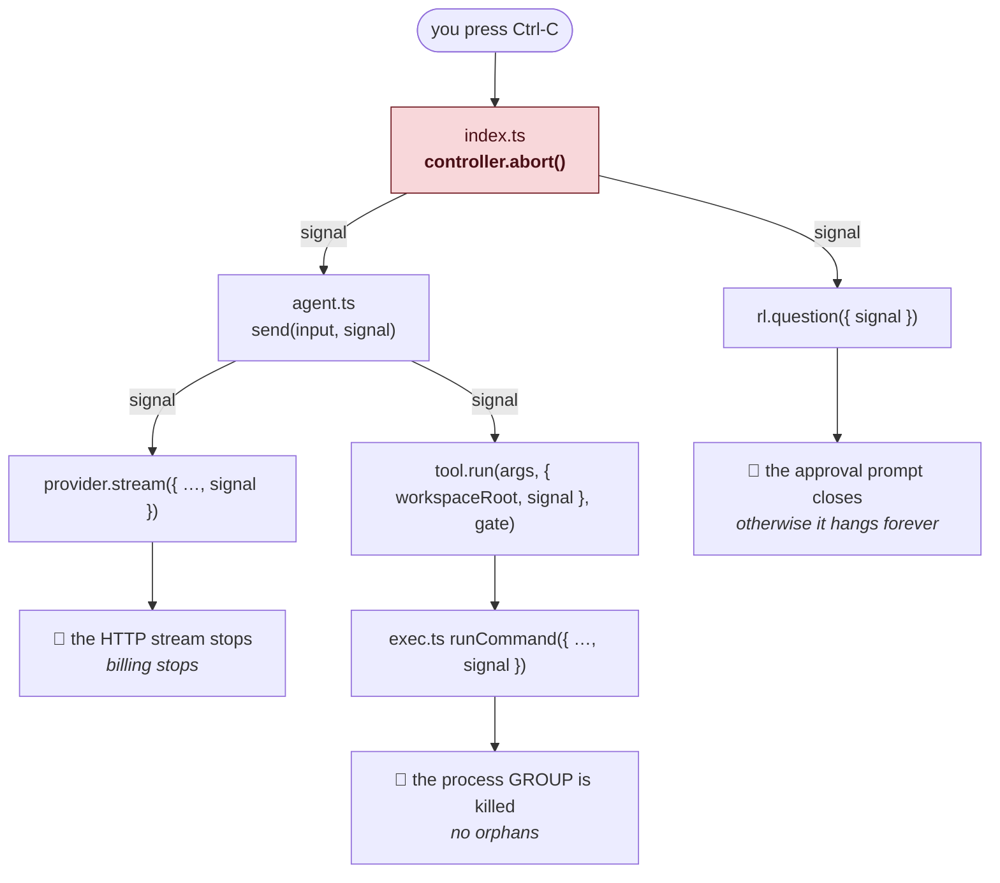
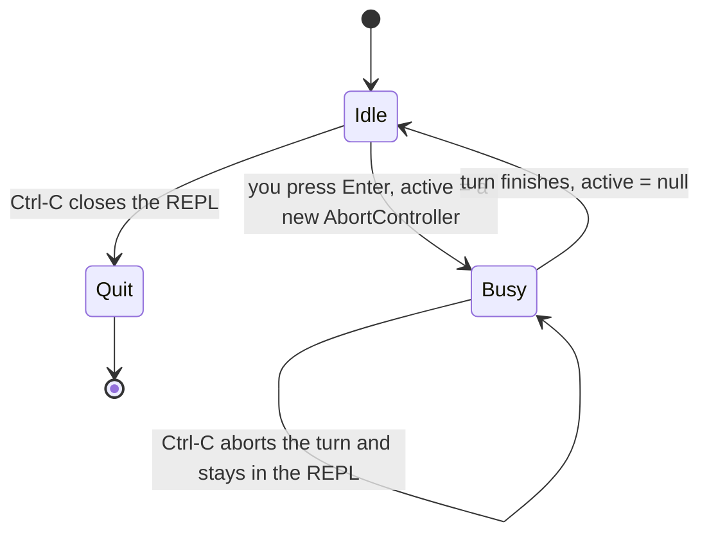
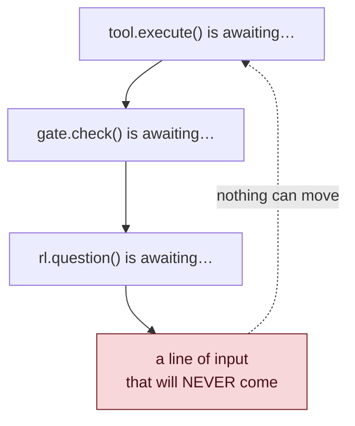
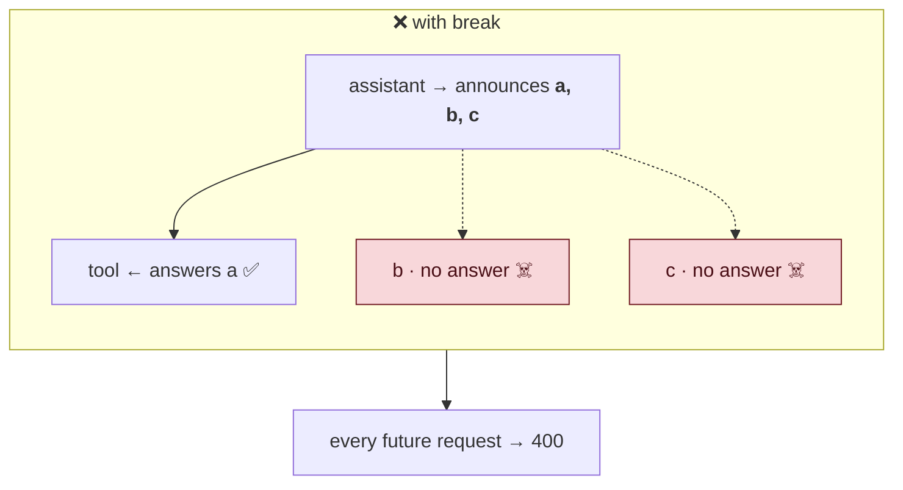
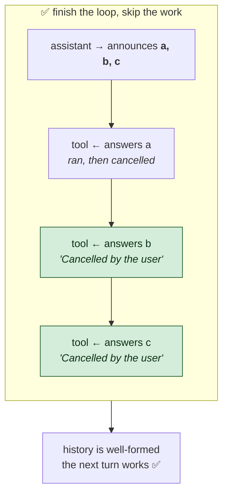
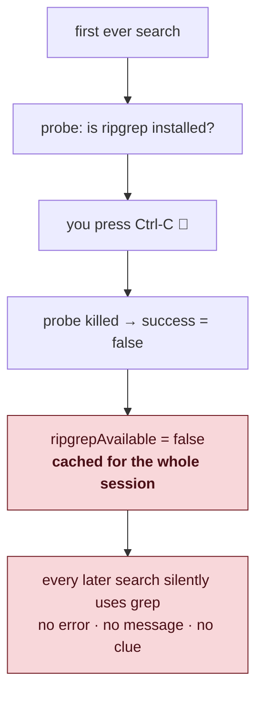

# 05 — Cancellation

Second feature of the day. Simpler idea, but it touches **six files**, and it
hides one trap that is the twin of the orphan bug from Chapter 03.

---

## The problem

You ask for something. You immediately realise it was wrong. You press Ctrl-C.

Before this work, here is what actually happened:

- The model kept generating. And kept billing you.
- A running `npm test` kept running.
- The REPL closed after the turn finished anyway.

No brake pedal.

---

## The embarrassing part

Look at `types.ts` — this was there from the very first day:

```ts
export interface ModelRequest {
  readonly model: string;
  readonly messages: readonly Message[];
  readonly tools?: readonly ToolSpec[];
  readonly signal?: AbortSignal;   // ← declared on day one
}
```

And `provider.ts` used it:

```ts
request.signal ? { signal: request.signal } : {},
```

Everything was ready. **Nobody ever passed a signal.** The agent called
`provider.stream({ model, messages, tools })` — no `signal` — so the field was
always `undefined` and the whole mechanism was decorative.

> **A feature that is plumbed but never connected looks exactly like a feature
> that works.** Until you test it.

There is now a test that would have caught it on day one:

```ts
test('the signal reaches the provider so the HTTP request can be aborted', async () => {
  // It was declared on ModelRequest from the start but never supplied, so
  // cancelling left generation running and still billable.
  ...
  assert.equal(provider.requests[0]?.signal, controller.signal);
});
```

---

## What an AbortSignal is

Two objects that work as a pair:

```ts
const controller = new AbortController();
const signal = controller.signal;
```

- **The controller** is the button. Whoever holds it can press `abort()`.
- **The signal** is the wire. You hand copies of it to everyone doing work.

```ts
signal.aborted                              // has the button been pressed?
signal.addEventListener('abort', () => {})  // tell me the moment it is
```

One button, many listeners. You hand the *signal* down and keep the
*controller* at the top. Nobody downstream can press it — they can only react.

That is the same least-privilege idea as the permission gate not being in
`ToolContext` (Day 2). **Hand down the ability to observe, not the ability to
decide.**

---

## The four layers

The signal has to reach everything that could still be running:



Miss any layer and cancellation is a half-truth. Skip the exec layer, and
Ctrl-C stops the *model* while a `sleep 300` keeps running. The user thinks
they stopped it. They did not.

---

## Layer 1 — the terminal

```ts
let active: AbortController | null = null;

rl.on('SIGINT', () => {
  if (active === null) {
    rl.close();
    return;
  }
  active.abort();
});
```

`active` is the turn in flight, or `null` while waiting for you to type.

So Ctrl-C means two different things depending on context:



- **Mid-turn** → stop what you are doing
- **Idle** → quit

That is exactly how Ctrl-C behaves in a normal shell, so it needs no
explaining. **Match the conventions people already have.**

And in the REPL loop:

```ts
active = new AbortController();
try {
  await agent.send(line, active.signal);
} catch (err) {
  ...
} finally {
  const cancelled = active.signal.aborted;
  // Cleared before rendering, so a Ctrl-C landing in this window is read
  // as "quit" rather than aborting a controller nothing is watching.
  active = null;
  render.end();
  if (cancelled) stdout.write(`${DIM}cancelled${RESET}\n\n`);
}
```

Read the comment. There is a tiny window between "the turn finished" and "we
are waiting for input again." If Ctrl-C lands there and `active` is still set,
we would abort a controller nobody is listening to — and the user's Ctrl-C
would do **nothing at all**. Clearing it first makes that window behave as
"quit".

**A fresh controller per turn.** Never reuse one: an `AbortController` is
single-use. Once aborted, always aborted. Reusing it would mean every turn
after your first Ctrl-C is instantly cancelled.

---

## ⭐ The permission prompt trap

Here is a bug that is invisible until you think it through.

Ctrl-C while an approval prompt is on screen:

```
  ⚠ run command via run_command
  npm run deploy

  [y]es  [n]o  [a]lways ›     ← you press Ctrl-C here
```

The code is sitting inside `await rl.question(...)`, waiting for you to type.

We abort the controller. The agent tries to stop. But the tool is still
`await`ing `gate.check()`, which is `await`ing `rl.question`, which is waiting
for a line that **will never come**.



**The whole program hangs.** Cancellation makes it freeze.

The fix is to give the question the signal too:

```ts
// The signal makes Ctrl-C dismiss the prompt. Without it the question
// stays pending forever and the cancelled turn never finishes.
const signal = active?.signal;
answer = (
  await rl.question(
    `\n  ${options} ${DIM}›${RESET} `,
    signal ? { signal } : {},
  )
)
  .trim()
  .toLowerCase();
```

Node's `readline/promises` accepts a signal and **rejects** the promise when it
fires. The existing `catch` already returns `'no'`:

```ts
} catch {
  return 'no'; // stdin closed mid-prompt, or the turn was cancelled
}
```

Cancelled means denied. Fails closed. Exactly right.

> **Anything that waits forever must be cancellable — or your cancel button
> becomes a freeze button.**

---

## Layer 2 — the provider

```ts
} catch (err) {
  // A cancelled request is not a failure. Reporting it as an error would
  // surface an SDK abort message to the user and, worse, make the agent
  // throw on a path the user deliberately chose.
  if (request.signal?.aborted) {
    yield { type: 'done', stopReason: 'cancelled' };
    return;
  }

  yield {
    type: 'error',
    message: err instanceof Error ? err.message : String(err),
  };
}
```

When you abort an HTTP request, the SDK throws. Technically an exception —
but **not an error**.

The agent throws on `type: 'error'`, which the REPL prints as
`error: Request was aborted.` You would be shown a scary message for pressing
the key we told you to press.

So we check *why* the exception happened. Aborted on purpose → a clean `done`.

> **Distinguish "something went wrong" from "you asked me to stop."** They look
> the same to a `catch` block and must never look the same to a user.

---

## Layer 3 — the tool gate

```ts
// Checked before the gate, so cancelling a turn cannot leave an approval
// prompt on screen for work that will never run.
if (context.signal?.aborted) {
  return {
    success: false,
    error: 'Cancelled by the user before the call ran.',
    retryable: false,
  };
}
```

Placement is everything here. **Before** the gate.

Otherwise you press Ctrl-C and a permission prompt appears asking whether to
run something that has already been abandoned. Baffling.

`retryable: false` — re-sending the same arguments will not un-cancel it.

---

## Layer 4 — killing the process

Day 2's lesson returns: killing a shell does not kill its children.

```ts
const terminate = (): void => {
  const pid = child.pid;
  if (pid === undefined) return;

  killGroup(pid, 'SIGTERM');
  setTimeout(() => killGroup(pid, 'SIGKILL'), GRACE_MS).unref();
};

const onAbort = (): void => {
  cancelled = true;
  terminate();
};
options.signal?.addEventListener('abort', onAbort, { once: true });
```

Notice `terminate` is now **shared** between the timeout path and the cancel
path. Both need identical behaviour: SIGTERM, then SIGKILL after a grace
period, killing the whole **process group**.

Before this change, that logic lived inline inside the timeout. Pulling it out
means cancellation cannot accidentally get a weaker version of the same
guarantee.

> **When two paths need the same guarantee, give them the same code.** Copies
> drift.

### Reporting *why* it died

```ts
export interface CommandResult {
  ...
  readonly timedOut: boolean;
  /** Killed because the caller aborted, as opposed to hitting the timeout. */
  readonly cancelled: boolean;
  ...
}
```

Why a separate flag instead of reusing `timedOut`? Because they mean opposite
things to whoever reads the result:

- **timed out** → it was too slow; maybe retry with a longer timeout
- **cancelled** → you stopped it; do not retry

### Do not start what you are about to kill

```ts
if (options.signal?.aborted) {
  return Promise.resolve({
    success: false,
    stdout: '',
    stderr: 'Cancelled before the command started.',
    exitCode: null,
    timedOut: false,
    cancelled: true,
    durationMs: 0,
  });
}
```

If the signal is already aborted, do not spawn at all. Starting a process just
to kill it can still leave side effects — a file written, a port bound, a row
inserted — in the milliseconds before the signal lands.

### Clean up your listeners

```ts
options.signal?.removeEventListener('abort', onAbort);
```

Easy to forget, and it matters. **One controller covers every command in a
turn.** Twenty tool calls means twenty listeners attached to the same signal.
Leave them attached and Node eventually warns about a memory leak.

There is a test that pins it:

```ts
test('REGRESSION: listeners are detached when a command finishes', async () => {
  const controller = new AbortController();
  for (let i = 0; i < 12; i++) {
    await runCommand('true', { cwd, signal: controller.signal });
  }
  assert.equal(getEventListeners(controller.signal, 'abort').length, 0);
});
```

> **If you attach, you must detach.** Every `addEventListener` needs a matching
> `removeEventListener` on every exit path.

---

## ⭐⭐ The trap: cancelling mid-tool-loop

Now the dangerous part. This is Chapter 03's orphan bug in a new costume.

The model asks for three tools at once:

```
assistant  → calls read_file (id: a), search_code (id: b), git_diff (id: c)
```

The agent loops through them. You press Ctrl-C while tool `a` is running.

**The obvious code is wrong:**

```ts
for (const call of toolCalls) {
  if (signal?.aborted) break;      // ❌ looks perfectly reasonable
  const result = await this.#runToolReported(call, signal);
  this.#history.push({ role: 'tool', toolCallId: call.id, content: ... });
}
```

Trace what history now holds:





**Two orphaned tool calls.** The assistant announced three; only one came back.

Every future request is a 400. The user cancelled one turn and lost the entire
conversation.

**The fix:**

```ts
for (const call of toolCalls) {
  // Every announced call gets a result, cancelled ones included. Leaving
  // one unanswered would make the next request malformed — providers
  // reject an assistant tool call with no matching tool message — and
  // the session could never recover.
  const result = signal?.aborted
    ? CANCELLED_RESULT
    : await this.#runToolReported(call, signal);

  this.#history.push({
    role: 'tool',
    toolCallId: call.id,
    content: JSON.stringify(result),
  });
}
```

We do not `break`. We **finish the loop without doing the work**.

Tools b and c are never executed — but they each get an answer:

```ts
const CANCELLED_RESULT: ToolResult = {
  success: false,
  error: 'Cancelled by the user.',
  retryable: false,
};
```

History stays well-formed. The next turn works.

> **Leaving is not the same as finishing.** When a structure requires pairs,
> you must complete the pairs even while abandoning the work.

### So where *is* it safe to leave?

```ts
for (let turn = 0; turn < MAX_TURNS; turn++) {
  // Safe to bail here and nowhere else in the middle: at the top of the
  // loop every announced tool call already has its result, so history is
  // well-formed and the next send can build on it.
  if (signal?.aborted) return;
```

**At the top of the turn loop**, and nowhere else mid-flight.

Same shape as the cut-point rule: *leave only at a point where the structure is
complete.* Two features, one principle.

---

## Cancelling during compaction

One more:

```ts
const summary = await this.#summarize(plan.elide, signal);
// Cancelling mid-summary would otherwise bake the fallback digest into
// history permanently. Leave it untouched and compact properly next time.
if (signal?.aborted) return;
```

Cancel during summarization → the stream ends early → empty text → the fallback
digest fires.

Without this check, we would **permanently** replace good history with a crude
digest, because you pressed Ctrl-C. The summary is not retried; it is written
once and kept.

So we throw the half-made summary away and leave history exactly as it was.
Next turn compacts properly.

> **Do not commit a degraded result that was only degraded because you were
> interrupted.**

---

## ⭐ A real bug found while wiring this

`search_code` checks once whether ripgrep is installed, and caches the answer:

```ts
let ripgrepAvailable: boolean | null = null;

async function hasRipgrep(cwd: string): Promise<boolean> {
  if (ripgrepAvailable === null) {
    const probe = await runProgram('rg', ['--version'], { cwd, timeoutMs: 5_000 });
    ripgrepAvailable = probe.success;
  }
  return ripgrepAvailable;
}
```

Adding the signal looked like a one-line change. Pass it in, done.

**Think about what happens if you press Ctrl-C during the probe.**



The probe is killed → `probe.success` is `false` → `ripgrepAvailable = false`
→ **cached forever.**

One badly-timed Ctrl-C and ripgrep is disabled for the rest of the session.
Every search silently downgrades to slower grep. No error, no message. You
would never connect the two events.

The fix:

```ts
const probe = await runProgram('rg', ['--version'], {
  cwd,
  timeoutMs: 5_000,
  signal,
});
// A cancelled probe says nothing about whether ripgrep is installed.
// Caching it would let a single Ctrl-C downgrade the session to grep for
// good, with no way to recover short of a restart.
if (probe.cancelled) return false;
ripgrepAvailable = probe.success;
```

A cancelled probe is **not an answer**. Return `false` for now, cache nothing,
ask again next time.

Two lessons, both worth keeping:

1. **Never cache a result you did not actually obtain.** "I was interrupted" is
   not the same as "the answer is no."
2. **Adding a cross-cutting concern is not mechanical.** Threading a signal
   through looked like find-and-replace. In one place it silently changed the
   meaning of a cached value. Read each site; do not autopilot.

---

## Things to remember

1. Plumbed-but-unconnected looks identical to working. Test the wiring.
2. Controller at the top, signal handed down. Observe, do not decide.
3. Cancellation must reach every layer, or it is a comforting lie.
4. One fresh controller per turn — they are single-use.
5. Ctrl-C: cancel when busy, quit when idle. Match shell conventions.
6. Anything that waits forever needs the signal, or cancel becomes freeze.
7. Cancelled is not an error. Do not show a scary message for a chosen action.
8. Check for cancellation **before** the permission gate.
9. Killing must still be by process group, on the cancel path too.
10. Separate `cancelled` from `timedOut` — opposite advice to the caller.
11. Do not spawn something you are immediately going to kill.
12. Detach every listener you attach.
13. ⭐ Never `break` a loop that owes answers. Finish the pairs, skip the work.
14. Leave only where the structure is already complete.
15. Never cache a result you were interrupted while obtaining.

## Try it yourself

1. Ask the agent to run a long command (`sleep 60`), approve it, then press
   Ctrl-C. In another terminal, `pgrep -f "sleep 60"` and confirm nothing
   survived.
2. Press Ctrl-C at the `>` prompt with nothing running. It should quit. Now
   press it mid-answer. It should cancel and return to the prompt.
3. Remove the `signal` option from `rl.question` in `index.ts`. Trigger a
   permission prompt, press Ctrl-C, and watch it hang. Revert.
4. Change the tool loop's cancel branch back to `break`. Run `npm test` and
   read which test fails and why. **Revert immediately.**
5. Delete `if (probe.cancelled) return false;` from `search_code.ts`. Run the
   agent, start a search, Ctrl-C during the probe, then search again. You are
   now on grep and nothing told you.

Next: `06-testing-what-you-cannot-see.md`.
