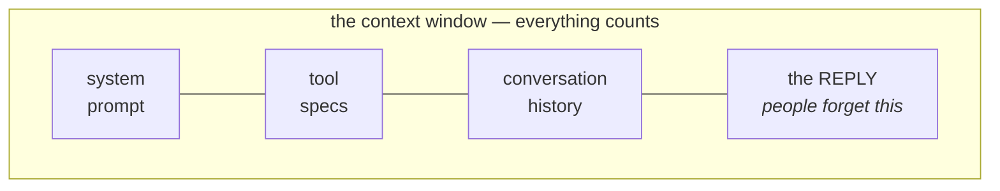
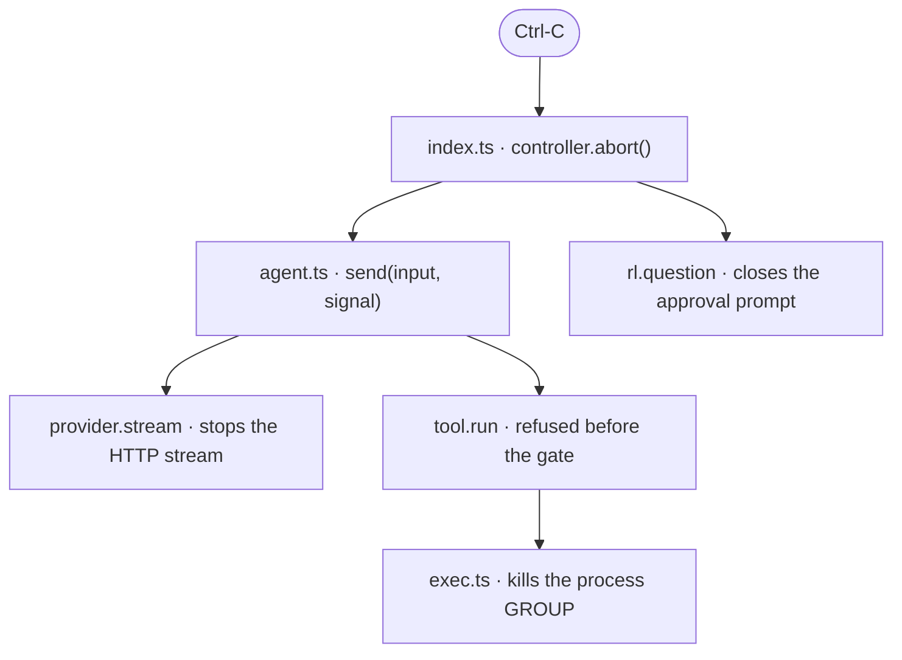

# 07 — Day 3 Concepts Cheat Sheet

New material only. Day 1 and Day 2 cheat sheets still apply.

---

## The context window



Everything counts. **Including the reply** — leave room for it.

```ts
budget = maxTokens - reserveTokens        // the number we actually respect
reserve = max(1_000, min(16_000, floor(maxTokens * 0.2)))
```

**Why running out is fatal:** the oversized history is still there on the next
request, so recovery is impossible from inside the session.

> Shrink **before** the limit. After the limit, shrinking is no longer possible.

---

## Token estimation

```ts
const CHARS_PER_TOKEN = 3;      // low on purpose → over-estimates
const PER_MESSAGE_TOKENS = 4;   // role + JSON scaffolding per message
```

| Text | Chars per token |
|---|---|
| English prose | ~4 |
| Source code | ~3 |
| Dense JSON | ~2–3 |

Count all of:

- `message.content` (every role has one)
- `toolCalls[].name` + `toolCalls[].argsJson` ← easy to forget; `content` may
  be empty while args are huge
- `toolCallId` on tool messages
- `messages.length * PER_MESSAGE_TOKENS`

`Math.ceil`, never floor. **Lean toward "bigger."**

No real tokenizer: the model is swappable, and an exact count for the wrong
model is worse than an honest estimate.

---

## ⭐ Turn integrity — the rule behind everything

```
assistant → announces tool call (id: abc)
tool      → answers id abc
```

**Welded together by the id.**

> Every `tool` message must be preceded by an `assistant` message announcing a
> matching id. Break it → `400` → permanent death.

An **orphaned tool result** is a `tool` message whose announcement was removed.

### Where it is safe to cut / leave

| Situation | Safe point |
|---|---|
| Compaction | only at a `user` message |
| Cancelling a turn | only at the **top** of the turn loop |
| Cancelling mid-tool-loop | nowhere — finish the pairs instead |

> **Leave only where the structure is already complete.**

---

## Compaction

```ts
planCompaction(history, policy) → { elide, keep } | null
```

```ts
const starts = indices where role === 'user';
if (starts.length <= keepRecentTurns) return null;     // no safe move
const cut = starts[starts.length - keepRecentTurns];
if (cut === undefined || cut === 0) return null;       // nothing to gain
return { elide: history.slice(0, cut), keep: history.slice(cut) };
```

`keepRecentTurns: 2` — one turn loses what "that function" refers to.

**Returning `null` is a real answer.** Over budget beats corrupted.

### Last resort: shrink, do not delete

```ts
shrinkToolResults(messages, budget)
```

- Blanks tool result **bodies**, oldest first
- **Never removes the message** — that would orphan its call
- Keeps `role` and `toolCallId`
- Skips already-blanked ones
- `break` as soon as it fits

```ts
ELIDED_TOOL_RESULT = '{"success":false,"error":"Result elided...","retryable":false}'
```

Still valid `ToolResult` shape — **keep your own contract even in an emergency.**

---

## The summary

**Sent as text, never as messages** — the elided range starts/ends mid-turn, so
passing it structurally would create the very orphan we are avoiding.

```
USER: fix the failing test
  -> called run_tests({})
  <- {"success":false,"error":"3 tests failed..."}
ASSISTANT: Fixed — the addition was inverted.
```

Clips: prose 2,000 chars · args 400 · tool results 600 · whole request
`budget * 3 / 2`.

### Where it lives

```ts
composeSystem(basePrompt, summary) → { role: 'system', content: ... }
```

| Option | Verdict |
|---|---|
| Second `system` message | ❌ many self-hosted templates allow only one |
| `user` message | ❌ reads as an instruction from you |
| Folded into the one system prompt | ✅ |

### Rebuild, never append

```ts
#history: Message[] = [];        // live turns only — no system message
#summary: string | null = null;  // one string, replaced wholesale

#requestMessages() {
  return [composeSystem(SYSTEM_PROMPT, this.#summary), ...this.#history];
}
```

Appending would make the code that prevents context overflow **cause** context
overflow.

> Separate the thing that changes from the thing that stays.

### Compacting twice

Feed the previous summary into the next summarization, or the second one erases
the first.

### Fallback

`mechanicalDigest(previousSummary, elided)` — user requests + tool names, no
model needed. Runs when the summarization request fails **or returns empty**.

It says it is a digest, so the model asks instead of inventing.

> "It didn't crash" ≠ "it worked." Check the output.

---

## AbortSignal

```ts
const controller = new AbortController();
controller.abort();                            // the button — keep at the top
controller.signal                              // the wire — hand down

signal.aborted                                 // already pressed?
signal.addEventListener('abort', fn, { once: true });
signal.removeEventListener('abort', fn);       // on EVERY exit path
AbortSignal.abort()                            // an already-aborted signal
```

**Single use.** One fresh controller per turn.

### The four layers



Miss a layer and cancellation is a comforting lie.

### Rules

| Rule | Why |
|---|---|
| Cancel when busy, quit when idle | matches shell convention |
| Clear `active` **before** rendering | else a late Ctrl-C hits a dead controller |
| Pass the signal to `rl.question` | otherwise cancel becomes **freeze** |
| Aborted → `done`, not `error` | you chose it; it is not a failure |
| Check aborted **before** the gate | no prompts for abandoned work |
| `cancelled` separate from `timedOut` | opposite advice: retry vs do not |
| Don't spawn an already-cancelled command | side effects land before the kill |
| Never `break` a loop that owes answers | orphaned tool calls |

```ts
readline.question(query, { signal })   // rejects on abort → catch → 'no'
```

---

## Cancellation and caches

```ts
if (probe.cancelled) return false;   // do NOT cache
ripgrepAvailable = probe.success;
```

> **Never cache a result you were interrupted while obtaining.**
> "I was interrupted" ≠ "the answer is no."

Threading a signal through a codebase is **not** find-and-replace. Read every
site.

---

## Config at a boundary

```ts
MAX_CONTEXT_TOKENS: z.coerce.number().int().min(4_000).optional()
const DEFAULT_MAX_CONTEXT_TOKENS = 128_000;
```

- `z.coerce` — env vars are always strings
- `.min(4_000)` — reject nonsense early
- **Guess low.** Low costs one summary; high costs the session.

---

## Testing techniques

**Fake the narrow interface:**

```ts
class FakeProvider implements ModelProvider {
  async *stream(request) {
    this.requests.push({ ...request, messages: [...request.messages] });  // COPY
    for (const event of this.#script(request)) yield event;
  }
}
```

**Free discriminator** — the summarizer is the call with no tools:

```ts
const isSummarizer = (r: ModelRequest) => r.tools === undefined;
```

**Shrink the world:** `MAX_CONTEXT = 6_000` instead of building 128k fixtures.

**Deterministic timing** — reuse render callbacks as hooks:

```ts
makeAgent(provider, { onToolStart: () => controller.abort() });
```

**Assert the thing ran:**

```ts
assert.ok(provider.summarizerCalls.length > 0, 'compaction never ran');
```

**⭐ Mutation testing:** reintroduce the bug → confirm the test fails → revert.

> "Does it work?" and "would I notice if it broke?" are different questions.

**Test the rule across many shapes, not one example:**

```ts
for (let turns = 3; turns <= 12; turns++) { ... }
```

---

## Design principles added on Day 3

1. **Shrink before the limit** — after it, recovery is impossible.
2. **Leave only where the structure is complete.**
3. **Leaving ≠ finishing.** Complete the pairs, skip the work.
4. When measurement is uncertain, **make the error land on the safe side**.
5. **Precision you cannot trust is decoration.**
6. **Refuse rather than corrupt.** `null` is a legitimate answer.
7. **Keep your own contract**, even in the emergency path.
8. **Rebuild derived output; never append to it.**
9. **Label degraded information as degraded**, or it gets trusted.
10. **Distinguish "went wrong" from "you asked me to stop."**
11. **Anything that waits forever must be cancellable.**
12. **Never cache what you were interrupted while obtaining.**
13. **A test you have never seen fail is a test you should not trust.**
14. **Say so when your program silently becomes less capable.**

Next: `08-quiz-and-exercises.md`.
