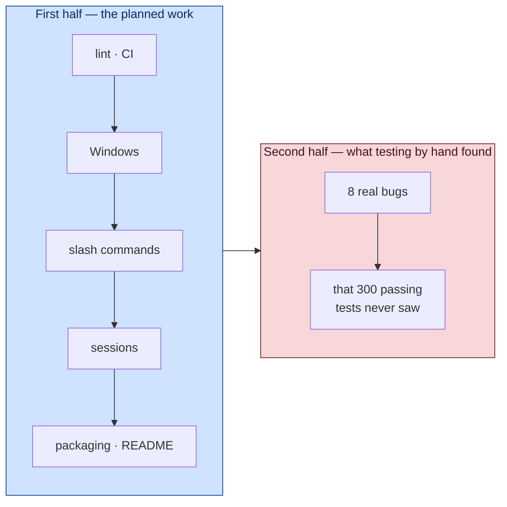

# Day 4 — Start Here

Day 1 asked: **how does an agent work?**
Day 2 asked: **what happens when it goes wrong?**
Day 3 asked: **what happens when it keeps working, for a long time?**

Day 4 asks the question nobody puts on a slide:

> **What is the difference between code that works and a product someone else
> can actually use?**

---

## The moment this day begins

At the end of Day 3 the project looked finished.

```
206 tests · all green
typecheck clean
8 tools
~3,000 lines
```

Everything worked. The loop looped, the gate gated, commands got killed, long
conversations compacted themselves. You could sit down and use it.

Then someone asked a simple question: *"is our product ready?"*

And the honest answer was **no** — and not because of anything the tests could
see.

A stranger who cloned the repository could not start it. There was no README.
There was no way to install it as a command. Close the terminal and the
conversation was gone forever. There was one slash command. It only ran on Mac
and Linux. And the one promise the whole architecture was built around — *swap
to any OpenAI-compatible model* — had never once been tested against a second
model.

None of that is a bug. Every test still passes. That is exactly the point.

> ⭐ **Green tests tell you the code does what you told it to do. They say
> nothing about whether you told it to do the right things.**

---

## The shape of Day 4

Day 4 has two halves, and the second half is the one that teaches you the most.



The first half was a list. We wrote it down, we did it, it worked.

The second half started when we stopped writing code and **used the thing** —
and found eight defects in an afternoon, several of them serious, none of them
visible to the test suite.

---

## The eight things using it found

Keep this list in view as you read. Every one of these was discovered by a
human typing at a prompt, not by an assertion.

| # | What happened | Why tests missed it |
|---|---|---|
| 1 | Ctrl-C at an idle prompt **hung forever** and left the terminal broken | `index.ts` runs on import — no test can reach it |
| 2 | The model repeated one impossible call **22 times** | needs a real model making real mistakes |
| 3 | Redaction and `edit_file` **deadlocked** each other | two correct features, wrong together |
| 4 | `production.env` was treated as an **ordinary file** | the tests only ever tried `.env` |
| 5 | You were asked to approve a diff that was **fiction** | the edit failed, so nothing looked wrong |
| 6 | `/clear` cleared memory but **not the screen** | nobody asserts on what a human sees |
| 7 | The agent **could not create a file** at all | no test asked it to |
| 8 | CI went red on Linux and Windows | the tests had only ever run on one machine |

Eight. In one afternoon. From a suite that was 100% green the whole time.

---

## The one sentence to carry through the day

> **Software is not finished when the tests pass. It is finished when someone
> other than you can use it without you in the room.**

Every chapter of Day 4 is a different face of that sentence.

---

## What you will build

| Chapter | The thing | The lesson underneath |
|---|---|---|
| **[01](01-the-finishing-work.md)** | lint, CI, packaging, README | the unglamorous half is half the work |
| **[02](02-another-machine.md)** | Windows support | writing for a machine you cannot run |
| **[03](03-remembering.md)** | saving and resuming sessions | how to store something safely |
| **[04](04-the-terminal-talks-back.md)** | slash commands, `/clear`, the Ctrl-C hang | the interface is part of the product |
| **[05](05-what-tests-cannot-see.md)** ⭐ | the eight bugs, one by one | why you must use your own software |
| **[06](06-the-day-ci-went-red.md)** | zombies and line endings | your machine has been lying to you |
| **[07](07-concepts-cheatsheet.md)** | everything on one page | |
| **[08](08-quiz-and-exercises.md)** | recall and practice | |

Chapter 5 is the heart of the day. If you only read one, read that one.

---

## A warning before you start

Day 4 contains the only **security-relevant defects** in the whole project.
Not one of them came from carelessness. Every one came from two sensible
decisions colliding:

- Redaction is right. Exact-match editing is right. Together they deadlock.
- Refusing to create files is right. Having no create tool is not.
- Asking permission is right. Asking about something impossible is corrosive.

> ⭐ **Most real bugs are not one wrong decision. They are two right decisions
> meeting.**

That is the idea Day 4 exists to teach you, and it is the hardest one in these
notes to learn from a book. You have to watch it happen.

Turn the page.
