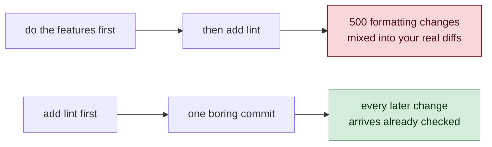
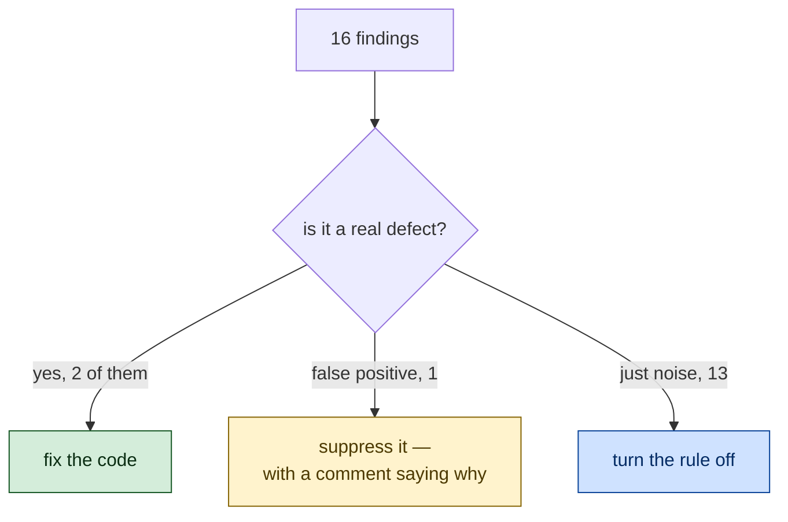

# 1 · The Finishing Work

> The part nobody demos, and everybody needs.

---

## The gap between "it works" and "you can have it"

Imagine handing someone a car with no doors.

The engine is perfect. The gearbox is beautiful. You can prove, with tests,
that every part functions. But they cannot get in.

That was KRIMICODE at the end of Day 3. Four missing doors:

| Missing | What it meant |
|---|---|
| No README | A stranger cloning the repo could not start it |
| No `bin` entry | No `krimicode` command — only `npm run dev` from inside the folder |
| No persistence | Close the terminal, lose the conversation |
| One slash command | Only `/exit` |

And underneath, three more: no linter, no formatter, no CI.

---

## Why lint came first

We had five phases of work planned. Lint and CI went first, and the reason is
worth understanding.



If you add a formatter after writing five features, the formatter reflows every
file you touched, and now your commit says *"added sessions"* while showing 400
changed lines of moved brackets. Nobody can review it. The bug hides in there.

> ⭐ **Add the checker before the code it will check. The cost is one boring
> commit; the alternative is every later commit being unreadable.**

We chose **Biome** — one dependency, one config file, does linting and
formatting together. The alternative (ESLint + Prettier + typescript-eslint)
is five dependencies and two configs. For a small clean codebase that is a lot
of machinery for very little.

---

## Reading a linter's output properly

Biome found 16 problems. This is the interesting part: **we did not fix all
16.** We sorted them.



**The real one.** `list_files.ts` had `let listing;` with no type. TypeScript
calls that an "evolving any" and allows it, but CLAUDE.md says *no `any`
without a comment justifying it*. Fixed properly: `let listing: Dirent[];`

**The false positive.** Biome flagged `toWireMessages` for possibly not
returning on every path. It does — the `switch` covers all four `Message` roles
and the callback has an explicit return type, so TypeScript already proves it.
Biome just doesn't do exhaustiveness analysis on discriminated unions.
Suppressed, with the reason written down:

```ts
// biome-ignore lint/suspicious/useIterableCallbackReturn: exhaustive switch, proven by tsc
```

**The noise.** 13 findings said `process.env['PATH']` should be
`process.env.PATH`. That is a style opinion with no correctness value, and
bracket access on environment variables is idiomatic. Rule turned off.

> ⭐ **A linter is a colleague with opinions, not a judge. Some of its findings
> are bugs, some are wrong, and some are just its taste. Your job is to decide
> which — and to write down why whenever you disagree.**

A suppression without a reason is technical debt. A suppression *with* a reason
is a decision.

---

## CI: the machine that does not trust you

```yaml
on: [push, pull_request]

matrix:
  os:   [ubuntu-latest, windows-latest, macos-latest]
  node: ['20.12', '22']
```

Five jobs. `npm ci` → typecheck → lint → test → build.

Here is the thing worth noticing. Before this, **every test you had ever run
had run on one machine**: your Mac. 308 assertions, one operating system, one
Node version, one filesystem, one shell.

Adding Windows and Linux to that matrix is not bureaucracy. It is the first
time anyone else's computer gets a vote — and in Chapter 6 you will watch it
immediately find two things your Mac had been hiding for weeks.

---

## Packaging: three lines and one surprise

To turn a folder into a command:

```json
"bin":   { "krimicode": "dist/index.js" },
"files": ["dist"],
"scripts": { "prepare": "npm run build" }
```

plus a shebang at the top of `src/index.ts`:

```ts
#!/usr/bin/env node
```

TypeScript preserves a leading shebang in its output — a small kindness, and
the reason this works at all.

**The surprise:** we kept `"private": true`.

You might expect to remove it. Don't. `npm install -g .` and `npm link` both
work fine with `private: true`, and it makes an accidental `npm publish` of a
client's code **impossible**. You lose nothing and you close a door that only
ever opens onto a disaster.

> ⭐ **When a safety setting costs you nothing, keep it. "We might want that
> later" is not a reason to disarm something today.**

---

## The README, and telling the truth

Writing the README produced the day's quietest lesson.

Three sentences in the first draft were **wrong**, and they were wrong because
they described what the author remembered rather than what the code did:

| Claimed | Reality |
|---|---|
| "`read_file` reads a file or a line range" | there is no line-range option |
| "`git_diff` shows unstaged, staged, or committed changes" | there is no committed mode |
| "`DESTRUCTIVE` = writing to a credential file" | it also covers `rm -rf`, `sudo`, `git push --force`, curl-piped-to-shell… |

All three were caught by opening the source and checking. Which is the lesson:

> ⭐ **Documentation is a claim about your code. Verify it the same way you
> would verify a test — by reading what is actually there.**

The third one matters most. A README that *understates* what counts as
dangerous teaches the reader to relax. That is not a typo; that is a security
document being wrong.

---

## Things to remember

1. **The boring half is half the work.** README, packaging, CI, lint. None of
   it demos well. All of it is the difference between a project and a product.

2. **Add the checker before the code.** One dull commit now beats unreadable
   diffs forever.

3. **Triage lint findings; don't obey them.** Fix, suppress-with-a-reason, or
   turn off. Never suppress silently.

4. **Keep free safety.** `private: true` costs nothing and prevents a
   catastrophe.

5. **A README is a claim.** Check it against the code, especially where it
   describes what is dangerous.

---

## Try it yourself

**1 — Watch the reformat you avoided.**
Set `"lineWidth": 60` in `biome.json`, run `npm run format`, and look at how
many files change. Now imagine that diff mixed into a feature commit. Undo it.

**2 — Break a README claim on purpose.**
Add a sentence to the README saying `read_file` accepts a `lines` parameter.
Then try to verify it from `src/tools/read_file.ts`. Notice how fast the lie
falls apart when you check — and how plausible it looked when you didn't.

**3 — Prove the shebang matters.**
Delete `#!/usr/bin/env node` from `src/index.ts`, run `npm run build`, then run
`./dist/index.js` directly. Read the error. Put it back.
