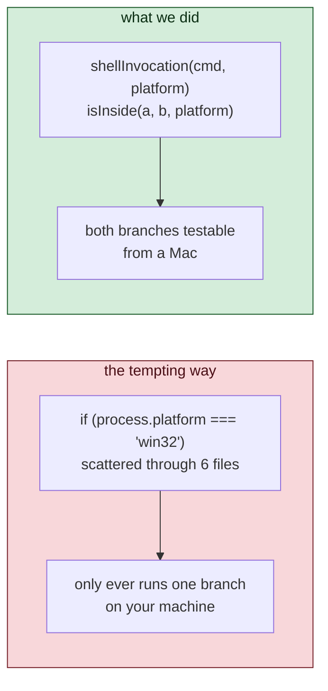
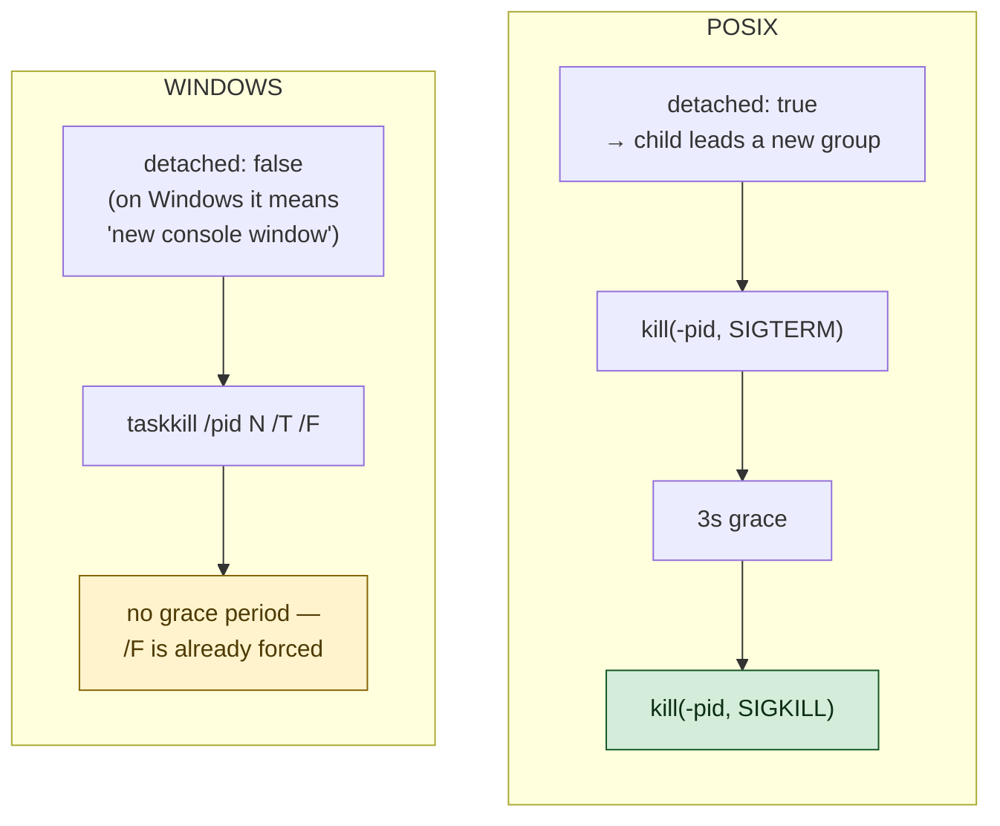

# 2 · Writing For A Machine You Cannot Run

> Windows support, written on a Mac, and how to make that honest.

---

## The uncomfortable request

The project was POSIX-only. Three things guaranteed it:

```ts
runCommand → '/bin/sh'                 // does not exist on Windows
spawn(..., { detached: true })          // means something else on Windows
process.kill(-pid, 'SIGTERM')           // there are no process groups on Windows
```

The honest options were: declare it POSIX-only and guard it, or write Windows
support **blind** — code that neither you nor your machine can execute.

Writing blind is normally how you ship something broken. So the interesting
question is not *"should we?"* but:

> **How do you write code for a platform you cannot run, and still have
> evidence it works?**

The answer has two halves, and both matter.

---

## Half one — make the decisions pure

Every place the behaviour must differ went into one file, `src/exec/platform.ts`,
as functions that **take the platform as an argument** instead of asking the
computer they are running on.



The difference is enormous and it is only one parameter.

`if (process.platform === 'win32')` can only ever take one branch on your
machine. The Windows path is *unreachable* — you could type anything there and
never know.

`shellInvocation(command, 'win32')` is a pure function you can call from a test
on a Mac and assert on the result. The Windows branch becomes ordinary code.

```ts
test('a shell command runs under cmd.exe on Windows', () => {
  const invocation = shellInvocation('dir', 'win32', 'C:\\Windows\\cmd.exe');
  assert.deepEqual(invocation.args, ['/d', '/s', '/c', '"dir"']);
});
```

That test runs on your Mac, right now, and it genuinely checks the Windows
decision.

> ⭐ **Take the environment as a parameter, not as a fact. A function that asks
> the world what it is can only be tested in one world.**

### Where this technique has a hole

Months later, CI on `windows-latest` went red on exactly one test — in the file
whose entire purpose is being checkable from a Mac.

```
not ok 174 - cmd.exe is the fallback when ComSpec is unset
  + actual   'C:\Windows\system32\cmd.exe'
  - expected 'cmd.exe'
```

`shellInvocation` takes a third argument: which shell binary to use. Windows
names it in the `ComSpec` environment variable, and the signature looked
perfectly injected:

```ts
export function shellInvocation(
  command: string,
  platform: NodeJS.Platform,
  comSpec: string | undefined = process.env['ComSpec'],   // ← the hole
): Invocation
```

The test passed the argument explicitly, which is the whole discipline of this
chapter:

```ts
const invocation = shellInvocation('dir', 'win32', undefined);
assert.equal(invocation.file, 'cmd.exe');
```

**That `undefined` never arrives.** In JavaScript, passing `undefined` to a
parameter with a default *triggers* the default rather than overriding it. Only
omitting the argument and passing `undefined` are the same thing — so there is
no way to say "no ComSpec" at all. The function read the real environment every
time:

| Machine | `process.env.ComSpec` | `invocation.file` | |
|---|---|---|---|
| macOS, Linux | unset | `'cmd.exe'` | ✅ green |
| Windows | `C:\Windows\system32\cmd.exe` | that | ❌ red |

Read the test's name again: *"cmd.exe is the fallback when ComSpec is unset"*.
It could not unset ComSpec. It passed on every machine it was ever written on,
and failed on the one platform it was written about.

The fix is to have no default at all — the parameter becomes required, and the
environment is read once at the edge, in `exec.ts`:

```ts
shellInvocation(command, process.platform, process.env['ComSpec'])
```

Two things worth noticing about what happened next. The typechecker immediately
found **three more** call sites that had been quietly relying on that default —
harmless ones, but nobody had known they were there. And the new guard test
turns the whole thing red on a Mac:

```ts
process.env['ComSpec'] = 'C:\\Windows\\system32\\cmd.exe';
assert.equal(shellInvocation('dir', 'win32', undefined).file, 'cmd.exe');
```

> ⭐ **A default value is not an injection point.** `= process.env.X` in a
> signature looks like the parameter version and behaves like the hardcoded
> version. If a seam is meant to keep the world out, it has to go all the way
> through — every input arrives from the caller, or the technique is decoration.

And note what actually caught it. Not the pure functions — they were the thing
that was broken. It was the second half of this chapter.

---

## Half two — make the real machine vote

Pure functions prove the *decisions*. They cannot prove that `cmd.exe` actually
accepts those arguments, or that `taskkill` really kills a tree.

So `windows-latest` went into the CI matrix. Now the whole suite runs on a real
Windows machine on every push. "Untested" became "tested by a machine on every
commit."

> ⭐ **Blind code plus CI on the real platform is not blind. Blind code alone
> is a guess you have written down.**

---

## The three things that differ

### 1 · The shell

```ts
POSIX:    /bin/sh  -c  "<command>"
Windows:  cmd.exe  /d /s /c  "<command>"     + windowsVerbatimArguments
```

`/d` skips any AutoRun registry command, `/s` gives documented quoting for what
follows, `/c` runs and exits. This mirrors exactly what Node itself builds for
`shell: true`.

`windowsVerbatimArguments` is the subtle one. Node normally re-quotes each
argument for `CreateProcess`. If you have already quoted a command line for
`cmd.exe`, that second quoting mangles it. Verbatim says *"I have done this,
pass it through."*

### 2 · Killing

This is the CLAUDE.md non-negotiable — kill the **group**, never just the
child, or grandchildren survive.



Two traps here, and both are the kind you only find by reading documentation
rather than guessing:

- On Windows, `detached: true` does **not** create a process group. It means
  "give this its own console window" — the opposite of helpful. So it is set
  on POSIX only.
- Windows has no graceful signal that console programs reliably honour, so
  there is nothing to escalate *from*. `taskkill /F` is the first and only
  blow. **A command interrupted on Windows does not get to clean up.** That is
  a real behavioural difference, and it is written in the README rather than
  hidden.

> ⭐ **When a platform genuinely cannot do what the other one does, document
> the difference. Do not paper over it and let the user discover it.**

### 3 · Paths — and a real security bug

This one was not a portability wart. It was a **boundary bug**.

The workspace check looked like this:

```ts
if (real !== realRoot && !real.startsWith(realRoot + sep)) → refuse
```

A plain string comparison. Now:

> On Windows, `C:\Work\proj` and `c:\work\proj` are **the same directory**.

A case-sensitive comparison says they are different. So a path genuinely inside
the workspace could be read as outside it — or, with a root differing only in
case, the reverse.

That is the check protecting every file operation in the program.

```ts
export function isInside(child, root, platform): boolean {
  const fold = (p) => isWindows(platform) ? p.toLowerCase() : p;
  ...
}
```

Two details in three lines, both deliberate:

**`toLowerCase`, not `toLocaleLowerCase`.** Under a Turkish locale the latter
maps a dotted capital `I` to a dotless `ı`, which would make your security
boundary depend on the machine's language settings. Genuinely.

**POSIX stays case-sensitive.** On Linux `/Work` and `/work` really *are*
different directories. The Windows fix must not leak across and loosen the
check everywhere else — so there is a test asserting exactly that.

---

## Proving the boundary fix was real

It would be easy to write this and assume it works. Instead, the check was
mutated on purpose — the separator dropped, reverting it to the classic
prefix bug:

```ts
c.startsWith(r.endsWith(sep) ? r : r + sep)   // correct
c.startsWith(r)                                // the bug
```

Result: **six tests went red**, including two pre-existing symlink tests from
Day 1 that had nothing to do with Windows.

That is the proof that `isInside` is genuinely load-bearing and not decorative.

> ⭐ **A test you have never seen fail is a test you should not trust. Put the
> bug back, watch it go red, then revert.** (Same rule as Day 3. It keeps
> earning its place.)

---

## The trap: reintroducing a shell

On Windows, `npm` is `npm.cmd` — a batch file. And Node **refuses** to spawn a
batch file without a shell (the fix for CVE-2024-27980). So `run_tests` has to
go through `cmd.exe`.

Which means a shell comes back. And a shell is exactly what `runProgram` exists
to avoid.

The weak answer is a comment saying "only use this with fixed arguments." The
answer we used makes the mistake **unexpressible**:

```ts
const CMD_METACHARACTERS = /[&|<>^"'`%\r\n]/;

for (const part of parts) {
  if (CMD_METACHARACTERS.test(part) || part.includes(' ')) {
    throw new Error(`Refusing to route "${part}" through cmd.exe: ...`);
  }
}
```

Try to pass model-supplied text through `runShim` and it throws at the
boundary. It cannot silently become an injection.

> ⭐ **When you must reintroduce a hazard, put a guard on it that fails loudly.
> "Remember not to do X" is not a security control. Code that refuses to do X
> is.**

---

## Things to remember

1. **Take the platform as a parameter.** It turns unreachable branches into
   ordinary testable code.

2. ⭐ **A default value is not an injection point.** `= process.env.X` reads the
   world anyway: passing `undefined` triggers the default instead of overriding
   it. Every input arrives from the caller, or the seam leaks.

3. **Pure functions + CI on the real OS.** Neither alone is enough; together
   they are honest — and here it was CI that caught the pure functions being
   wrong.

4. **`detached: true` means different things on different systems.** Read the
   docs for the platform you cannot run.

5. **Case-insensitive filesystems break string-comparison boundaries.** This is
   a security bug, not a cosmetic one.

6. **`toLowerCase`, never `toLocaleLowerCase`, for security comparisons.**

7. **If you must bring back a shell, guard it so misuse throws.**

---

## Try it yourself

**1 — Feel the difference a parameter makes.**
Open `src/exec/platform.ts` and rewrite `isInside` to read `process.platform`
directly instead of taking it as an argument. Now try to keep
`src/tests/exec/platform.test.ts` passing. You cannot — half those tests become
unwritable. Revert.

**2 — Re-run the mutation.**
Change `c.startsWith(r.endsWith(sep) ? r : r + sep)` to `c.startsWith(r)` and
run `npm test`. Count the failures. Note which ones are from Day 1. Revert.

**3 — Watch a default swallow an argument.**

```js
const f = (x = 'DEFAULT') => x;
console.log(f(undefined));   // 'DEFAULT', not undefined
console.log(f(null));        // null
```

Two minutes, no project needed. Then open `src/exec/platform.ts` and put
`= process.env['ComSpec']` back on `shellInvocation`. Run `npm test` — one test
goes red **on your Mac**, which is the whole point of the guard. Revert.

**4 — Try to smuggle a command.**
In a Node REPL, call
`shimInvocation('npm', ['test && whoami'], 'win32', 'cmd.exe')`.
Watch it throw. That is the guard doing its job.
