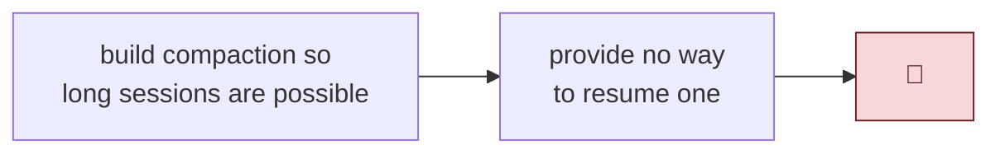
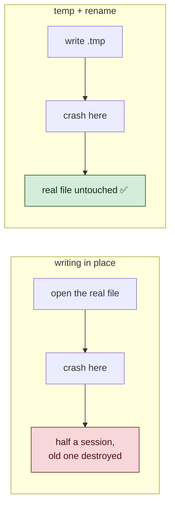

# 3 · Remembering Conversations

> Day 3 taught the agent to survive a long conversation.
> It still forgot everything the moment you closed the window.

---

## The joke that wasn't funny

Day 3 was entirely about long sessions. Token budgets, compaction, summaries —
serious engineering so a conversation could run for hours.

Then you pressed Ctrl-D and it was all gone.



That is the shape of a lot of missing features: not a bug in what you built,
but a gap **next to** it that only appears when you use the thing.

---

## Decision 1 — do not build an interface

`ARCHITECTURE.md` lists `SessionStore` among the abstractions to design later.
CLAUDE.md is blunt about it:

> *Do not implement anything from ARCHITECTURE.md's interface list until
> there's a second real implementation that needs it. One concrete
> implementation first, always.*

So sessions shipped as `src/agent/session.ts`: a handful of plain functions. No
interface, no class, no `SessionStore`, no dependency injection.

```ts
saveSession()  loadSession()  listSessions()  latestSession()  newSessionId()
```

This is worth dwelling on, because the instinct to abstract is strong and
almost always premature.

> ⭐ **An interface written for one implementation is a guess about the second
> one. You will guess wrong, and then you will have both the wrong abstraction
> and the code that uses it.**

If a database-backed store ever appears, the interface can be *extracted* from
two real things — which is a refactor, not an act of prophecy.

---

## Decision 2 — where the files live

Two candidates:

| Option | Problem |
|---|---|
| `.krimicode/` inside the project | needs a `.gitignore` entry; a client could commit a transcript |
| `~/.krimicode/sessions/` | none of that |

Home directory wins, keyed by the workspace path. `--continue` in a project
resumes *that* project's last conversation. Transcripts never touch the
client's repository, and it works when the tool is installed globally and run
from anywhere.

---

## Decision 3 — the file is untrusted

A session file was written by your own program. It is still untrusted input.

It could have been written by an older version, hand-edited, or truncated by a
full disk. So it is validated with Zod on the way in, exactly like an env var
or a model's tool arguments:

```ts
const SessionSchema = z.object({
  version: z.literal(1),
  id: z.string().min(1),
  history: z.array(MessageSchema),
  ...
});
```

And every failure returns `null` instead of throwing:

```ts
try { raw = await readFile(path, 'utf8'); } catch { return null; }
try { parsed = JSON.parse(raw); }          catch { return null; }
const result = SessionSchema.safeParse(parsed);
return result.success ? result.data : null;
```

Why so careful? Because this runs **at startup**. A corrupt session file that
threw would mean the program refuses to launch, and the user has no way past it
except deleting a file by hand that they don't know exists.

> ⭐ **Code that runs before the user can type anything must never be able to
> refuse to start. Degrade, don't die.**

---

## The two things that make a save safe

### Atomic writes

```ts
await writeFile(temporary, body, { mode: 0o600 });
await rename(temporary, target);
```

Write to `<id>.json.tmp`, then rename. `rename` is atomic on every filesystem
that matters.

Without it, a crash mid-write leaves a **truncated file where a valid session
used to be** — you lose the old conversation *and* the new one. With it, the
file on disk is either entirely the old version or entirely the new one. Never
half.



### Redaction — and the half everyone forgets

Tool results are already scrubbed on their way into history — that was Day 1,
and `normalize.ts` is the single road they all take.

But **your own typing is not**.

You paste a key into the prompt to ask *"is this one still valid?"* That is a
completely normal thing to do. Without redaction at the save boundary, it
lands in a file on disk in cleartext and stays there long after you have
forgotten the conversation.

```ts
const body = redact(JSON.stringify(session, null, 2));
```

Plus `0o600` on files and `0o700` on the directory, so even on a shared machine
nobody else can read them.

The test for this was mutation-checked: remove `redact()` and exactly one test
goes red — the right one.

> ⭐ **Ask of every new place data comes to rest: what is written here that has
> never been through the scrubber?** For sessions, the answer was *everything
> the human typed.*

---

## What actually needs saving

Surprisingly little:

```ts
export interface SessionState {
  readonly history: readonly Message[];
  readonly summary: string | null;
}
```

Two fields. That is the whole resumable state of a conversation.

Everything else is either configuration (model, base URL) or rebuilt on every
request. Remember from Day 3: the system message is **not stored in history**,
it is composed fresh each time from the base prompt plus the running summary.
That decision, made for a completely different reason, is why resuming is two
fields instead of a serialization problem.

> ⭐ **Clean internal state makes features you haven't thought of yet almost
> free. Messy state makes them expensive.**

The Agent grew a matching pair:

```ts
snapshot(): SessionState          // copies — a saved snapshot must not
                                  // mutate while the conversation continues
constructor({ initialState })     // restores
```

---

## When to save

In the `finally` of the REPL loop — **after** a turn has fully settled, never
during one.

This is a Day 3 rule wearing new clothes. Mid-turn, history can contain an
assistant message announcing a tool call whose result has not been recorded
yet. Save *that* and you have persisted a malformed conversation: every future
request built on it is a permanent 400.

The same principle governs compaction cut points and cancellation bail-outs:

> ⭐ **Leave only where the structure is complete.** Cut history at a `user`
> message. Abandon a turn at the top of the loop. Save a session after the turn
> ends. One rule, three places.

Saving after an *error* or a *cancellation* is deliberate too — history is
well-formed in both cases, and losing an hour's work because the last turn went
badly would be worse than keeping it.

---

## The small UX decisions

**`/clear` starts a new session id.** Otherwise the cleared conversation gets
overwritten by whatever comes next. Clearing should not destroy the transcript
you already had — it is still on disk, still resumable by id.

**A resumed session keeps the model it was held with.** Continuing a
conversation should not silently change who is answering it.

**Sorting.** The id begins with a timestamp, so a plain lexicographic sort is
also chronological. No date parsing, no dependency.

---

## Things to remember

1. **One implementation before any interface.** Extract abstractions from two
   real things; never invent them for one.

2. **Your own files are untrusted input.** Validate on read.

3. **Startup code must never refuse to start.** Corrupt file → `null`, not a
   crash.

4. **Temp file, then rename.** A crash then costs you nothing.

5. **Redact at every resting place** — and remember the user's own words have
   never been scrubbed.

6. **Save only when the structure is complete.** Same rule as cutting history
   and abandoning turns.

---

## Try it yourself

**1 — Break the atomic write.**
Change `saveSession` to write straight to the target file. Then kill the
process mid-write (a very large history helps). Try `--continue`. Now put the
rename back and repeat.

**2 — Prove the redaction.**
Start a session, type a fake key like
`sk-testonly-abcdefghijklmnopqrstuvwxyz012345`, exit, then
`grep -r "sk-testonly" ~/.krimicode/sessions/`. Nothing. Now comment out the
`redact()` call and do it again.

**3 — Feed it garbage.**
Open a saved session file and delete a random closing brace. Run
`krimicode --list`. It should skip the file, not crash. Now imagine that file
was the one `--continue` would have picked.
