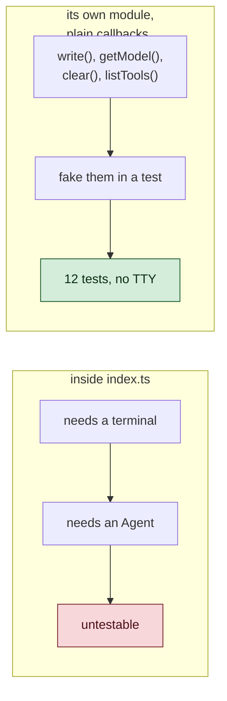
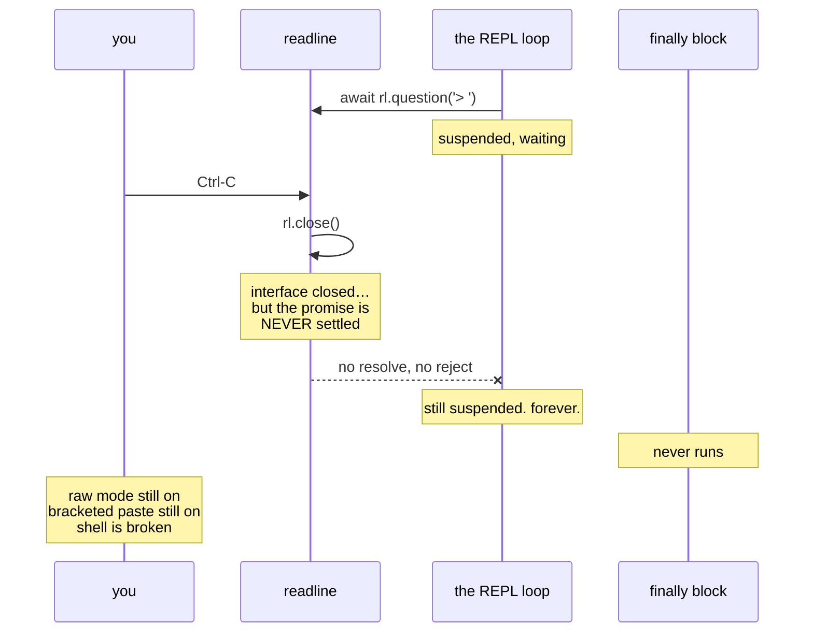

# 4 · The Terminal Talks Back

> Slash commands, a screen that wouldn't clear, and a bug that broke your shell
> after the program had already exited.

---

## Part 1 — one command is not a command system

The REPL had exactly one:

```ts
if (line === '/exit') break;
```

Everything else you typed went to the model. Including `/hepl`, which cost a
network request so a language model could puzzle over your typo.

The dispatcher went into its own file, `src/commands.ts`, and that placement is
the interesting decision.



`handleCommand` takes a `CommandContext` of plain functions and returns one of
three things:

```ts
type CommandOutcome = 'handled' | 'exit' | 'not-a-command';
```

Three states, not two — and the third is the one that carries the design.

### The `/usr/lib` problem

A naive dispatcher says: *starts with `/` → it's a command*.

Then a user asks *"what's in /etc/hosts?"* and the agent replies "unknown
command."

```ts
// Anything with a slash or a dot is far more likely to be a path the user is
// asking about than a mistyped command.
if (name.includes('/', 1) || name.includes('.')) return 'not-a-command';
```

So `/helo` gets answered locally as a typo, while `/usr/lib/node`,
`/etc/hosts`, and `/README.md` go to the model as ordinary questions.

> ⭐ **A prefix is a hint, not a decision. When two meanings share a syntax,
> use the shape of the whole thing to choose.**

---

## Part 2 — the screen that wouldn't clear

`/clear` reset the conversation. Then the user said:

> *"it is deleting and telling just cleared. it should also remove whatever
> shown on screen"*

Correct. `/clear` forgot the conversation and left the entire transcript
visible. It *looked* like nothing had happened.

The fix is three escape codes, and the middle one is the one people miss:

```ts
export const CLEAR_SCREEN = '\x1b[2J\x1b[3J\x1b[H';
//                              2J = visible screen
//                              3J = SCROLLBACK
//                              H  = cursor home
```

Without `3J`, you clear the visible screen and can then **scroll up and read
the entire conversation the agent has just been told to forget.** The screen
looks clean; the transcript is still sitting there.

Two smaller decisions came with it:

- **Only when `stdout.isTTY`.** Piped into a log file those codes are literal
  junk. Same guard the spinner uses.
- **The clearing lives in `index.ts`, not `commands.ts`.** ARCHITECTURE §2 puts
  rendering in the CLI layer. The dispatcher calls `context.clear()` and has no
  idea what a terminal is.

> ⭐ **"Clear" is a promise about what the human can see. Memory and screen
> have to agree, or the command is lying.**

---

## Part 3 — the bug that outlived the program

This is the best bug of Day 4. It was found by a two-line manual test.

**Step 5d: press Ctrl-C at an idle prompt. Expect a clean exit.**

It hung. And afterwards the user's shell was broken.

### The code looked obviously correct

```ts
rl.on('SIGINT', () => {
  if (active === null) {
    rl.close();          // nothing running → quit
    return;
  }
  active.abort();        // a turn is running → cancel it
});
```

```ts
try {
  line = (await rl.question('> ')).trim();
} catch {
  break;   // stdin closed: Ctrl-D, or piped input exhausted
}
```

Read that and it is completely reasonable. Close the interface, the question
fails, the `catch` breaks the loop, the `finally` restores the terminal.

Every step of that sentence is wrong except the first.

### What actually happens



`rl.close()` does **not** settle a pending `rl.question()`. The promise neither
resolves nor rejects. It just stops existing in any useful sense.

Proved in eleven lines, no agent involved:

```
rl.question('> ') pending → rl.close() → question promise: NEVER
```

### The consequences stack up

1. The `await` never returns, so the loop never breaks.
2. The loop never breaks, so `finally` never runs.
3. `finally` is what restores the terminal:

```ts
stdout.write(DISABLE_BRACKETED_PASTE);
stdin.setRawMode(false);
```

So the program left **raw mode on and bracketed paste enabled** in a terminal
it no longer controlled. Your shell misbehaves afterwards, and nothing on
screen explains why.

### And the same cause broke Ctrl-D

Look at the `catch` again:

```ts
} catch {
  break; // stdin closed: Ctrl-D, or piped input exhausted.
}
```

Ctrl-D also closes the interface. So that catch — the one whose comment
describes exactly this case — **could never fire.** A comment describing
behaviour that was impossible.

> ⭐ **A comment is a claim. It can be false. This one had been sitting there
> confidently describing a code path that could not execute.**

### The fix

Don't close the interface. **Abort the question**, so it rejects and the loop
leaves through its normal exit:

```ts
let idle: AbortController | null = null;
const stopWaitingForInput = (): void => idle?.abort();

rl.on('SIGINT', () => {
  if (active === null) { stopWaitingForInput(); return; }   // was rl.close()
  active.abort();
});

rl.on('close', stopWaitingForInput);   // Ctrl-D, and pipe EOF
```

```ts
idle = new AbortController();
line = (await rl.question('> ', { signal: idle.signal })).trim();
```

The satisfying part: **the approval prompt already did this.** It had passed
`active?.signal` to `rl.question` since Day 2, for exactly this reason. The
idle prompt was the one place that hadn't learned the lesson.

> ⭐ **When one part of your code already solves a problem, look for the places
> that haven't adopted it. The fix usually already exists in your own
> repository.**

### Proving it

Unit tests cannot reach this. `index.ts` runs `main()` on import — nothing in
it is reachable from `node --test`. So it was tested with a real pseudo-terminal
and a real keystroke:

```
                 Ctrl-C at idle
before   hung — killed at 2 minutes, never exited
after    exit=0, terminal restore sequence emitted
```

And all three exits verified end to end:

```
Ctrl-C at idle : exit=0  restore-sequence=1
Ctrl-D at idle : exit=0  restore-sequence=1
/exit          : exit=0  restore-sequence=1
```

---

## The lesson that ties the chapter together

Every bug here lived in the **last inch** — between correct code and a human
being.

The dispatcher, the screen, the signal handling: none of it is algorithmically
interesting. All of it is what the user actually touches. And none of it was
covered by 300 passing tests, because the tests could not reach the place where
a person and a program meet.

> ⭐ **The interface is not a wrapper around the product. For the person using
> it, the interface *is* the product.**

---

## Things to remember

1. **Three outcomes, not two.** `handled` / `exit` / `not-a-command` is what
   lets `/etc/hosts` still be a question.

2. **`3J` or it isn't cleared.** Scrollback counts as "on screen."

3. **`rl.close()` never settles a pending `rl.question()`.** Abort it instead.

4. **Cleanup in `finally` only helps if the loop can actually exit.** A hang
   skips every recovery path you wrote.

5. **Comments can describe impossible code.** Check that the path can run.

6. **Some things need a pty and a keystroke.** If `main()` runs on import, no
   unit test will ever reach it.

---

## Try it yourself

**1 — Reproduce the hang in eleven lines.**

```js
import * as readline from 'node:readline/promises';
import { PassThrough } from 'node:stream';
const rl = readline.createInterface({
  input: new PassThrough(), output: new PassThrough(), terminal: true,
});
let settled = 'NEVER';
rl.question('> ').then(() => settled = 'RESOLVED', () => settled = 'REJECTED');
setTimeout(() => rl.close(), 100);
setTimeout(() => { console.log(settled); process.exit(0); }, 600);
```

Then add `{ signal }` and abort it instead. Watch `NEVER` become `REJECTED`.

**2 — Break your own terminal on purpose.**
Revert the fix, run the agent, press Ctrl-C at the prompt, then kill it from
another window. Type in the original shell. Fix it with `reset`. You will not
forget what `finally` is for.

**3 — Delete `\x1b[3J`.**
Run `/clear`, then scroll up. Everything the agent "forgot" is still there.
