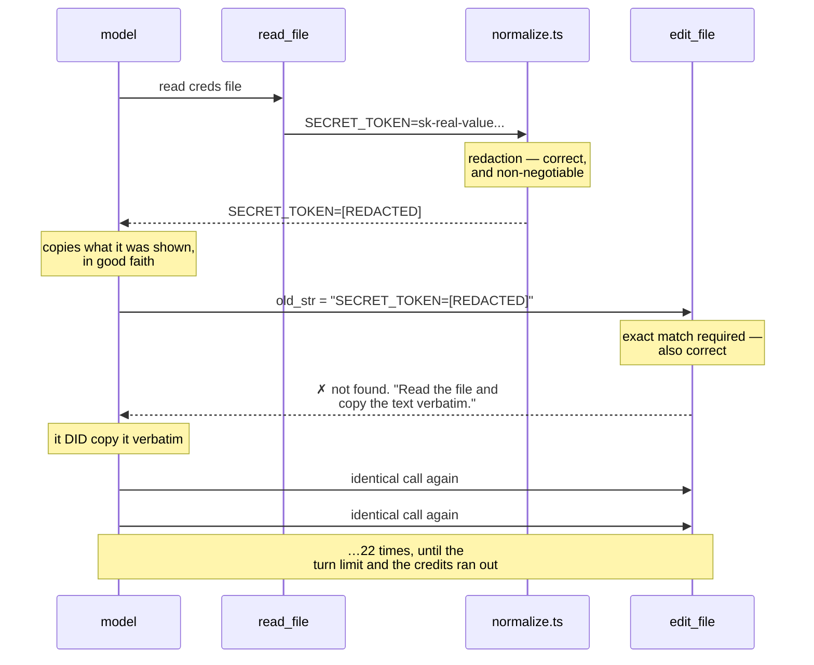
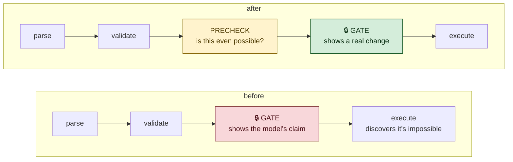
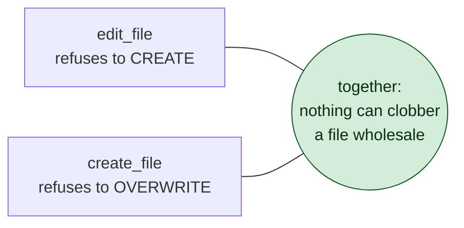

# 5 · What Tests Cannot See ⭐

> The suite was green the entire time this chapter happened.

---

## How it started: running out of money

The plan said the riskiest untested claim in the whole project was this one,
from the very first line of `CLAUDE.md`:

> *Model access goes through an OpenAI-compatible endpoint so the backend can
> later swap to a self-hosted model without touching agent logic.*

Designed for. Never tried. The agent had only ever spoken to one provider.

Then, mid-test, the API returned:

```
error: 402 This request requires more credits…
```

No budget. And suddenly the "someday" test was the only way to keep working.

The `.env` changed. Nothing else did:

```sh
OPENAI_API_KEY=ollama
OPENAI_BASE_URL=http://localhost:11434/v1
MODEL_NAME=llama3.2:3b
MAX_CONTEXT_TOKENS=4000
```

It worked. A local model, on a laptop, through the same code.

And it was a **real** test, not a formality, because the two providers disagree
in exactly the place you'd worry about:

| | tool-call arguments arrive as |
|---|---|
| the hosted API | many fragments, concatenated |
| Ollama | one complete chunk |

`ToolCallAccumulator` was written on Day 1 to be set-once for `id`/`name` and
concatenating for `arguments` — precisely so both shapes work. Day 1's caution,
collected in Day 4.

> ⭐ **An architecture claim you have never exercised is a wish. Exercise it
> once and it becomes a fact — or a bug, and either is better than a wish.**

There is a trap here worth remembering: Ollama *reported* a 131072-token
context but was actually serving **4096**. Leave `MAX_CONTEXT_TOKENS` at its
default and the agent never compacts while the server silently truncates the
front of the conversation. The model just starts "forgetting," with no error
anywhere. That is why Day 3 made the window configuration rather than a guess.

---

## Bug 1 — two right decisions, deadlocked

The user asked the agent to edit a file containing a secret. Watch:



Look at what is wrong here: **nothing**.

Redaction is a CLAUDE.md non-negotiable and it worked perfectly. Exact-match
editing is a CLAUDE.md non-negotiable and it worked perfectly. The model
behaved reasonably at every step.

The model *cannot* succeed. It has never seen the real text and never will. And
the error message told it to do the one thing it had already done.

> ⭐ **Most real bugs are not one wrong decision. They are two right decisions
> meeting somewhere neither author was looking.**

**The fix** — recognise the dead end and say so:

```ts
if (input.old_str.includes(PLACEHOLDER)) {
  return {
    success: false,
    error: `old_str contains ${PLACEHOLDER}, which is a placeholder put there
      to keep a secret out of this conversation — it is not the real text of
      ${input.path}, so no edit can match it…`,
    retryable: false,      // ← the important part
  };
}
```

`retryable: false` is the load-bearing line. The old error was
`retryable: true`, which is an *invitation*.

---

## Bug 2 — nothing stopped the loop

Twenty-two identical calls. Each one a network request. Each one real money.
The only backstop was `MAX_TURNS = 30`.

A repeated **identical failing** call is a certainty, not a probability. If the
name and the arguments are the same, so is the outcome.

```ts
const MAX_IDENTICAL_FAILURES = 2;

const key = `${call.name} ${call.argsJson}`;
const failures = this.#failedCalls.get(key) ?? 0;

if (failures >= MAX_IDENTICAL_FAILURES) {
  return { success: false, error: 'This exact call has already failed…' };
}
const result = await this.#dispatch(call, signal);
if (!result.success) this.#failedCalls.set(key, failures + 1);
```

Four design decisions in ten lines:

- **Only failures count.** Calling `git_status` five times as the tree changes
  is legitimate. A repeated *success* means nothing.
- **Two before blocking.** A genuinely transient failure — a timeout, a file
  being written just then — deserves one retry. The third is refused.
- **Keyed on name *and* arguments.** Keying on the name alone would stop the
  model correcting a typo in a path.
- **Cleared by `/clear`.** A new conversation deserves a clean slate.

### The mistake I made writing it

The first version put the check *after* the unknown-tool lookup:

```ts
const tool = getTool(call.name);
if (!tool) return { error: `Unknown tool: "${call.name}"` };   // ← returns early
// … failure counting down here, never reached for unknown tools
```

So a model inventing the same nonexistent tool 22 times was still not caught —
the identical runaway, straight past the guard.

The test caught it. The fix was to split `#runTool` (which guards) from
`#dispatch` (which executes), so the guard wraps **every** path.

> ⭐ **An early `return` is a hole in anything you add below it. When you add a
> guard, check what returns before it.**

---

## Bug 3 — the sensitive-file list was narrower than it looked

The test file was called `fake-creds.env`. The agent treated it as an ordinary
file. Was that wrong?

```
/^\.env(\..*)?$/i      matches  .env  .env.local  .env.production
                       misses   fake-creds.env  production.env  secrets.env
```

The pattern was anchored: the name had to **start** with `.env`.

`production.env` and `secrets.env` are names real projects use every day. They
were ordinary files — editable under a standing `always` approval, with no
`DESTRUCTIVE` prompt.

```ts
/^\.env(\..*)?$/i,   // the dotfile and its variants
/\.env$/i,           // and anything ending in .env
```

Then checked the other direction — `environment.ts`, `benv`, `my.envx` all
stay ordinary. A denylist that over-matches trains people to ignore it.

> ⭐ **Test your security patterns on the things that should *not* match, not
> just the things that should. A pattern is defined by both edges.**

---

## Bug 4 — you were approving fiction

This is the subtlest one on Day 4, and the most important.

The user asked to edit a file. The permission prompt appeared:

```
  ⚠ write file via edit_file
  src/a.ts
    - i love you
    + I love you
  [y]es  [n]o  [a]lways › y
  ✗ old_str was not found in src/a.ts
```

`src/a.ts` contained `export const haystack = 1;`. The string `i love you`
appeared nowhere in it.

**You were shown a diff, you approved it, and it was fiction.**

The cause, in `classify()`:

```ts
const diff = { before: input.old_str, after: input.new_str };
```

It never reads the file. The diff is assembled purely from what the model
*claims*. And every check that could contradict it — does the file exist, does
`old_str` match, does it match twice — ran inside `execute()`, **after**
approval.



Nothing dangerous happened — an unmatched `old_str` fails safe. So why does it
matter?

> ⭐ **A prompt that is routinely wrong teaches you to press `y` without
> reading. That habit is how permission gates are defeated — not bypassed,
> rubber-stamped.**

Four prompts in that transcript. Zero achievable effects. The next prompt might
be `rm -rf`.

### And a documented property that was false

The README said:

> *Anything resolving outside the workspace — via `../`, an absolute path, or a
> symlink — is refused outright rather than prompted for.*

Untrue for `edit_file`. `resolveInWorkspace` ran inside `execute()`, so asking
to edit `../../etc/passwd` **showed you a permission prompt** first. The refusal
held, but you were dragged into a decision that should never have reached you.

The existing test only checked the *result*, not that the gate went unconsulted
— so it could not catch this. The new one does, and it fails the instant
`precheck` is disabled.

### What it cost

Be honest about the trade. CLAUDE.md says:

> *Placing it here rather than inside each tool is what makes "no tool bypasses
> confirmation" structural instead of a convention.*

`precheck` runs **before** confirmation. The doc comment says "must not mutate
anything" — and that is a *convention*, exactly the thing that sentence warns
against. A future tool could write a file in `precheck` and never reach the
gate.

Consent got more accurate; the chokepoint got weaker. That is a real trade, and
the honest move is to write it down rather than to pretend the change was free.

---

## Bug 5 — it could not create a file

```
> create two temporary files with i love you written inside them
```

It could not. There was no tool that creates a file.

- `edit_file` refuses by design — *"a typo in `path` would silently produce a
  new file instead of failing loudly."*
- `run_command` could, via a shell heredoc — clumsy, and it routes file
  writing through a shell, defeating the structured path.

Sound reasoning for an *edit* tool. But the conclusion — a coding agent that
cannot create a file — is absurd, and nobody noticed until somebody asked it to.

`create_file` is the deliberate mirror:



The guarantee is not the precheck — it is one flag:

```ts
await writeFile(absolute, input.content, { encoding: 'utf8', flag: 'wx' });
//                                                            ^^^^^^^^^^
//                       fails atomically if the path exists
```

The precheck is a courtesy so you aren't prompted for a doomed creation. `wx`
is the property. A file appearing in the gap between them cannot be clobbered.

> ⭐ **Know which line is the guarantee and which is the convenience. If you
> deleted the check, would the property still hold? For `wx`, yes.**

---

## Bug 6 — "here is the code" is not doing the work

With `create_file` in place:

```
> write program to print table of 5 in b.ts

⚒ create_file  ✗ src/b.ts already exists…

It seems that b.ts already exists. Here's the edited file:

```typescript
function printTable(size: number) { … }
```
```

It printed the program in the chat and stopped. The file was untouched, and the
answer *looked* like success.

Partly a small model's limits. But the system prompt was complicit:

```
'Use the provided tools to inspect real files rather than guessing.'
```

**Inspect.** Every word of that prompt was about reading. Nothing said that
when asked to *change* a file, showing code is not the same as changing it.

```ts
'When the user asks you to create or change a file, do it with the tools.',
'Code in your reply is not the work — nothing has changed until a tool call',
'succeeds.',
'create_file makes new files only and never overwrites. To replace what is',
'already in a file, read_file it first, then edit_file using its exact',
'current text as old_str.',
```

That second paragraph exists because the tool set has a shape nobody states out
loud: **neither tool overwrites**, so replacing a file means reading it first.
Obvious once you own both tools. Invisible to whoever has to use them.

> ⭐ **Your system prompt is documentation for a reader who cannot ask
> questions. Anything you'd have to explain to a new colleague belongs in it.**

---

## The pattern behind all six

Look at what actually found these:

| Found by | Bugs |
|---|---|
| The test suite | 0 |
| A person using the software | 6 |

Not because the tests are bad — 308 of them, mutation-checked, genuinely
load-bearing. They are excellent at *"does this function do what I said?"*

Every bug in this chapter is a different question:

- Do two correct features combine correctly? *(redaction × exact-match)*
- Does the system recover from a bad state? *(the 22 retries)*
- Does the pattern match the real world? *(`production.env`)*
- Does the human understand what they are agreeing to? *(the fictional diff)*
- Can it do the obvious thing? *(create a file)*
- Does the model know what "done" means? *(code in the reply)*

None of those fit in an assertion, because none of them are about one function.

> ⭐ **Tests check the parts you thought of. Using the software checks the
> parts you didn't. You need both, and only one of them is optional to
> automate.**

---

## Things to remember

1. **Two right decisions can deadlock.** Look at the seams, not the parts.

2. **An impossible call must be unretryable.** `retryable: true` is an
   invitation.

3. **Break identical failing calls.** Same name + same args = same outcome.

4. **An early `return` is a hole in every guard below it.**

5. **Test denylists on what should *not* match.**

6. **Never prompt for something impossible.** Meaningless prompts train
   reflexive approval, and that is how gates die.

7. **Know your guarantee from your convenience.** `wx`, not the precheck.

8. **The system prompt is documentation.** Say what "done" means.

9. **Use your own software.** It is the only way to find any of this.

---

## Try it yourself

**1 — Recreate the deadlock.**
Make a file containing `SECRET_TOKEN=sk-testonly-abcdefghijklmnop123456`. Ask
the agent to change the token. Watch it fail *once*, clearly. Now comment out
the `PLACEHOLDER` check and watch it try until the turn limit.

**2 — Watch the breaker.**
Set `MAX_IDENTICAL_FAILURES = 99`, ask for something impossible, and count the
attempts. Put it back to 2.

**3 — Approve a fiction.**
Disable the `precheck` call in `define.ts` and ask the agent to edit text that
doesn't exist in a file. Read the prompt carefully. Say yes. Notice how normal
it felt.

**4 — Find bug 7.**
The `precheck` hole is still open — the "must not mutate" rule is a comment,
not something enforced. Write a test that runs every registered tool's
`precheck` against a scratch workspace and asserts the directory is unchanged.
Now it is structural again.
