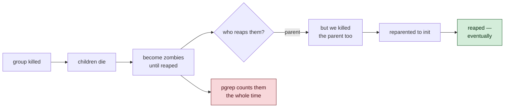

# 6 · The Day CI Went Red

> Your machine has been lying to you for weeks. It just never had a reason to
> stop.

---

## Push, and the board lights up

Everything was green locally. 308 tests, lint clean, typecheck clean, build
clean. The branch went up, and:

```
✅ macos-latest  · node 22      Successful in 18s
❌ ubuntu-latest · node 20.12   Failing after 17s
❌ ubuntu-latest · node 22      Failing after 23s
❌ windows-latest · node 22     Failing after 48s
```

One green. It was the one that matched the machine everything had been written
on.

That is the whole value of CI in a single screenshot.

> ⭐ **Until another machine runs your tests, "all tests pass" means "all tests
> pass on my laptop." Those are very different sentences.**

---

## Reading the board before reading the logs

The pattern tells you a lot before you open anything.

**macOS passed, Linux and Windows failed.** So it is not the code being wrong
in general — it is the code depending on something about macOS.

**Both Ubuntu jobs failed, at 20.12 *and* 22.** So it is not a Node version
issue. It is Linux itself.

**Ubuntu failed at 17–23s while macOS *passed* at 18s.** Comparable durations,
so Ubuntu got roughly as far — it ran most of the pipeline. Not an install
failure; something near the end.

**Windows took 48 seconds.** Different from both. Probably a different problem
entirely.

Then the logs confirmed it: the Ubuntu job showed `pass 305 / fail 3` — so lint
had *passed* there. The lint failure was a separate job. **Two unrelated bugs
wearing one red X.**

> ⭐ **Read the shape of a failure before the contents. Which platforms, which
> versions, how long — that narrows it faster than any log.**

---

## Not guessing: reproducing Linux locally

The temptation is to change something plausible and push again. That is a
20-minute feedback loop and an unfalsifiable guess.

Docker was available, so Ubuntu came to us:

```sh
docker run --rm -v "$PWD":/src:ro -w /work node:22-bookworm bash -c '
  cp -r /src/{src,package.json,package-lock.json,tsconfig*.json,biome.json} /work/
  npm ci && npm test
'
```

```
not ok 39  - CLAUDE.md: cancelling kills the process group, not just the shell
not ok 41  - nothing is left running after an already-aborted call
not ok 161 - CLAUDE.md: the whole process group dies, not just the shell
# pass 305
# fail 3
```

**Exactly the CI numbers.** Now the loop is thirty seconds and the guesses are
falsifiable.

> ⭐ **Reproduce before you fix. A fix you cannot watch fail is a fix you
> cannot trust.**

---

## The Linux failure: dead is not gone

All three failures were the process-group tests — the ones enforcing the
CLAUDE.md rule that killing a shell must kill its children.

The assertion message:

```
orphaned processes survived
1 !== 0
```

That reads like the process-group kill is broken on Linux. It is not. Watch
what actually happens:

```
before kill:   pid 16 (S)   pid 17 (S)      ← both running, both in group 15
after kill:                 pid 17 (Z)      ← 16 reaped, 17 is a ZOMBIE
```

`S` is sleeping. **`Z` is a zombie** — a process that has already died and is
waiting for its parent to collect its exit status.

Both processes were killed. The group kill worked perfectly.

But the test counted survivors with `pgrep`, and **`pgrep` matches zombies.**



The test asserted **"nothing matches"** when it meant **"nothing is still
running."** Those are not the same claim, and the gap between them is a race.

macOS reaps fast enough that the window never opened. Linux is slower to close
it. Same code, same correctness, different timing — and a test that had been
subtly wrong since Day 2 finally got measured on a machine that could see it.

**The fix is in the test, not `exec.ts`:**

```ts
export function countLiveMatching(marker: string): Promise<number> {
  const child = spawn('ps', ['-A', '-o', 'stat=', '-o', 'args=']);
  // …
  const live = out.split('\n')
    .filter((line) => line.includes(marker))
    .filter((line) => !line.trimStart().startsWith('Z'));   // ← not a survivor
  resolve(live.length);
}
```

A bonus from filtering in JavaScript rather than piping through `grep`: the
search command can no longer match *itself*, which is the other classic bug in
tests like these.

> ⭐ **When a test fails, ask what it is really asserting. "No process matches
> this name" and "no process is still running" look identical until a zombie
> stands between them.**

The fix was verified back in the container — and that container is *harsher*
than the real runner, because its PID 1 is `bash`, which never reaps orphans at
all. Passing there means passing comfortably on Ubuntu.

---

## The Windows failure: an invisible character

The Windows log showed something different — Biome wanting to rewrite entire
files, `+` on every single line, 30+ diagnostics across 50 files.

That is not a formatting disagreement. Nobody's style is *that* wrong.

When **every line** of **every file** differs, the difference is not in the
lines. It is at the end of them.

```
macOS / Linux :  line\n            (LF)
Windows       :  line\r\n          (CRLF)
```

Git, with no instructions, converts to CRLF on checkout on Windows. Biome
formats with LF. So every line reads as changed.

```
* text=auto eol=lf
```

One line in a new `.gitattributes`. It forces LF in the working tree on every
platform.

And a detail worth understanding: the files are stored as LF in the repository
already, because they were committed from a Mac. The corruption happens *on
checkout*. So `eol=lf` fixes it going forward with no need to re-normalise
anything.

> ⭐ **When a diff is 100% of the file, stop reading the content. The problem is
> the invisible characters: line endings, encoding, or a BOM.**

---

## Both bugs had the same shape

Neither was a bug in the agent. Both were **assumptions about the environment**
that had never been challenged:

| Assumption | Held on | Broke on |
|---|---|---|
| "dead processes disappear promptly" | macOS | Linux |
| "a line ends with `\n`" | macOS, Linux | Windows |

Both had been sitting in the repository for days, completely invisible, because
only one kind of machine had ever run the code.

That is what the CI matrix bought. Not tidiness — **a second opinion.**

---

## Things to remember

1. **Green on your machine means green on your machine.** Nothing more.

2. **Read the failure's shape first.** Which platforms, which versions, how
   long. It narrows the search before you open a log.

3. **One red board can be two unrelated bugs.** Ubuntu's tests and Windows'
   lint had nothing to do with each other.

4. **Reproduce locally before fixing.** Docker turns a 20-minute CI loop into
   30 seconds and turns guesses into experiments.

5. **A zombie is dead, not alive.** `pgrep` cannot tell the difference; `ps -o
   stat=` can.

6. **Ask what the assertion really claims.** "Nothing matches" ≠ "nothing is
   running."

7. **A whole-file diff means line endings.** Add `.gitattributes` on day one of
   any project that will meet Windows.

---

## Try it yourself

**1 — Watch a zombie.**

```sh
node -e "
  const { spawn, execSync } = require('child_process');
  const c = spawn('/bin/sh', ['-c','sleep 77 & sleep 77'], { detached: true });
  setTimeout(() => {
    process.kill(-c.pid, 'SIGTERM');
    setTimeout(() => {
      console.log(execSync('ps -eo pid,stat,comm | grep sleep').toString());
      process.exit(0);
    }, 300);
  }, 300);
"
```

Look for `Z` in the second column. That is a process the old test would have
called a survivor.

**2 — Reproduce Linux yourself.**
Run the Docker command from this chapter against the repo *before* the fix
(revert `countLiveMatching` to `pgrep`). Watch three tests fail on Linux and
pass on your Mac, from the same source tree, at the same moment.

**3 — Manufacture the Windows bug.**
Convert one source file to CRLF and run `npm run lint`:

```sh
perl -pi -e 's/\n/\r\n/' src/types.ts
npm run lint
git checkout src/types.ts
```

Watch Biome want to rewrite the whole file. That is exactly what the Windows
job saw, fifty times over.
