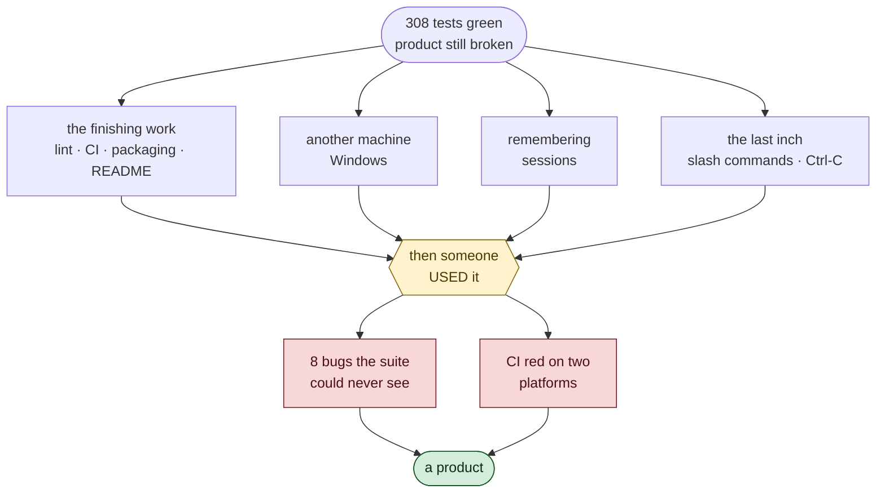
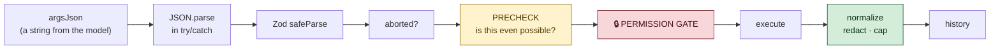

# 7 · Day 4 Cheat Sheet

Everything from Day 4 on one page.

---

## The day in one sentence

> **Green tests mean the code does what you told it to. Using the software is
> the only way to find out whether you told it the right things.**

---

## The whole day as a picture



---

## New files

| File | What it holds |
|---|---|
| `src/exec/platform.ts` | every decision that differs on Windows, as pure functions |
| `src/agent/session.ts` | save / load / list conversations — concrete, no interface |
| `src/cli/commands.ts` | the slash-command dispatcher |
| `src/cli/args.ts` | CLI flags (separate so `index.ts` isn't imported to test it) |
| `src/tools/create_file.ts` | the mirror of `edit_file` |
| `biome.json` | lint + format |
| `.github/workflows/ci.yml` | 5 jobs across 3 operating systems |
| `.gitattributes` | `* text=auto eol=lf` |
| `README.md` | the door on the car |

---

## The tool-call path, final form



`precheck` is Day 4's addition. It exists so the gate never asks you to approve
something impossible — and it is the one place the chokepoint got weaker, since
code now runs before confirmation.

---

## The two write tools

```
edit_file    refuses to CREATE     (a typo must not silently make a file)
create_file  refuses to OVERWRITE  (a typo must not silently destroy one)
```

Together: **nothing can replace a file wholesale.** To replace contents you
must `read_file` first, then `edit_file` with the current text as `old_str` —
which the system prompt now says out loud.

The guarantee is `flag: 'wx'`, not the precheck.

---

## Platform differences, complete

| | POSIX | Windows |
|---|---|---|
| shell | `/bin/sh -c "cmd"` | `cmd.exe /d /s /c "cmd"` + verbatim args |
| new group | `detached: true` | not used — means "new console window" |
| kill | `kill(-pid, SIGTERM)` → 3s → `SIGKILL` | `taskkill /pid N /T /F`, no grace |
| paths | case-**sensitive** | case-**insensitive** |
| `npm` | an executable | `npm.cmd`, a batch file — needs `cmd.exe` |
| `grep` fallback | available | **absent** — ripgrep required |

---

## Numbers worth knowing

| Constant | Value | Why |
|---|---|---|
| `MAX_TURNS` | 30 | runaway-loop guard; throws `MaxTurnsError` |
| `MAX_IDENTICAL_FAILURES` | 2 | one retry for transient failures, then refuse |
| session dir mode | `0o700` | transcripts quote your code |
| session file mode | `0o600` | and whatever you typed |
| `CLEAR_SCREEN` | `\x1b[2J\x1b[3J\x1b[H` | screen, **scrollback**, cursor |

---

## The eight bugs, and what each teaches

| Bug | Lesson |
|---|---|
| Ctrl-C hung, terminal left broken | `rl.close()` never settles a pending `question()`; a hang skips every `finally` |
| 22 identical failing calls | same name + same args = same outcome; break the loop |
| Redaction × exact-match deadlock | two right decisions can collide |
| `production.env` was ordinary | test denylists on what should *not* match |
| Approving a fictional diff | never prompt for the impossible; it trains reflexive `y` |
| `/clear` left the screen full | "clear" is a promise about what a human sees |
| Could not create a file | a sound rule can still leave an absurd gap |
| CI red on Linux + Windows | your machine has been lying to you |

---

## Rules that carried over from earlier days

Day 4 mostly *reused* ideas rather than inventing them:

| Rule | First learned | Reused as |
|---|---|---|
| One road, one rule | Day 1 (redaction) | `precheck` — and the hole it opens |
| Leave only where the structure is complete | Day 3 (cut points) | when to save a session |
| A test you've never seen fail is untrustworthy | Day 3 | mutation-testing `isInside`, `redact`, `precheck` |
| Make the mistake unexpressible | Day 2 (argv vs shell) | `shimInvocation` refusing metacharacters |
| Classify the call, not the tool | Day 2 | `create_file` on `.env` is DESTRUCTIVE |

> ⭐ **The same handful of ideas keep solving new problems. That is what makes
> them principles rather than tricks.**

---

## Commands added

```sh
krimicode --continue        # resume the latest session here
krimicode --resume <id>     # resume a specific one
krimicode --list            # what's saved for this directory
krimicode --help            # works without an API key

/help  /clear  /model  /tools  /sessions  /exit
```

---

## If you remember only six things from Day 4

1. **Use your own software.** Eight bugs, zero found by 308 tests.

2. **Two right decisions can deadlock.** Look at the seams.

3. **Never prompt for the impossible.** Meaningless prompts are how gates die.

4. **Take the environment as a parameter.** It makes unreachable branches
   testable.

5. **Reproduce before you fix.** Docker turned a 20-minute guess into a
   30-second experiment.

6. **Know your guarantee from your convenience.** `wx` is the property; the
   precheck is a courtesy.
